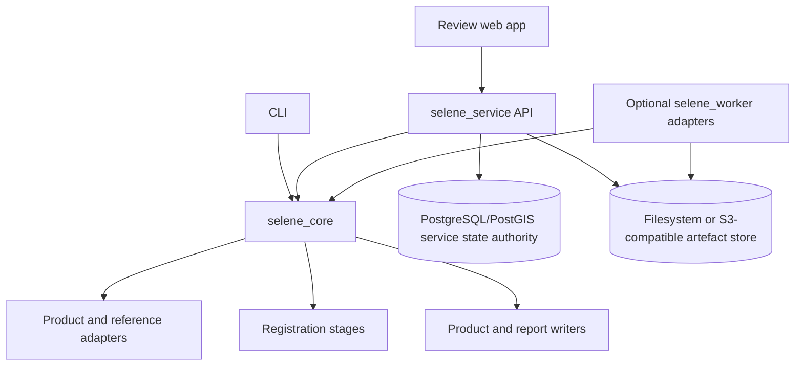
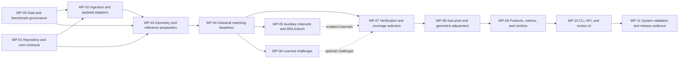

# SELENE-XR Detailed Implementation Plan

## 1. Purpose and status

This document turns the repository's design material into an implementable, evidence-driven plan for SIH26166. It is ordered by technical dependency and risk retirement. It intentionally contains no calendar or effort estimates; progress is controlled by entry conditions, verification evidence, and exit criteria.

The repository includes implemented scientific components and an unqualified
local in-memory registration slice, plus a persistence-integrated operator
platform. The scientific components cover defensive ingestion,
geometry/preflight contracts, matching, verification, coverage selection,
refinement, covariance, limited adjustment, verdicts, and local bundle
validation; only the matching-through-bundle subset is integrated by the local
in-memory slice. The service and web console persist and display real
PostgreSQL/PostGIS records, including registration provenance, semantic
knowledge, reviews, and session-authenticated operators; they do not yet invoke
the scientific slice.

This is still a development foundation, not a completed mission route. It does
not establish held-out mission-data accuracy, the proposed performance gates,
final COG/GeoPackage products, API/CLI scientific parity, or SIH26166
compliance. No capability satisfies a work package merely because a component
or synthetic test exists: its exit criteria require the stated integration and
committed evidence.

### Source authority

This plan reconciles all files currently under `docs`:

1. `docs/context/SELENE-XR-Technical-Verification.md` is authoritative for verified facts, corrected scientific claims, provisional targets, and known unknowns.
2. `docs/context/SELENE-XR-Complete-Technical-Specification.md` supplies the long-term product model, workflows, architecture, data contracts, failure handling, and research backlog.
3. `docs/ppt/Team-Horizon-SELENE-XR-SIH2026-Idea.pdf` supplies challenge framing, intended demonstration content, user value, and presentation context.

When the sources disagree, the technical verification note takes precedence. The complete specification remains useful as a backlog, but it is not evidence of a validated prototype.

### Corrections applied by this plan

| Earlier design claim | Implementation rule used here |
| --- | --- |
| A physical render cancels the modality and illumination gap | Relighting is an auxiliary feature hypothesis. The real reference stays in the verification loop, and an ablation must show whether the channel helps. |
| IIRS can be collapsed into a faithful TMC-2 or NAC panchromatic image | IIRS gets a separate thermal and structural branch. Any TMC-2 or WAC bridge is optional and evaluated independently. |
| LRO NAC is the datum | LRO NAC and SELENE TC are image references with uncertainty. Controlled products and independent lunar-frame control define absolute accuracy where available. |
| Scale is known and never searched | Metadata bounds the pyramid and search. Residual local scale, affine variation, and terrain-dependent deformation are estimated. |
| Synthetic data removes the real-data problem | Synthetic controlled shifts support training and unit truth; held-out real scenes remain mandatory. |
| Cycle closure gives independent accuracy | Closure is a consistency diagnostic that cannot detect common-mode bias. Independent withheld control is required for accuracy. |
| Clark-Evans near 1 proves uniform spacing and the proposed selector has a certified bound | The MVP uses pre-filtering and NMS followed by eligible grid/quadtree selection. Its gates use occupancy, convex-hull coverage, and empty-region measures. No unsupported approximation guarantee is claimed. |
| Exact RMSE, low-sun, throughput, determinism, and tie-point figures are demonstrated | All such values remain provisional until calibrated and frozen on the official dataset; interim benchmark reproduction is not enough to make them final. |
| The presentation alternates between a fixed five-channel representation and a three-channel risk mitigation | No fixed channel count is accepted in advance. Channels use a common contract, are independently toggleable, and remain enabled only where ablation evidence supports them. |
| COG and Zarr are both named as storage formats | COG/GeoTIFF is the MVP registered-raster format. Zarr is deferred until a corpus or multidimensional intermediate access pattern demonstrates a need. |
| The full research and enterprise platform is one prototype | The credible MVP will be implemented first. Advanced rendering, learned-corpus work, graph adjustment, jitter/SFS research, and distributed operations have separate entry criteria. |

### Current implementation snapshot

Status here describes the checked-in implementation, not scientific
qualification. “Partial” means useful code and tests exist but one or more exit
criteria remain unmet.

| Work package | Status | Checked-in evidence | Principal remaining gap |
| --- | --- | --- | --- |
| WP-00 governance | Partial | Schemas, interim route matrix, acquisition/leakage checks, controlled shifts, benchmark runner, and claim ledger | Real integrity-checked route products, frozen splits/control, and published route reports |
| WP-01 foundation | Substantial, exit evidence incomplete | Package boundaries, typed contracts, JSON Schemas, stage runner, hashing, atomic publication, resume/cancel/failure handling, CLI no-op, and tests | Close remaining contract/ADR evidence and prove the complete vertical slice |
| WP-02 ingestion | Partial | Hardened PDS4/PVL parsers, raster allowlist, OHRC/TMC-2/IIRS metadata adapters, registration/quarantine, checksums, and preview provenance | Mission fixtures, calibration and kernel completeness, re-validation workflow, and qualified payload adapters |
| WP-03 geometry/reference | Partial | Lunar CRS and coordinate types, footprint/local geometry, preflight, SPICE inventory/provider contracts, eligibility masks, and PSF-aware pyramids | Independently validated line-scan models and complete LRO/SELENE terrain/control reference routes |
| WP-04 baselines | Partial | Phase correlation, NCC, SIFT and RIFT-class adapters, tiled execution, de-duplication, and robust candidate verification | Frozen mission baseline reports for every claimed route |
| WP-05 auxiliary/IIRS | Partial | Local radiometric normalization, conservative shadow estimation, gradient/phase/self-similarity channels, and IIRS-aware metadata/model hooks | Complete thermal/band policy, route integration, and controlled ablations |
| WP-06 learned challenger | Partial | Dense-flow matcher adapter, local checksummed model registry, training package/configurations, and explicit fallback behavior | Versioned trained artefacts and fair held-out comparison with the baselines |
| WP-07 verification/coverage | Partial | Forward/backward and robust verification, eligible-grid selection, coverage metrics, and deterministic tests | Mission-scale integration and frozen quality/coverage thresholds |
| WP-08 refinement/adjustment | Partial | ECC and upsampled Fourier refinement, covariance estimation/calibration, and robust limited linearized adjustment | Observable terrain-aware sensor correction, adjusted geometry export, and real-route validation |
| WP-09 products/verdicts | Partial | Failure taxonomy, scene-verdict contracts, provenance, CSV/JSON/array local bundles, checksum validation, and tamper tests | COG/GeoTIFF, GeoPackage, adjusted model, complete masks/reports, and qualified accept/review/reject examples |
| WP-10 interfaces/platform | Partial | CLI foundation; persisted FastAPI/PostGIS API; lifecycle, review, idempotency and cursor contracts; two graph APIs; session roles; persisted web console; local Compose stack | Scientific CLI command, service runner, storage publication, retry/resume/output endpoints, typed parity, and full E2E evidence |
| WP-11 release evidence | Not satisfied | Broad unit/property/security tests and opt-in PostgreSQL integration tests provide development evidence | Frozen mission benchmarks, ablations, robustness/accessibility runs, clean install, and demonstration/release bundle |

## 2. Target outcome

The scientific pipeline MVP is complete when a user can provide a calibrated Chandrayaan-2 optical product and a supported reference product, run a reproducible registration through a CLI, API, or review UI, and receive:

- a registered COG/GeoTIFF and an adjusted geometry/model variant without overwriting the original geometry;
- a GeoPackage and CSV catalogue of source/reference correspondences with scores, inlier state, covariance, and selection provenance;
- validity, overlap, illumination/shadow, and coverage masks;
- source-frame correspondence metrics, spatial-coverage metrics, uncertainty diagnostics, and resource diagnostics;
- a content and provenance manifest identifying every input, reference, parameter set, algorithm, code revision, and output checksum;
- an explicit `accept`, `review`, or `reject` verdict with actionable reasons;
- a before/after overlay, residual-vector view, match map, and coverage view;
- evaluation evidence for each supported payload/reference route against classical baselines and held-out data.

The pipeline must fail clearly when inputs, geometry, overlap, reference coverage, matching evidence, or validation evidence are inadequate. Producing no answer with a specific diagnosis is preferable to emitting an unqualified registration.

The project may call the result **SIH26166-compliant** only when the route matrix contains at least one validated end-to-end registration for each required source payload, OHRC, TMC-2, and IIRS, and both named reference families, LRO and SELENE/Kaguya, are represented by validated evaluation routes. A subset is a partial scientific prototype and must be labeled that way.

## 3. Scope boundaries

### 3.1 MVP scope

The MVP includes:

- calibrated PDS4 and ISIS product ingestion;
- safe PDS4 XML, ISIS PVL, and raster parsing;
- checksum, label, dimension, calibration-state, and SPICE-coverage validation;
- payload adapters for OHRC, TMC-2, and IIRS metadata;
- validated OHRC and TMC-2 line-scan geometry paths;
- an explicit validation gate for the IIRS camera/geometry path;
- LROC NAC and SELENE/Kaguya Terrain Camera reference adapters;
- reference terrain/control adapters for appropriate SLDEM, LOLA, regional NAC DTM, and controlled products;
- metadata-guided footprint, overlap, local-GSD, orientation, and search priors;
- common-GSD, MTF/PSF-aware, coarse-to-fine working pyramids;
- classical SIFT/RIFT-class, normalized cross-correlation, and phase-correlation baselines;
- one detector-free learned challenger behind a common matcher interface;
- photometric normalization, shadow/validity masks, gradients, phase, self-similarity, and optional source-lit terrain channels;
- dedicated IIRS thermal/structural preprocessing;
- forward/backward and robust geometric candidate verification;
- NMS followed by grid/quadtree coverage selection over eligible overlap;
- ECC and Fourier sub-pixel refinement with empirical uncertainty calibration;
- robust terrain-aware pushbroom adjustment with a deliberately limited correction model;
- registered image, adjusted geometry, match catalogue, masks, metrics, provenance, and verdict outputs;
- a local CLI, a REST API, and a focused overlay review UI;
- an automated benchmark, ablation, integration, security, and end-to-end test harness.

### 3.2 Deferred research and productionisation

These are not dependencies for declaring the scientific pipeline MVP complete:

- a full custom Hapke/CUDA/OptiX renderer with ray-traced shadows and inter-reflection;
- a large synthetic corpus and full matcher training platform;
- learned pixel-locking bias correction;
- high-frequency platform-jitter estimation;
- multi-payload graph adjustment and loop-closure optimisation;
- alternating shape-from-shading and registration;
- automatic DTM production;
- Celery/RabbitMQ/Redis distributed stage orchestration;
- large campaign management and quota scheduling;
- Keycloak-backed institutional identity and the full role matrix;
- Kubernetes, multi-node object storage, production observability, and automated failover;
- signed release images, signed scientific manifests, and a complete offline installation bundle;
- automated service retention, archival, and audit-lifecycle enforcement;
- Zarr intermediate/corpus storage unless its multidimensional access pattern becomes necessary;
- DFSAR, Chandrayaan-1, or general planetary mission support.

### 3.3 Non-goals

The implementation must not expand into:

- defining or maintaining a lunar geodetic datum;
- claiming centimetre-level absolute location from sub-pixel image correspondence;
- scientific interpretation such as mineral mapping, crater counting, or change detection;
- raw instrument radiometric calibration beyond documented preprocessing needed for matching;
- a general-purpose GIS or planetary image viewer;
- reconstruction of terrain detail absent from the available DTM;
- anonymous public processing or mutually hostile multi-tenant isolation;
- registration through an unqualified payload/reference route, or absolute-accuracy claims when independent control is absent; a qualified route may still issue a scene verdict without scene-specific control under Section 10.

## 4. Decisions and unknowns to resolve

The decision register is part of the implementation, not an appendix. Each resolved item must produce an ADR or benchmark-manifest revision.

| ID | Decision or unknown | Evidence required | Blocks |
| --- | --- | --- | --- |
| D-001 | Official SIH product IDs and benchmark split are unavailable | Organizer release or written clarification; until then, an explicitly interim public-data manifest | Freezing final acceptance thresholds |
| D-002 | Authoritative control/reference realization for absolute map error | Named controlled products, coordinate frame, vertical datum, uncertainty, and version | Absolute error in metres |
| D-003 | Required source/reference route matrix, especially direct IIRS-to-NAC versus a structural bridge | Challenge clarification plus feasibility results from representative products | Final IIRS acceptance route |
| D-004 | Rigorous IIRS camera/geometry support | Label review, sensor documentation, a working adapter, and independent footprint/check-point validation | Claiming IIRS end-to-end support |
| D-005 | PSF/MTF data availability for each sensor | Instrument documentation or a recorded empirical-estimation method with uncertainty | Sensor-faithful PSF matching |
| D-006 | Reference-data access, redistribution, and credential constraints | Dataset license/access review and a versioned acquisition manifest | Reproducible fixtures and release packaging |
| D-007 | Construction of independent withheld check points | Defined reviewer protocol, uncertainty model, and leakage controls | Source-frame RMSE gate |
| D-008 | Quality-verdict policy around incomplete control data | Approved rule defining which missing metrics force `review` versus `reject` | Automated verdict engine |
| D-009 | Accepted adjusted-geometry interchange for each payload | Round-trip tests with downstream ISIS/CSM consumers | Geometry deliverable |
| D-010 | Resource envelope for the demonstration environment | Measured CPU, RAM, GPU/VRAM, storage, and offline constraints | Performance tuning and packaging, not scientific correctness |

Resolved challenge interpretations:

- sub-pixel correspondence is evaluated in the source-image frame;
- distribution is evaluated over the physically eligible valid overlap;
- numeric gates remain provisional until the official data split is frozen;
- image-relative and absolute surface accuracy are reported separately.

## 5. Architecture and repository design

### 5.1 System boundaries



The core rules are:

- `selene_core` has no dependency on HTTP, ORM, queues, Redis, object-store SDKs, or UI code.
- The completed CLI must execute the full scientific path locally using files
  and manifests. The current CLI exposes environment inspection, trusted-local
  product registration, lifecycle no-op, and run-integrity commands only.
- The API must call the same core functions and must not contain a second
  scientific implementation. The current persisted API does not yet execute a
  scientific run.
- Worker adapters, when introduced, carry identifiers and immutable parameter snapshots rather than caller-controlled paths or credentials.
- Original input bytes and geometry remain immutable. Corrected geometry and registered products are named derived variants.
- Persistent job state has one authority. Ephemeral progress and queued work never become competing state stores.
- The service profile uses PostgreSQL/PostGIS as that authority; the standalone CLI uses a self-contained run manifest and does not pretend to be a multi-user service.
- Every raster-producing or raster-consuming stage is tiled. A shared `TileSpec` declares core size, halo, valid window, memory/scratch budget, and merge rule; no stage loads a full OHRC frame.
- Stage and final outputs are written to a temporary location, flushed, checksummed, schema-validated, and atomically published. Stale partial outputs are never discoverable as successful artefacts.

### 5.2 Repository layout

```text
.
├── web/                              React/TypeScript operator console
├── packages
│   ├── selene_core/
│   │   └── src/selene_core/
│   │       ├── ingest/              PDS4, ISIS, payload adapters
│   │       ├── geometry/            SPICE, sensor models, projections, typed coordinates
│   │       ├── reference/           NAC, SELENE, terrain, and control adapters
│   │       ├── preprocess/          calibration checks, pyramids, PSF, masks
│   │       ├── features/            radiometric and structural channels
│   │       ├── match/               baselines, learned adapter, verification
│   │       ├── select/              eligibility, NMS, grid/quadtree selection
│   │       ├── refine/              ECC, Fourier, covariance
│   │       ├── adjust/              robust terrain-aware sensor adjustment
│   │       ├── metrics/             accuracy, coverage, diagnostics, verdicts
│   │       ├── products/            raster, geometry, catalogue, report, manifest
│   │       ├── pipeline/            local stage runner and immutable stage results
│   │       └── types.py             coordinate, match, covariance, and result types
│   ├── selene_client/               CLI and API client
│   ├── selene_service/              FastAPI, persistence, auth, product/run and graph APIs
│   └── selene_worker/               optional long-stage adapters
├── schemas/                         input, parameter, match, metric, report, manifest schemas
├── configs/                         versioned non-secret scientific parameter sets
├── benchmarks/
│   ├── manifests/                   product IDs, hashes, splits, control uncertainty
│   ├── expected/                    schema-level and small numeric expectations
│   └── scripts/                     acquisition checks and benchmark runner
├── tests/
│   ├── unit/
│   ├── property/
│   ├── integration/
│   ├── science/
│   ├── security/
│   └── e2e/
├── infra/
│   └── compose/                     local PostGIS/service/web/MinIO profiles
└── docs/
    ├── adr/
    ├── context/
    ├── methods/
    ├── runbooks/
    └── ppt/
```

Large mission products, credentials, SPICE kernels, model weights, and generated rasters must not be committed to Git. Git stores manifests, checksums, acquisition instructions, small permitted fixtures, and expected results.

### 5.3 Architecture decisions

Keep the ADR status index aligned with the implementation. Proposed records are
not retrospective approval merely because related code exists; they must be
reviewed and accepted explicitly.

- ADR-001: internal pixel-centre convention and named ISIS/GDAL conversions;
- ADR-002: lunar body-fixed frame, map projection selection, and CRS serialization;
- ADR-003: source-frame versus reference-frame metric definitions;
- ADR-004: reference authority and uncertainty propagation;
- ADR-005: package import boundaries;
- ADR-006: immutable inputs, stage results, and provenance hashing;
- ADR-007: matcher plugin and common correspondence contract;
- ADR-008: eligibility mask and spatial-coverage definition;
- ADR-009: adjustment parameterization and observability limits;
- ADR-010: verdict semantics and fail-closed rules;
- ADR-011: benchmark split and leakage prevention;
- ADR-012: IIRS thermal/structural processing and unsupported-band policy;
- ADR-013: stage resume, retry, cancellation, atomic publication, and downstream invalidation;
- ADR-014: service state authority, minimum persistence model, and transaction boundaries;
- ADR-015: loopback-only versus authenticated network service boundary;
- ADR-016: session-based operator authentication and fixed local role model.

### 5.4 Minimum service persistence model

The CLI remains infrastructure-independent, but the REST service needs concrete durable state. Implement PostgreSQL/PostGIS migrations for at least:

| Entity | Minimum responsibility |
| --- | --- |
| `subjects` / `api_keys` | Minimal non-loopback service identities, hashed scoped credentials, revocation, and audit identity; omitted only in enforced loopback mode |
| `user_accounts` / `user_sessions` | Argon2-hashed local operator accounts, fixed role, activity/lockout state, revocable server-side session, and bootstrap/creator provenance |
| `products` | Input identity, owner/scope, payload, validation state, manifest hash, footprint, and quarantine reason |
| `runs` | Frozen source, reference, parameters, algorithm/model versions, execution state, computed verdict, effective disposition, and code/environment identity |
| `run_stages` | Ordered stage, attempt, state, input/output hashes, lease or local claim, warning/failure, and atomic completion marker |
| `artifacts` | Kind, URI/key, media type, bytes, checksum, schema/CRS metadata, publication state, and owning run/stage |
| `metrics` | Versioned report document plus indexed fields needed for filtering and gates |
| `reviews` | Immutable actor, decision, reason code, note, source computed verdict, and recorded timestamp |
| `idempotency_records` | Subject, operation/key, request-body hash, stored response/result ID, and expiry policy |
| `run_events` | Append-only state, stage, warning, failure, review, and override history for progress and audit |
| `knowledge_entities` | Explicit semantic entity type, external ID, label, JSON properties, optional lunar point/CRS, creator, and timestamp |
| `knowledge_edges` | Explicit directed source/target relation, JSON properties, optional weight, creator, and timestamp |

State transitions and the corresponding event, artefact registration, metric registration, or review record commit in one database transaction. Image bytes remain in a filesystem or S3-compatible store; the database records only validated published objects. Migrations are versioned and integration-tested against a real PostgreSQL/PostGIS instance.

### 5.5 Registration provenance and semantic knowledge

The platform has two graph contracts, and clients must not merge their
semantics:

1. The **registration provenance graph** is derived at read time from durable
   subjects, products, runs, stages, artefacts, metrics, and reviews. It is a
   navigational projection of service state, not a separately editable source
   of truth. `/registration-graphs` is the canonical route and
   `/knowledge-graph` remains a compatibility alias.
2. The **semantic knowledge graph** is explicit domain data stored in
   `knowledge_entities` and `knowledge_edges`. Entity and relation vocabularies
   are extensible; stored examples may include craters, observations, payloads,
   terrain, morphology features, registration jobs, and data products.

Semantic queries are bounded, cursor-paginated, case-insensitive literal
label/external-ID retrieval with exact entity/relation filters. Direct-neighbor
and crater-observation routes return only persisted relationships. The service
must never present lexical retrieval as vector similarity, infer missing
relationships, auto-seed scientific facts, or use the semantic graph as proof
of registration accuracy. Every mutation is attributed and idempotent when an
idempotency key is supplied.

## 6. Shared scientific and data contracts

These contracts must exist before independent algorithm branches are developed, otherwise outputs will be incomparable.

### 6.1 Coordinate and unit types

Provide explicit types or dataclasses for:

- `SourcePixel(line, sample)` and `ReferencePixel(line, sample)` with a declared centre convention;
- `MapCoordinate(x_m, y_m, crs_wkt)`;
- `BodyFixedCoordinate(x_m, y_m, z_m, frame)`;
- `SelenographicCoordinate(longitude_deg, latitude_deg, radius_m, frame)`;
- `LocalWarpJacobian`, used for cross-frame residual conversion;
- `Covariance2D(xx, xy, yy, frame, units)`;
- `TileSpec(core_window, halo_px, valid_window, merge_rule, memory_budget_bytes, scratch_budget_bytes)` shared by every raster stage;
- acquisition time in UTC at interfaces and SPICE ephemeris time internally;
- angles with `_deg` or `_rad` suffixes and distances with `_m`, `_px`, or `_m2` suffixes.

Inline half-pixel corrections are forbidden. Conversion functions are named, tested, and documented.

### 6.2 Product input manifest

Each source or reference product record must include:

- stable product and mission identifiers;
- payload/reference family and product level;
- data, label, kernel, calibration, and auxiliary file locations;
- SHA-256 for every file;
- acquisition interval and calibration state;
- raster shape, dtype, nodata, band metadata, and reported GSD;
- geometry adapter and adapter version;
- frame, projection, datum/control realization, and their versions;
- access and redistribution notes;
- ingestion warnings and validation status.

### 6.3 Reference bundle manifest

Record the exact image references, terrain sources, control sources, albedo/photometry sources, coverage masks, uncertainty layers, resampling choices, and version identifiers. The manifest must distinguish image reference from geodetic control and state which source supports each accuracy claim.

### 6.4 Correspondence record

The canonical record must contain at least:

| Group | Fields |
| --- | --- |
| Identity | Match ID, job ID, algorithm, algorithm version, tile/level, selection reason |
| Position | Source line/sample, reference line/sample, optional ground coordinate and frame |
| Evidence | Raw score, calibrated confidence if available, descriptor/channel agreement, forward/backward error |
| Geometry | Prior displacement, residual from prior, robust-model residual, local warp Jacobian |
| Refinement | Coarse and refined locations, estimator identities, estimator disagreement |
| Uncertainty | `cov_xx`, `cov_xy`, `cov_yy`, covariance method, calibration status |
| Quality | Candidate/inlier/withheld-check-point flags, rejection reason, NMS status |
| Coverage | Eligible cell, grid/quadtree level, selected/not selected, selection rationale |
| Provenance | Input/reference hashes, parameter-set hash, code revision |

Training points, fitting inliers, and withheld check points must be disjoint and explicitly flagged.

### 6.5 Stage result protocol

Every scientific stage returns an immutable result containing:

- input manifest hashes and the exact parameter subset read;
- outputs with type, path, media type, checksum, shape, CRS, nodata, and units;
- warnings, failure code, retryability, and remediation hint;
- stage metrics and validity-mask summary;
- algorithm and dependency versions;
- deterministic seed where applicable;
- start/end instrumentation for runtime and resource reporting;
- code revision and environment fingerprint;
- publication state and atomic commit identifier.

For resume, the runner may reuse a completed stage only when its recorded input hashes, parameter subset, code/algorithm version, output checksums, and schemas all match. A changed upstream input invalidates that stage and every downstream result. Cancellation leaves the last atomically completed stage reusable, marks scratch/partial output orphaned, and never publishes it. Retry policy is keyed by stable failure code; deterministic validation and scientific gate failures do not retry automatically.

### 6.6 Metric report schema

Two related reports use the same schema but different applicability rules:

- a **route-qualification report** evaluates an algorithm/parameter/reference route on the frozen benchmark and is the authority for held-out accuracy claims;
- a **scene report** qualifies one user product using observable scene evidence and cites the route-qualification version. Arbitrary user scenes generally do not contain independent withheld control.

Metric groups are:

- source-frame `RMSE_x`, `RMSE_y`, `RMSE_2D`, median endpoint error, P90, and CE90 on withheld check points, required for route qualification and optional for a scene only when independent control exists;
- optional absolute horizontal error in metres with the independent control source and its uncertainty;
- candidates, verified inliers, inlier ratio, estimator failures, and automated outcome rate;
- eligible area, eligible-cell occupancy, convex-hull/valid-overlap ratio, and largest empty region/run;
- illumination, view/emission, local-GSD ratio, terrain, overlap, and reference-quality strata;
- forward/backward error, residual spatial structure including optional Moran's I with its neighborhood/null-model definition, local-warp diagnostics, runtime, memory, and device information;
- an optional cycle-closure field reserved for post-MVP graph adjustment and labeled as consistency rather than accuracy;
- per-gate observed value, threshold, applicability, pass state, and evidence source;
- provenance and limitations.

Metrics that cannot be computed are `null` with a reason. They are never replaced with zero or omitted.

## 7. Dependency-ordered work packages



WP-07 can operate on WP-04 baseline candidates. WP-05 and WP-06 may be developed independently after the baseline contracts are stable, and neither may redefine the correspondence or metric schema. The IIRS portion of WP-05 is mandatory for SIH-compliant IIRS support; the learned challenger may remain experimental without blocking the classical pipeline.

The presentation's S0-S6 labels map to the corrected work packages as follows:

| Presentation stage | Corrected implementation responsibility |
| --- | --- |
| S0 Prime | WP-02 ingestion plus WP-03 sensor geometry, footprint, local GSD, and measured prior |
| S1 Reference | WP-03 image, terrain, control, uncertainty, masks, and PSF-aware pyramids |
| S2 Render | WP-05 optional source-lit terrain/photometric channels; not exact modality cancellation or 3-D reconstruction |
| S3 Match | WP-04 classical baselines plus the optional WP-06 detector-free challenger |
| S4 Select | WP-07 quality verification, NMS, eligibility, and grid/quadtree coverage selection |
| S5 Refine | WP-08 ECC/Fourier refinement and covariance calibration |
| S6 Adjust | WP-08 terrain-aware pushbroom adjustment and residual diagnostics |
| Finalize | WP-09 products, reports, provenance, and computed verdict; products are not published before S6 |

Any calibration feedback loop is a separately recorded rerun with new parameters, not a normal S6-to-S0 state transition.

### WP-00: Data and benchmark governance

**Objective:** establish reproducible data, truth, splits, and evidence before algorithm claims are made.

**Implementation tasks**

1. Create the benchmark manifest schema and acquisition checker.
2. Assemble an interim public product matrix covering OHRC, TMC-2, IIRS, LROC NAC, SELENE TC, representative terrain sources, solar-angle differences, GSD ratios, relief classes, and overlap fractions.
3. Record product IDs, source URLs, credentials needed, licenses/access conditions, byte sizes, checksums, labels, kernel sets, calibration files, and reference versions.
4. Keep spatially related crops, repeated acquisitions, or products from the same local terrain group in one split to prevent geographic leakage.
5. Define train/development, validation, and held-out test roles without using held-out scenes for parameter tuning.
6. Define an independent check-point protocol. Record reviewer identity or process, point covariance, control uncertainty, disagreement handling, and excluded points.
7. Generate small controlled-shift fixtures with exact sub-pixel truth for unit and calibration tests. Clearly label them synthetic.
8. Define stress bins for payload, reference family, solar-angle difference, view/emission angle, direction-independent GSD ratio, terrain class, overlap, and reference quality.
9. Implement a benchmark runner that produces a schema-valid report even when an algorithm fails.
10. Add a claim ledger linking every README or presentation result to a benchmark run ID and immutable report.

**Outputs**

- versioned benchmark manifests and split definitions;
- acquisition and integrity checker;
- independent-control protocol;
- controlled-shift fixture generator;
- benchmark runner and empty baseline report;
- dataset/access risk record.

**Verification**

- all referenced files pass checksum checks;
- split-leakage tests fail when related terrain appears across protected splits;
- synthetic fixtures round-trip to their declared shifts within the fixture-generation tolerance;
- the runner records failed and rejected scenes rather than dropping them from success-rate calculations.

**Exit criteria**

- at least one legally usable, integrity-checked candidate route exists for each of OHRC, TMC-2, and IIRS;
- both LRO and SELENE/Kaguya reference families are represented in the route matrix;
- an IIRS route and any still-missing geometry evidence are recorded explicitly; unresolved geometry keeps the overall deliverable partial and blocks SIH-compliant completion;
- every provisional gate has a formula, frame, population, and evidence source;
- no quantitative project claim exists outside the claim ledger.

### WP-01: Repository foundation and core contracts

**Objective:** create a testable monorepo and make coordinate, configuration, failure, and provenance mistakes difficult to express.

**Implementation tasks**

1. Create Python packages for `selene_core`, `selene_client`, `selene_service`, and `selene_worker`, plus the TypeScript web workspace.
2. Configure reproducible dependency locks, formatting, linting, static typing, unit tests, property tests, secret scanning, and license inventory.
3. Enforce package import directions in CI.
4. Implement the typed coordinate, units, covariance, product manifest, reference bundle, correspondence, stage result, metrics, and failure-code contracts from Section 6.
5. Add JSON Schemas for parameters, inputs, outputs, metrics, provenance, and verdicts; reject unknown scientific-parameter fields.
6. Implement structured logging with run, product, route, stage, algorithm, and trace identifiers. Do not log imagery, tokens, credentials, or signed URLs.
7. Implement immutable local artefact manifests and checksum verification. Use input/result hashes for resume validation; a distributed content-addressable store remains optional.
8. Implement the shared tile/halo contract and require every raster stage to declare memory, scratch, validity, and merge behavior.
9. Create a local stage runner with deterministic seed plumbing, cancellation checkpoints, stable retry rules, restart from the last verified stage, and downstream invalidation when inputs or parameters change.
10. Implement temporary writes, checksum/schema validation, atomic rename or publish, and orphan/scratch cleanup for stage and final artefacts.
11. Create a no-op CLI command and an interrupted/restarted no-op stage fixture to prove packaging, configuration, atomic result writing, resume, cancellation, and error propagation.
12. Add the required ADRs and contributor documentation.

**Outputs**

- installable Python packages and web workspace;
- common schemas and typed models;
- local stage runner and artefact protocol;
- shared tiling, resume, cancellation, and atomic-publication protocol;
- baseline CI pipeline;
- architecture decision records.

**Verification**

- forbidden imports fail CI;
- coordinate conversions and schema round trips are tested;
- invalid units, unknown parameters, non-positive covariance, and absent checksums are rejected;
- a no-op job produces a complete manifest and intentional failure produces a stable error envelope;
- process interruption cannot expose a partial result, and restart reuses only checksum-verified compatible stages.

**Exit criteria**

- a new scientific stage can be implemented without importing service infrastructure;
- every stage can return success, warning, rejection, or failure through one contract;
- the core package runs in a clean local environment with no database, queue, or browser.

### WP-02: Secure ingestion and payload adapters

**Objective:** turn calibrated mission products into trustworthy normalized inputs without losing original metadata or geometry.

**Implementation tasks**

1. Implement file registration by manifest and local path for the trusted CLI only; add API upload registration through server-generated storage identifiers in WP-10 and never accept arbitrary server paths from an API client.
2. Parse PDS4 XML with DTD loading, entity expansion, and external entity resolution disabled. Apply size, recursion, and resource limits.
3. Parse ISIS/PVL under equivalent size and recursion limits.
4. Open rasters through a GDAL driver allow-list with remote virtual filesystems disabled for caller-controlled paths.
5. Verify checksums, dimensions, dtype, nodata, band count, calibration state, acquisition interval, label/raster agreement, and declared payload.
6. Preserve exact input bytes and write normalized preview/working products as derived artefacts.
7. Implement a shared `PayloadAdapter` protocol for metadata, calibration status, timing, band information, sensor geometry inputs, PSF/MTF metadata, and quality masks.
8. Implement OHRC and TMC-2 adapters using documented ISIS/ALE/usgscsm or equivalent validated paths.
9. Implement the IIRS metadata adapter with label-driven bands, bad-band information, wavelength/FWHM data, reflected-versus-emitted regime markers, and an explicit `geometry_validated` state.
10. Furnish only allow-listed SPICE kernels and record exact kernel names, hashes, coverage, priority, and reconstructed/predicted status.
11. Quarantine invalid products with stable reasons and make re-validation possible after kernels or metadata are corrected.
12. Generate small permitted parsing fixtures and malicious XXE, archive, path traversal, malformed label, decompression, and raster-driver fixtures.
13. Invoke ISIS/GDAL/native command-line tools only with argument arrays and a shell-disabled subprocess API. Reject caller-derived leading-option arguments, use an allow-listed environment, apply process time/resource limits, and capture bounded diagnostics.

**Outputs**

- payload-adapter API and three metadata adapters;
- normalized product manifest and derived preview;
- kernel inventory and coverage report;
- quarantine and re-validation behavior;
- secure parser fixture suite.

**Verification**

- parsed metadata matches labels and independent tools on representative products;
- raster/label shape disagreement and missing kernel intervals are caught before processing;
- malicious fixtures cannot read local files, expand entities, escape paths, open remote URLs, or exhaust configured resources;
- IIRS support remains marked incomplete until D-004 is resolved.

**Exit criteria**

- representative products can be ingested reproducibly with stable hashes and complete manifests;
- OHRC and TMC-2 are geometry-ready;
- IIRS preprocessing metadata is available and its geometry validation status is honest and machine-readable.

### WP-03: Geometry prior and reference preparation

**Objective:** construct a measured spatial prior, valid overlap, reference bundle, and resolution-aware working representation.

**Implementation tasks**

1. Instantiate validated sensor models and compute per-line or sampled pose using SPICE and product timing.
2. Compute footprints by ray/terrain intersection over a boundary and interior grid, not four corners alone.
3. Validate footprints against published footprints or independent tools and report disagreement.
4. Select an explicit lunar body-fixed frame and per-scene projection; serialize the full CRS in every raster and geometry artefact.
5. Compute local GSD and view/emission geometry over the scene rather than using one scale constant.
6. Forward-project a grid through source and reference models to form a coarse displacement, local-scale, and orientation prior with uncertainty.
7. Implement reference adapters for LROC NAC and SELENE TC imagery and catalogue their control status.
8. Implement terrain/control adapters for SLDEM, LOLA, controlled mosaics, polar products, and regional NAC DTMs. Treat SLDEM2015 as roughly 60 m/pixel at the equator and limited to about 60 degrees south to 60 degrees north; select LOLA or appropriate polar products outside that coverage and never use SLDEM to imply OHRC-scale texture.
9. Build a reference bundle with exact versions, coverage, resolution, vertical/horizontal uncertainty, masks, and resampling history.
10. Prefer controlled products where available. Never silently promote an uncontrolled image to datum status.
11. Construct common-resolution pyramids using local GSD. Apply measured MTF/PSF matching when D-005 is resolved; otherwise use a documented fallback and label its uncertainty.
12. Estimate residual local scale/affine range for the matcher rather than treating metadata as exact.
13. Build overlap, nodata, terrain-coverage, and preliminary illumination eligibility masks.
14. Add preflight output showing overlap, reference/control quality, GSD range, expected search bounds, and reasons the route may be inadmissible.

**Outputs**

- validated source/reference sensor-model objects;
- footprints, local projection, per-line/sample geometry, and local-GSD maps;
- prior displacement and uncertainty field;
- versioned reference bundle and masks;
- PSF-aware working pyramids;
- preflight report.

**Verification**

- ISIS/GDAL/CSM/pixel coordinate round trips meet declared numerical tolerance;
- known control points reproject consistently within their combined uncertainty;
- prior error is measured against withheld correspondences and reported as a distribution;
- pyramid impulse/edge tests verify blur-before-downsample behavior and prevent aliasing;
- polar and longitude-wrap footprints remain valid.

**Exit criteria**

- a real OHRC and TMC-2 scene each produce a validated footprint and overlap;
- the search prior contains empirically measured uncertainty rather than an assumed fixed radius;
- reference/control uncertainty is available to downstream metrics and adjustment.

### WP-04: Classical baseline pipeline

**Objective:** establish simple, reproducible performance before auxiliary physics or learned methods are credited.

**Implementation tasks**

1. Define a `Matcher` interface that consumes typed pyramid tiles, masks, priors, and parameter snapshots and emits canonical correspondence records.
2. Implement global/coarse phase correlation within metadata-bounded search regions.
3. Implement local normalized cross-correlation with peak sharpness and ambiguity measures.
4. Implement SIFT and a RIFT-class multimodal baseline where implementation and licensing allow; document any substituted method.
5. Support direction-independent finer/coarser GSD ratios and local residual scale/affine estimation.
6. Tile large images with halos, deterministic overlap deduplication, and tile provenance.
7. Apply mask-aware normalization so nodata, mutually unusable shadow, borders, and terrain gaps do not become features.
8. Add mutual-nearest or forward/backward checks and an initial robust geometric filter.
9. Record every algorithm parameter and candidate, including rejected candidates and reasons.
10. Run all baselines through the same benchmark and metric schema.

**Outputs**

- common matcher interface;
- phase-correlation, NCC, SIFT, and RIFT-class baseline adapters;
- tiled matching and deduplication;
- baseline benchmark reports and failure examples.

**Verification**

- controlled shifts recover translation and residual scale within declared tolerance;
- source/reference direction reversal yields consistent converted errors;
- algorithms respect masks and priors;
- failure scenes remain in aggregate success/rejection statistics;
- hand-inspected match maps agree with the recorded candidate/inlier counts.

**Exit criteria**

- at least one classical path completes OHRC and TMC-2 routes end to end through coarse correspondences;
- benchmark reports establish the performance floor that later methods must beat;
- no learned or physics-assisted claim is needed to demonstrate the plumbing.

### WP-05: Photometric, structural, and IIRS feature branches

**Objective:** add defensible auxiliary channels and a scientifically correct IIRS path without claiming exact modality cancellation.

**Implementation tasks**

1. Implement local radiometric normalization with explicit masks and no extrapolation into invalid areas.
2. Implement gradient magnitude/orientation, phase-congruency or equivalent phase features, and local self-similarity channels.
3. Estimate source dark/shadow masks conservatively and preserve penumbra/uncertain regions as uncertainty rather than binary truth.
4. Implement source-lit hillshade or a portable Hapke-inspired terrain channel using the available DTM, local illumination, and view geometry.
5. Keep the real reference imagery in every match/verification path. Do not generate texture finer than the terrain/albedo inputs support.
6. Record DTM resolution and uncertainty in the auxiliary-channel confidence mask.
7. Make each channel individually toggleable so identical runs can form an ablation.
8. For IIRS, separate reflective and thermally influenced ranges using label wavelengths and documented thermal correction.
9. Reject unusable/bad or low-SNR bands; preserve the exact selection and reason.
10. Produce structural composites from selected bands using PCA, gradient energy, phase, or learned cross-spectral features.
11. Evaluate optional TMC-2 or WAC structural bridges only where spectral and spatial overlap is defensible.
12. Report IIRS results separately from panchromatic routes.

**Outputs**

- versioned auxiliary-channel generators and confidence masks;
- simple relighting/hillshade hypothesis behind a feature flag;
- dedicated IIRS thermal/structural product;
- per-channel and combined ablation reports.

**Verification**

- disabling all auxiliary channels reproduces the WP-04 baseline;
- each claimed benefit is supported by held-out real-data deltas with uncertainty, not selected screenshots;
- channel output remains bounded, finite, correctly masked, and aligned;
- IIRS selected bands, thermal handling, and structural composite are reproducible from the label and parameters.

**Exit criteria**

- beneficial channels are retained with measured strata where they help;
- neutral or harmful channels stay disabled by default;
- no README or presentation claim says relighting removes all illumination effects or recreates absent fine texture.

### WP-06: Detector-free learned challenger

**Objective:** compare one detector-free learned path fairly against the classical baselines while keeping a functional fallback.

**Implementation tasks**

1. Add a model adapter compatible with the common matcher contract.
2. Evaluate a pinned LoFTR/RoMa-lineage checkpoint and record model license, weights hash, preprocessing, device, precision, and operator support.
3. Condition coarse search on the measured metadata prior without preventing residual local-scale correction.
4. Evaluate raw imagery and the retained WP-05 channel combinations through a fixed ablation matrix.
5. Calibrate confidence against actual held-out endpoint error if the model exposes confidence; otherwise label it an uncalibrated score.
6. Add forward/backward, mutual, prior-deviation, and local-consistency filters identical in semantics to baseline verification.
7. Use controlled synthetic shifts for pretraining or calibration only after the real split is frozen. Prevent synthetic terrain or patches derived from held-out regions from leaking into training.
8. Add self-supervised or few-shot real adaptation only on the development split.
9. Measure runtime, peak memory, failure rate, confidence calibration, and accuracy across stress bins.
10. Preserve automatic fallback to a classical method and record which path produced every match.

**Outputs**

- pinned learned matcher adapter;
- optional training/adaptation recipe and manifests;
- confidence-calibration report;
- direct baseline/challenger comparison.

**Verification**

- benchmark inputs, masks, metrics, and held-out scenes are identical across methods;
- failure or OOM does not discard the scene and can invoke a recorded fallback;
- the learned path is never credited with a synthetic-only gain as if it were real-data accuracy;
- model outputs conform to the correspondence schema.

**Exit criteria**

- the challenger either demonstrates a reproducible held-out benefit and is enabled for the relevant strata, or remains experimental without blocking MVP completion;
- at least one classical fallback remains a first-class supported path.

### WP-07: Candidate verification and coverage-aware selection

**Objective:** select geometrically credible correspondences with measurable spatial support across the eligible overlap.

**Implementation tasks**

1. Normalize candidate scores within each algorithm without pretending scores are comparable across algorithms until calibrated.
2. Apply forward/backward consistency, mutual-nearest checks where applicable, prior uncertainty gates, and duplicate removal.
3. Fit a robust local geometric or sensor-aware model to identify gross outliers. Use a homography only as a diagnostic baseline, never as the final terrain-aware model.
4. Define eligibility as valid source and reference data inside physical overlap and supported terrain/illumination regions. Record why every excluded cell is ineligible.
5. Apply quality filtering and spatial NMS before coverage selection.
6. Implement a deterministic 8 by 8 eligible grid selector first, with per-cell quality ranking and a global quality floor.
7. Add adaptive quadtree selection only after the fixed grid is tested and only if it improves coverage/accuracy trade-offs.
8. Keep measured, interpolated, and any derived points distinct. Derived points cannot count as verified inliers or occupied measured cells.
9. Compute eligible-cell occupancy, convex-hull/valid-overlap ratio, largest empty region/run, per-cell count distribution, and a visual coverage map.
10. Optionally report Clark-Evans only with its correct interpretation as complete spatial randomness near one; do not use it as proof of regular spacing.
11. Tune coverage-versus-quality choices only on the development split and assess their effect on withheld error.

**Outputs**

- candidate verification pipeline;
- eligibility mask with exclusion reasons;
- deterministic grid selector and optional quadtree selector;
- coverage metrics and coverage raster/vector product;
- selected tie-point set with complete selection provenance.

**Verification**

- metric bounds and behavior are property-tested on empty, clustered, regular, shadowed, partially overlapping, and edge-only patterns;
- NMS occurs before coverage scoring;
- ineligible cells cannot improve or reduce eligible occupancy;
- synthetic derived points cannot satisfy measured-point gates;
- selection is deterministic for fixed inputs and parameters.

**Exit criteria**

- provisional eligible occupancy can be evaluated consistently on every route;
- a failure names whether the cause is insufficient candidates, quality, overlap, illumination, or distribution;
- coverage improvements do not hide a regression in held-out source-frame error.

### WP-08: Sub-pixel refinement and terrain-aware adjustment

**Objective:** convert verified coarse matches into uncertainty-bearing measurements and adjust sensor geometry without overstating absolute accuracy.

**Implementation tasks**

1. Extract mask-aware local patches in source and reference working representations.
2. Implement inverse-compositional ECC refinement and band-limited Fourier upsampled phase correlation as independent estimators.
3. Record convergence, peak ambiguity, patch texture, estimator displacement, and estimator disagreement.
4. Estimate anisotropic covariance from the local Hessian where valid and calibrate it empirically with controlled shifts, bootstrap/perturbation tests, and reliability diagrams.
5. Reject non-positive covariance. If covariance is not yet empirically calibrated, retain an otherwise valid match only with `covariance_status = uncalibrated`, exclude it from uncertainty-dependent acceptance gates, and force the affected scene to `review` where policy requires. Down-weight directionally weak but valid covariance rather than converting it to one scalar.
6. Do not add learned pixel-locking correction until a held-out controlled-shift evaluation proves benefit without out-of-domain harm.
7. Withhold designated check points from all fitting and parameter tuning.
8. Implement a terrain-aware pushbroom adjustment using validated sensor models, reference/control uncertainty, per-match covariance, and robust loss.
9. Begin with an observable, limited parameter set such as position/attitude bias and low-order line-dependent correction. Add complexity only when residual diagnostics and information-rank tests justify it.
10. Propagate parameter and reference uncertainty to reported correspondence and ground uncertainty where supported.
11. Compute the local warp Jacobian for unit conversion and never use one scene-wide pixel scale across sensors.
12. Report residual vectors, relief correlation, scan-direction structure, rank/conditioning, and in-sample versus withheld error. Optionally report Moran's I only with its spatial weights, null model, and significance method; it diagnoses residual structure and is not an accuracy measurement.
13. Preserve the original sensor state and export the adjusted state as a variant.

**Outputs**

- independently refined measurements;
- per-match covariance with explicit calibrated or uncalibrated status, plus estimator diagnostics;
- robust terrain-aware adjustment;
- adjusted geometry/model variant and parameter covariance where observable;
- withheld source-frame and optional absolute-control metrics;
- residual and uncertainty maps.

**Verification**

- controlled shifts cover integer, half-pixel, arbitrary phase, blur, noise, low texture, and anisotropic ridge cases;
- covariance coverage is checked empirically rather than assumed from a Hessian formula;
- analytic derivatives, if introduced, are checked against complex-step or high-precision references;
- withheld points are absent from solver inputs;
- synthetic, image-relative, and absolute-control results are reported in separate fields;
- over-parameterized or rank-deficient adjustment rejects or reduces its model explicitly.

**Exit criteria**

- held-out source-frame metrics are computable for route qualification;
- scene-level metrics remain computable on arbitrary inputs without pretending that internal fit points are independent check points;
- the provisional primary and stretch gates are represented as targets, with pass state determined only from valid check points;
- residual maps show whether remaining error is matching-, geometry-, or terrain-limited;
- no absolute metre claim is made without D-002 and a propagated uncertainty budget.

### WP-09: Products, metrics, provenance, and verdicts

**Objective:** turn a scientific result into interoperable, auditable, and honestly qualified deliverables.

**Implementation tasks**

1. Write registered imagery as tiled COG/GeoTIFF with full lunar CRS, nodata, overviews, source/job IDs, and quality status.
2. Export adjusted CSM/ISIS-compatible geometry where D-009 has a passing round trip. Keep original geometry intact.
3. Write matches as GeoPackage and CSV using the canonical schema. Add GeoJSON only as a convenience for bounded result sizes.
4. Write validity, overlap, shadow/illumination, coverage, residual, and uncertainty products with units and CRS. Label an offset raster `three_sigma` only when covariance is calibrated and its stated coverage assumption has been validated; otherwise emit a generic uncertainty layer with calibration status and no unsupported confidence label.
5. Emit versioned route-qualification and scene JSON metrics plus human-readable reports that contain the same values rather than recomputing them.
6. Generate before/after overlays, residual-vector visualization, eligible grid, and tie-point map from the actual output files.
7. Create a manifest containing hashes, sizes, media types, schemas, input/reference versions, control realization, parameters, models, dependencies, code revision, environment, and limitations. Optionally export a schema-validated STAC 1.0 Item/Collection pointing to the COG and related assets; STAC is an interoperability export, not the state authority.
8. Implement stable failure codes and remediation hints for input, reference, geometry, matching, refinement, coverage, product, and validation failures.
9. Implement two gate layers:
   - **route qualification:** uses frozen held-out benchmark control to determine whether a payload/reference/algorithm/parameter version is eligible for scene-level use;
   - **scene verdict:** uses the qualified route version plus available scene evidence such as overlap, reference quality, verified inliers, coverage, estimator agreement, covariance status, adjustment conditioning, and residual diagnostics. Independent scene control is included when available but is not fabricated when absent.
10. Compute an immutable scene verdict:
   - `accept`: the route is qualified and all applicable scene hard gates pass with complete scene evidence;
   - `review`: computation succeeds but a soft gate, uncalibrated uncertainty, reference limitation, or agreed evidence limitation requires a human decision;
   - `reject`: a scene hard gate fails, a required scene metric is missing, or evidence is invalid.
11. Define an immutable review record with actor, decision, reason code, note, input computed verdict, and provenance. A review produces an effective disposition of accepted or rejected without altering computed metrics or the original `review` verdict.
12. Ensure a later administrative override, if added, appends a permanent override record and never rewrites computed gate results or review history.

**Outputs**

- registered raster and geometry variant;
- GeoPackage/CSV match catalogue;
- masks and diagnostic layers;
- JSON/HTML reports;
- optional STAC catalogue export;
- checksummed provenance manifest;
- stable verdict and error taxonomy.

**Verification**

- COG validation and block/overview checks pass;
- QGIS/GDAL and intended ISIS/CSM consumers read the files correctly;
- raster-to-geometry round trips meet declared tolerances;
- CSV and GeoPackage contain identical correspondence values;
- tampered or missing artefacts fail checksum verification;
- a missing applicable hard-gate metric cannot result in `accept`;
- a scene without independent check points can use a qualified route without reporting benchmark RMSE as if measured on that scene;
- a human review appends a decision and cannot alter the computed verdict;
- all visualizations trace to committed result IDs and manifests.

**Exit criteria**

- one command can validate a complete output bundle without running the pipeline;
- accepted, review, rejected, and failed examples each have schema-valid products or failure reports;
- outputs contain enough provenance to reproduce the run when the same external data remain available.

### WP-10: CLI, REST API, and review UI

**Objective:** expose one scientific implementation through local, programmatic, and interactive workflows.

**Current implementation status:** partial. The CLI provides environment,
trusted-local product registration, no-op lifecycle, and run-bundle integrity
commands. The FastAPI service persists products, runs, stages, events, metrics,
artefacts, reviews, registration-provenance projections, and explicit semantic
entities/edges in PostgreSQL/PostGIS. It implements bounded cursor pages,
idempotent create operations, cancellation, stable errors, health/readiness,
and session-mode login/profile/Admin account management with server-enforced
roles. The web console reads those APIs for catalogue, registration metadata,
run/review/audit, provenance graph, semantic graph, profile, and operator
administration views. The packaged local stack runs migrations and serves a
same-origin, loopback-only web ingress.

The service still does not execute `selene_core`, upload or publish scientific
artefacts, or seed demo/scientific records. The CLI has no command for the
implemented in-memory registration slice. Retry/resume, output download,
match/geometry browsing, generated-client parity, and a complete
preflight-to-export workflow remain open, so WP-10 exit criteria are not met.

**Implementation tasks**

1. Implement CLI commands for environment inspection, product validation, registration, output validation, and benchmark execution.
2. Support parameter files and explicit manifests. Never accept hidden scientific defaults without recording their resolved values.
3. Define an OpenAPI contract for products, uploads, re-validation, preflight, jobs, cancellation, retry/resume, stage/result status, reviews, geometry, metrics, matches, artefacts, health/version, and output validation.
4. Implement FastAPI domain services that call `selene_core`; routers must not contain scientific logic.
5. Implement the Section 5.4 PostgreSQL/PostGIS migrations, repositories, transactional state transitions, append-only events, and immutable review records. The database is the sole service-state authority.
6. Start with a local background runner that uses the WP-01 atomic stage protocol. Add cancel, restart-from-last-compatible-stage, and targeted retry behavior; introduce distributed queues only under post-MVP entry criteria.
7. Add direct-to-storage upload only after size, checksum, quota, abandoned-upload cleanup, and server-generated storage-key behavior are tested. API clients never supply arbitrary local filesystem paths.
8. Add idempotency for mutations using subject plus key plus request-body hash. Exact replay returns the stored result; key reuse with a different body is a conflict; expiration is configurable and tested. Add cursor pagination for match browsing.
9. Use presigned or controlled download responses for large products; do not proxy full rasters through ordinary JSON endpoints.
10. Constrain the unauthenticated development API to loopback/single-user use. Binding beyond loopback requires minimally scoped bearer/API-key authentication and one centralized authorization hook; institutional OIDC remains a productionisation item.
11. Implement the review operation and immutable decision record. The UI shows the computed verdict separately from the effective reviewed disposition and requires a reason for rejection.
12. Build focused UI routes for catalogue/input selection, preflight, run progress, metrics, overlay review, tie-point inspection, coverage, residuals, and export.
13. Keep server data in a query/cache layer and view-only state in the client.
14. Provide synchronized source/reference/registered overlays, checkerboard or swipe comparison, residual vectors, eligibility grid, and a text/numeric alternative for every visual analytic.
15. Meet keyboard, focus, contrast, reduced-motion, non-colour-only, error-association, and live-status requirements.
16. Generate a typed client from or checked against the OpenAPI schema.
17. Expose a bounded registration provenance projection derived only from the
    persisted operational records; never create a second provenance authority.
18. Maintain a separate attributed semantic entity/edge API with lexical and
    exact-filter retrieval, neighbor expansion, explicit truncation metadata,
    and a graph plus text UI. It must not infer or fabricate lunar knowledge.

**Outputs**

- local CLI with full scientific parity;
- versioned REST API and typed client;
- review UI and accessible analytic alternatives;
- PostgreSQL/PostGIS service persistence, transactional run/review history, and controlled artefact access;
- cancellation, compatible-stage resume, targeted retry, idempotency, and health/version behavior;
- registration-provenance and semantic-knowledge APIs with bounded graph views;
- local session authentication, profile management, and fixed Analyst/Reviewer/Admin enforcement;
- end-to-end workflow fixtures.

**Verification**

- CLI and API runs using the same input/parameters produce equivalent scientific outputs;
- API contract diffs detect breaking changes;
- Playwright or equivalent tests cover validation, preflight, submission, progress, accepted/review/rejected display, overlay inspection, and export;
- large match sets are paginated/decimated without changing exported full precision;
- unauthorized or invalid resource access follows one policy hook and error envelope;
- a non-loopback bind is refused without configured authentication;
- interrupted, cancelled, resumed, and retried runs preserve atomic history and never expose partial artefacts;
- competing review decisions resolve transactionally and retain the winning immutable record;
- graph API tests prove provenance is derived from authoritative records,
  semantic edges reference stored entities, pagination/truncation is explicit,
  and empty databases remain empty;
- authentication tests cover login lockout, cookie/session revocation, profile
  changes, role-gated review, and Admin-only account management;
- accessibility checks include automated rules and keyboard/manual analytic review.

**Exit criteria**

- a user can complete the supported registration and review workflow without inspecting internal files or logs;
- a downstream client can retrieve geometry, metrics, matches, provenance, and verdict through stable contracts;
- no interface invents a metric or state absent from the core result.

### WP-11: System validation and release evidence

**Objective:** prove what the MVP does, disclose what it does not do, and produce a reproducible demonstration bundle.

**Implementation tasks**

1. Run the frozen benchmark matrix for every claimed payload/reference route and every baseline/challenger configuration.
2. Run controlled ablations for PSF matching, metadata prior, each retained auxiliary channel, coverage selection, sub-pixel estimator, covariance weighting, and terrain-aware adjustment.
3. Stratify and publish success, rejection, error, coverage, uncertainty, runtime, and memory results.
4. Include all failures and preflight rejections in denominators with documented reason categories.
5. Run georeferencing, match-schema, provenance, output-bundle, CLI/API parity, UI, and accessibility tests.
6. Run security fixtures for XML/PVL parsing, malicious rasters, archives, path traversal, injection, upload limits, secrets, and authorization coverage.
7. Run robustness tests for interrupted processing, corrupt intermediate/output files, low storage, absent kernels, incomplete reference coverage, and learned-model failure.
8. Run reproducibility tests on the declared reference environment and report the actual tolerance achieved. Do not promise bit identity unless demonstrated.
9. Inventory dependency licenses and distinguish open-source dependencies from externally licensed GPU runtimes/toolkits.
10. Produce a local container profile only after the CLI works; validate clean installation from documented prerequisites.
11. Build a demonstration set containing at least a successful case, a review case, and a rejected/failure case with full provenance.
12. Update README and presentation claims from the claim ledger only after reports are frozen.

**Outputs**

- immutable benchmark and ablation reports;
- science, integration, security, accessibility, and robustness test evidence;
- dependency/license inventory;
- reproducible local demonstration bundle;
- limitations and known-failure catalogue;
- claim ledger suitable for README and presentation updates.

**Verification**

- another clean environment can validate the bundle and reproduce the declared benchmark procedure;
- every displayed number links to a run manifest;
- every claim states its population, frame, uncertainty, reference/control, and limitations;
- no synthetic-only result is presented as real mission-data accuracy;
- unsupported routes and deferred features are visibly marked.

**Exit criteria**

- all scientific-MVP deliverables in Section 2 are available for every route represented as supported;
- SIH-compliant status additionally requires at least one validated end-to-end route for OHRC, TMC-2, and IIRS and validated evaluation coverage for both LRO and SELENE/Kaguya reference families;
- provisional gates are either frozen from the official data or still visibly labeled provisional;
- known limitations are explicit enough that a user can decide whether a result is fit for purpose;
- the presentation can be regenerated without unsupported prototype or performance claims.

## 8. MVP API and workflow contract

The exact endpoint names may change before the OpenAPI schema is frozen, but the behavior must cover:

| Operation | Required behavior |
| --- | --- |
| Validate product | Register trusted-CLI files or API upload identifiers, verify checksums and labels, report calibration and geometry readiness, quarantine invalid inputs |
| Re-validate product | Re-run validation after a kernel, calibration, label, or reference issue is corrected without accepting caller-selected server paths |
| Preflight registration | Resolve route, overlap, reference/control quality, local GSD/search range, eligibility estimate, and blockers without running matching |
| Submit registration | Freeze inputs, references, parameters, algorithms, and code/environment identifiers; return a run ID |
| Read run | Return state, stage results, warnings, failures, outputs, and provenance |
| Cancel run | Request cooperative cancellation, preserve verified completed stages, and clean unpublished partial output |
| Retry or resume run | Reuse only compatible verified stages, record the new attempt, and invalidate changed downstream results |
| Read metrics | Return the versioned scene report, cited route qualification, gates, computed verdict, effective disposition, limitations, and strata |
| Browse matches | Return decimated or cursor-paginated records for interaction while preserving full-precision export |
| Retrieve geometry | Return original or named adjusted geometry with quality status and provenance |
| Record review | Append an authenticated immutable accept/reject decision with reason; do not rewrite the computed `review` verdict |
| Download outputs | Authorize and deliver large artefacts without embedding bytes in JSON |
| Read registration provenance | Project persisted product/run/stage/artefact/metric/review relationships without creating an independent graph authority; disclose bounded child collections |
| Manage semantic knowledge | Create and browse attributed entities and directed edges, retrieve neighbours, and support bounded literal/exact-filter queries without inference or fabricated similarity |
| Authenticate local operators | In session mode, log in/out through a revocable `httpOnly` cookie, hydrate/update the current profile, and restrict account provisioning/role changes to Admins |
| Validate output bundle | Recompute checksums, validate schemas/CRS, and report missing or tampered artefacts |
| Run benchmark | Resolve a frozen manifest and emit aggregate plus per-scene reports without excluding failures |
| Health and version | Separate process liveness from dependency readiness and report build/schema/algorithm versions without exposing secrets |

Execution state, computed scientific verdict, and human disposition are separate fields:

```text
execution_state:   PENDING -> RUNNING -> SUCCEEDED
                                      -> FAILED
                                      -> CANCELLED

computed_verdict:  null until SUCCEEDED, then ACCEPT | REVIEW | REJECT

review_state:      NOT_REQUIRED for computed ACCEPT/REJECT
                   PENDING -> ACCEPTED | REJECTED for computed REVIEW

effective_disposition:
                   computed ACCEPT -> ACCEPTED
                   computed REJECT -> REJECTED
                   computed REVIEW + pending review -> REVIEW_PENDING
                   computed REVIEW + decision -> ACCEPTED | REJECTED
```

An execution failure has no fabricated scientific verdict. The failure report still carries stage, code, retryability, remediation, and provenance. Review and override records append to history and never alter the computed verdict.

## 9. Testing strategy

| Test layer | Required coverage |
| --- | --- |
| Numerical unit | Coordinate conversions, local Jacobians, PSF kernels, known shifts, covariance validity, robust residuals, metric formulas |
| Parser/security unit | XXE, entity expansion, malformed PVL, decompression bombs, path traversal, raster driver restrictions, hostile filenames |
| Property-based | Projection round trips, metric bounds, mask/eligibility invariants, deterministic selection, schema round trips |
| Adapter contract | Every payload/reference adapter against common fixtures and failure behavior |
| Integration | Tiny complete registration through real local dependencies and output writers |
| Science regression | Frozen controlled, real, and adversarial scenes with per-route and per-stratum results |
| Ablation | Metadata prior, PSF matching, each auxiliary channel, learned challenger, coverage, refinement, covariance, adjustment |
| Contract | OpenAPI diff, typed client, output schemas, manifest compatibility, graph separation/pagination, session and role rules |
| End-to-end | Product validation, preflight, run, progress, review, export, validation, and a failure case |
| Accessibility | Keyboard-only review, focus, contrast, text alternatives, live state, reduced motion, non-colour-only encoding |
| Robustness | Cancellation, corrupt artefacts, absent references/kernels, low resources, process interruption, model fallback |
| Performance characterization | Stage runtime, CPU/RAM/GPU/VRAM, IO, tiling behavior, and scaling measured without implying an achieved target before evidence |

### Numerical tolerance policy

- Every comparison declares units, frame, absolute/relative tolerance, and justification.
- Exact equality is reserved for hashes, schemas, identifiers, and intentionally deterministic serialized data.
- Coordinate and derivative tests use a tolerance based on numerical conditioning.
- Image/render/matcher tests use physically meaningful pixel or radiance tolerances.
- CPU/GPU parity is reported at the tolerance actually measured; it is not assumed.

## 10. Quality gates and verdict rules

The provisional **route-qualification** gates are:

- held-out source-frame `RMSE_2D < 1.0` pixel;
- stretch target `RMSE_2D <= 0.5` source pixel;
- eligible occupancy of at least 70 percent in an 8 by 8 grid.

These must not be frozen as final challenge thresholds until D-001 and D-007 are resolved.

These apply to frozen benchmark routes, not automatically to arbitrary user scenes. A scene report cites the qualified route version and never copies benchmark RMSE into a scene-measured field.

Additional route-qualification and scene-gate candidates to calibrate, classify, and freeze include:

- minimum independent check-point count and spatial support for route qualification or scenes that actually contain independent control;
- maximum estimator disagreement and invalid covariance fraction;
- maximum cross-validated versus fit-error gap;
- minimum valid-overlap and eligible-area fraction;
- maximum largest-empty-region fraction;
- reference/control uncertainty ceiling for absolute claims;
- adjustment rank/conditioning and convergence;
- maximum proportion of points from one tile, region, or algorithm fallback;
- required output, schema, CRS, checksum, and provenance completeness.

Verdict rules:

1. Evaluate applicability first; a metric is not applicable only for a documented scientific reason.
2. A missing applicable hard-gate metric is a rejection, not a pass. D-008 must classify benchmark-only, scene-hard, scene-soft, and conditionally applicable metrics before automation is enabled.
3. A user scene without independent control may receive a scene verdict only through a currently qualified route and scene-observable gates; it cannot acquire a scene-specific independent-accuracy claim.
4. A result based only on internal fit residuals cannot pass a route independent-accuracy gate.
5. A synthetic result cannot pass a real-data route gate.
6. An absolute metre claim cannot pass without named control uncertainty.
7. A human review can qualify use but cannot rewrite measured values, the computed verdict, or a failed route gate.
8. Aggregate success rate includes rejected and failed inputs according to the declared benchmark population.

## 11. Risk register

| ID | Risk | Early signal | Mitigation and decision |
| --- | --- | --- | --- |
| R-001 | Relighting channel does not improve real correspondence | No held-out gain or worse calibration in WP-05 ablation | Keep it auxiliary or disable it; prioritize structural and classical channels |
| R-002 | Coarse DTM lacks needed OHRC texture or is misregistered | Residuals correlate with terrain source boundaries, slope, or DTM uncertainty | Report DTM-limited status, use better controlled terrain where available, and defer SFS research |
| R-003 | Metadata/kernels do not bound search sufficiently | Prior-error tails exceed the pyramid/search envelope | Widen bounded coarse search or add a coarse pre-alignment step; do not call the prior exact |
| R-004 | Learned matcher has sim-to-real or payload-specific failure | Synthetic gain without real holdout gain; confidence miscalibration | Retain classical fallback, adapt only on development data, and enable by validated stratum |
| R-005 | IIRS thermal/spectral and geometry path is not defensible | Unstable band composites, missing geometry fields, footprint disagreement | Keep IIRS unsupported or experimental until D-003/D-004 pass, label the build a partial prototype, and never force panchromatic synthesis |
| R-006 | Reference imagery is treated as truth despite its own error | Good image residuals but disagreement with independent control | Separate relative and absolute metrics and propagate reference uncertainty |
| R-007 | Coverage selection admits weak points and degrades geometry | Occupancy improves while held-out error worsens | Keep a quality floor, tune on development only, and report the trade-off |
| R-008 | Covariance is mathematically produced but not calibrated | Nominal confidence regions miss controlled truth systematically | Reliability-calibrate or label uncertainty uncalibrated; block uncertainty-based pass gates |
| R-009 | Adjustment model is unobservable or overfits | Rank deficiency, extreme covariance, fit/check-point gap, structured residuals | Reduce parameters, regularize from documented priors, or reject |
| R-010 | Coordinate convention or lunar CRS error creates plausible wrong output | Half-pixel offsets, longitude wrap, Earth datum in output, round-trip failure | Typed coordinates, named conversions, CRS assertions, independent-tool checks |
| R-011 | Official benchmark arrives with a different distribution | Performance collapses in unseen payload/terrain/illumination strata | Keep thresholds provisional, rerun the frozen pipeline, and retune only on the organizer's development split |
| R-012 | Data access or licensing prevents reproducibility | Credentials, removed URLs, redistribution restrictions, missing versions | Store manifests/checksums/acquisition instructions and prepare legally redistributable small fixtures |
| R-013 | Resource use prevents practical demonstration | OOM, excessive tiling overhead, unstable GPU operator support | Keep a CPU/classical route, tile predictably, characterize resources, and treat GPU acceleration as optional |
| R-014 | Platform scope crowds out scientific validation | Service features advance while no held-out benchmark exists | Enforce work-package exits; platform work cannot substitute for science evidence |
| R-015 | Presentation claims drift ahead of the repository | Numbers or screenshots lack run IDs | Enforce the claim ledger in review and link every result to a manifest |

## 12. Challenge traceability

| SIH26166 requirement | Implementation coverage | Acceptance evidence |
| --- | --- | --- |
| OHRC, TMC-2, and IIRS | WP-02 payload adapters; WP-05 IIRS branch; D-003/D-004 gates | At least one validated end-to-end route per required payload for SIH-compliant status; otherwise partial-prototype status |
| Multi-modal correspondence | WP-04 baselines, WP-05 structural channels, WP-06 challenger | Baseline/challenger comparisons on held-out real scenes |
| Sun-angle robustness | Shadow/valid masks, normalization, structural/relighting hypotheses | Results and rejection rate stratified by sun geometry; relighting ablation |
| Scale robustness | Local-GSD prior, PSF-aware pyramids, residual scale estimation | Direction-independent GSD-ratio strata and controlled scale tests |
| Viewpoint and relief handling | Sensor geometry, terrain-aware verification and adjustment | Residual-vector map, relief correlation, withheld error, homography diagnostic comparison |
| Sub-pixel source-frame accuracy | WP-08 refinement/adjustment and withheld checks | `RMSE_x`, `RMSE_y`, `RMSE_2D`, median, P90, CE90 with check-point uncertainty |
| Uniform distribution | WP-07 eligibility and coverage selection | Eligible occupancy, convex-hull ratio, largest empty region, match map |
| Software deliverable | WP-10 CLI, API, and UI | Clean end-to-end execution through all three interfaces |
| Registered product | WP-09 writers | COG/GeoTIFF validation, geometry round trip, before/after overlay |
| Corresponding match points | WP-09 GeoPackage/CSV | Schema validation, coordinate round trip, map visualization |
| Evaluation metrics | Sections 6.6 and 10 | Versioned JSON/HTML report, gates, provenance, verdict |
| Reference imagery including LRO and SELENE | WP-03 adapters | Both named reference families represented by validated evaluation routes with control uncertainty for SIH-compliant status |

## 13. Post-MVP entry criteria

Advanced work begins only when its prerequisite evidence exists.

| Advanced capability | Entry criteria |
| --- | --- |
| Full physical renderer | Portable auxiliary channel shows repeatable held-out value; high-resolution terrain/control cases are available; renderer parity and ablation protocols exist |
| Large synthetic corpus and model training | Real split is frozen; synthetic leakage controls exist; baseline and pretrained challenger reports identify a concrete gap |
| Learned sub-pixel bias model | Uncorrected estimator bias is measured on withheld controlled shifts; simple calibration is insufficient; out-of-domain detection is defined |
| Advanced jitter solve | Residual periodicity remains after simpler observable correction; timing/model inputs support the needed frequency band; information-rank tests pass |
| Graph adjustment | Multiple pairwise routes meet their own gates; shared-ground identity and covariance normalization are validated; closure is labeled consistency only |
| Shape-from-shading assist | DTM limitation is demonstrated; base renderer, matcher, and adjuster are stable; auxiliary terrain output can be clearly marked non-geodetic |
| Distributed workers | Local jobs are correct and stage boundaries are stable; measured concurrency need justifies queue complexity; idempotent stage effects are tested |
| Institutional identity and expanded authorization | The local session scheme is stable; external identity requirements, policy actions, and resource scopes are frozen; security review and deployment-boundary evidence are available |
| Kubernetes and air-gapped bundle | Local container profile and benchmark are reproducible; dependency/kernel/reference licensing is resolved; offline verification procedure exists |

## 14. Definition of done

The project may describe the MVP as implemented only when all of the following are true:

- [ ] Every claimed payload/reference route has validated ingestion, geometry, reference, matching, adjustment, output, and benchmark evidence.
- [ ] SIH-compliant status is withheld until OHRC, TMC-2, and IIRS each have at least one validated end-to-end route and both LRO and SELENE/Kaguya reference families have validated evaluation coverage.
- [ ] Unsupported or experimental routes are identified in machine-readable status and user documentation.
- [ ] The official benchmark is used if available; otherwise all thresholds and public data are labeled interim/provisional.
- [ ] Held-out check points are independent from fitting and tuning.
- [ ] Relative source-frame and absolute-control metrics are separated.
- [ ] Coverage is evaluated only over declared eligible overlap and cannot be inflated by derived points.
- [ ] Classical baselines and the learned challenger use identical inputs, masks, splits, and metrics.
- [ ] Auxiliary physical/structural channels have ablation evidence.
- [ ] Covariance is empirically calibrated or explicitly labeled uncalibrated.
- [ ] Registered COG/GeoTIFF, adjusted geometry, GeoPackage/CSV, masks, metrics, provenance, and verdict products validate successfully.
- [ ] CLI and API produce scientifically equivalent outputs, and the UI displays those outputs without recomputation drift.
- [ ] Accepted, review, rejected, and execution-failure cases are covered end to end.
- [ ] Parser, path, raster, archive, authorization, and secret-handling tests pass.
- [ ] Every quantitative README or presentation claim links to a frozen run manifest.
- [ ] No achieved runtime, throughput, low-sun, reproducibility, accuracy, or operational claim exceeds the committed evidence.

## 15. Next implementation actions

Continue with these actions in dependency order:

1. Reconcile proposed ADRs with the code they now govern, accepting only those
   whose verification evidence is complete; keep D-001 through D-010 open or
   resolved through versioned ADR/manifest evidence.
2. Acquire and integrity-check the interim mission products and independent
   control needed to turn the route matrix from structural coverage into real
   benchmark inputs.
3. Complete and independently validate OHRC/TMC-2 line-scan geometry, LRO and
   SELENE reference/control adapters, and the separate IIRS geometry plus
   thermal/band path before claiming any supported route.
4. Expose the existing unqualified local registration and bundle validator as
   an explicit CLI workflow with frozen manifests, while retaining its forced
   `review`/fail-closed semantics.
5. Replace the limited translation adjustment and development array bundle
   with the observable terrain-aware adjustment, adjusted-geometry variant,
   COG/GeoTIFF, GeoPackage/CSV, masks, metrics, and provenance outputs required
   by WP-08 and WP-09.
6. Freeze classical baseline reports on development data, then evaluate every
   auxiliary channel and learned challenger through controlled ablations on
   identical splits and masks.
7. Connect the service to the same core only after the local CLI path is
   reproducible; add durable runner transitions, compatible retry/resume,
   controlled object-storage publication, match/geometry/output APIs, and
   generated-client parity.
8. Complete the preflight-to-review/export web workflow and its accessibility,
   auth, graph, integration, and end-to-end evidence without adding demo
   records or client-computed scientific facts.
9. Freeze the route qualification, release bundle, and claim ledger before
   changing any provisional README or presentation gate into an achieved result.

This order ensures that later scientific claims inherit stable data, coordinate, provenance, and evaluation foundations instead of requiring them to be reconstructed after results exist.
