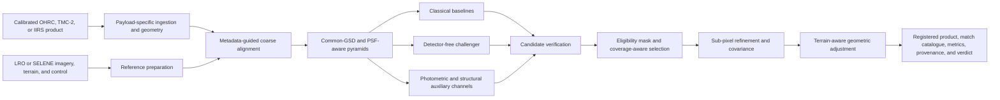

# SELENE-XR

**Selenographic Equivariant Lunar Emulation and Nadir-Equivariant Cross-Registration**

SELENE-XR is Team Horizon's proposed response to Smart India Hackathon 2026 problem statement **SIH26166**. The project aims to register Chandrayaan-2 OHRC, TMC-2, and IIRS imagery against LRO and SELENE/Kaguya reference products despite large differences in illumination, spatial resolution, sensor modality, viewpoint, and terrain relief.

> **Project status:** persistence-integrated development foundation. The repository now includes hardened ingestion primitives, benchmark fixtures, canonical matcher contracts, coarse phase-correlation/NCC baselines, a migration-first PostgreSQL/PostGIS service API, and a Vite/React/TypeScript/Tailwind console that reads persisted API records. The local packaged stack includes PostGIS migrations and a same-origin web proxy; it seeds no scientific records. It does **not** establish end-to-end mission-data results, performance, scientific processing, or validation. Performance and acceptance values described below remain proposed evaluation gates, not results.

SELENE-XR is an independent Team Horizon project. It is not affiliated with JAXA's SELENE/Kaguya mission.

## Current web console

The isolated `web/` application provides catalog and input selection,
registration/provenance views, persisted run lifecycle state, semantic knowledge
graph browsing, and review routes. It calls the versioned service API and shows
only durable PostgreSQL/PostGIS records; it never substitutes local records
when the service is unavailable or a collection is empty. The packaged local
stack serves it at `http://127.0.0.1:8080` and reverse-proxies `/api/v1` to the
service so browser requests do not need CORS.

The console does not execute scientific processing or manufacture imagery,
metrics, artifacts, tie points, knowledge entities, or graph relationships.
Empty states mean no persisted record is available and are not scientific
evidence. Operators register actual validated metadata explicitly; see the
[local platform runbook](docs/runbooks/local-platform.md).

Its CSS-only presentation includes restrained entrance, status, and progress
cues while keeping controls and data immediately available. Decorative motion
and transitions are disabled when the operating system requests reduced
motion. See the [web-console README](web/README.md) for local commands.

## The problem

Chandrayaan-2 and reference imagery do not necessarily overlay accurately enough for direct scientific comparison. Automated registration is difficult because:

- OHRC, TMC-2, and IIRS have very different optics, radiometry, and ground sample distances.
- Shadows and surface appearance change strongly with solar azimuth and elevation on the airless lunar surface.
- Pushbroom sensors observe relief terrain from different trajectories and viewing angles, so one global affine transform or homography is inadequate.
- Spacecraft metadata provides a useful geometry prior, but local scale and displacement still vary with altitude, emission angle, terrain, and image line.
- Match quality alone is insufficient when reliable points cluster in only one part of the valid overlap.
- Reference images have their own uncertainty; an LRO NAC or SELENE image is not automatically geodetic truth.

The SIH deliverable therefore needs to produce registered imagery, corresponding match points, and defensible evaluation metrics, with sub-pixel correspondence assessed in the **source-image frame** and coverage assessed over the **eligible valid overlap**.

## Proposed approach

The corrected design is a physics-guided, multi-scale registration pipeline. Physical and structural information helps matching, but does not replace the real reference image or eliminate the need for held-out real-data validation.



The core design principles are:

1. **Payload-aware processing.** OHRC and TMC-2 are planned to use geometry paths that are validated against independent products and tools. IIRS remains a dedicated cross-spectral branch with thermal handling, label-driven band selection, and structural features; it is not treated as a synthetic TMC-2 or NAC image.
2. **Metadata as a bounded prior.** SPICE, line-scan sensor models, and product labels constrain footprints, local GSD, orientation, and search regions. Residual local scale and deformation are still estimated from data.
3. **Baselines before novelty.** SIFT/RIFT-class features, normalized cross-correlation, and phase correlation establish reproducible baselines. A LoFTR/RoMa-style detector-free model is evaluated as a challenger rather than the only matching path.
4. **Physics as an auxiliary hypothesis.** Photometric normalization, shadow masks, source-lit hillshade or rendered channels, gradients, phase congruency, and self-similarity may improve robustness. Their contribution must be demonstrated through ablation; coarse terrain cannot recreate missing OHRC-scale texture.
5. **Coverage after quality filtering.** Candidate verification and non-maximum suppression happen before grid or quadtree selection. Coverage is measured with eligible-cell occupancy, convex-hull coverage, and the largest empty region; no unsupported optimality guarantee is claimed.
6. **Uncertainty-aware refinement.** ECC and Fourier phase-correlation refinement are intended to produce local offsets and per-match uncertainty for a robust, terrain-aware adjustment.
7. **Refuse rather than guess.** Every scientifically completed run is intended to produce an `accept`, `review`, or `reject` verdict with metrics, failure reasons, and provenance. Execution failures and cancellations remain separate run states. Missing required evidence cannot silently become a pass.

## Payload and reference routes

| Product | Verified characteristics | Planned treatment |
| --- | --- | --- |
| Chandrayaan-2 OHRC | Visible panchromatic; approximately 0.25-0.32 m/pixel depending on geometry | High-resolution panchromatic route with pushbroom geometry, local-GSD modelling, and terrain-aware adjustment |
| Chandrayaan-2 TMC-2 | Panchromatic; 5 m/pixel; fore, nadir, and aft stereo views | Panchromatic route and potential structural bridge for IIRS |
| Chandrayaan-2 IIRS | Hyperspectral; about 80 m/pixel; 0.8-5.0 micrometres; exact usable bands come from the label | Thermal correction, high-SNR reflective-band selection, PCA or gradient-energy composites, phase/self-similarity features, and independently evaluated geometry |
| LROC NAC | Monochrome pushbroom imagery, commonly about 0.5-2.0 m/pixel | Image reference with uncertainty; prefer controlled products and independent LOLA/GRAIL/IAU-frame control where available |
| SELENE/Kaguya Terrain Camera | Panchromatic pushbroom stereo; nominally 10 m/pixel | Required reference-family adapter and an independently reported evaluation route |
| SLDEM2015, LOLA, and regional NAC DTMs | Terrain sources with different resolution, coverage, and uncertainty; SLDEM2015 is about 60 m/pixel at the equator and is limited to roughly 60 degrees south to 60 degrees north | Terrain support, masking, relief modelling, and uncertainty propagation; use LOLA or appropriate polar products outside SLDEM2015 coverage and never assume any coarse source contains absent OHRC-scale texture |

## MVP scope

The first complete implementation is intentionally narrower than the long-term architecture in the technical specification. It includes:

- calibrated PDS4 or ISIS ingestion, hardened label parsing, checksums, and payload-specific metadata adapters;
- validated OHRC and TMC-2 sensor geometry plus an explicit IIRS geometry-validation track;
- LRO NAC and SELENE reference adapters, terrain/control selection, overlap masks, and reference uncertainty;
- metadata-guided coarse alignment with local-GSD and PSF-aware image pyramids;
- classical matching baselines and one detector-free challenger;
- photometric and structural auxiliary channels with controlled ablations;
- robust candidate verification, eligible-region masking, and grid/quadtree tie-point distribution;
- local sub-pixel refinement, covariance estimation, and terrain-aware geometric adjustment;
- registered COG/GeoTIFF output, adjusted model state, GeoPackage/CSV match catalogues, and a machine-readable metric and provenance report;
- CLI, REST API, and an overlay-based review interface using the same scientific core.

An OHRC/TMC-2-only build is a partial prototype, not a complete SIH26166 deliverable. SIH-compliant completion requires at least one validated end-to-end route for each required payload, including IIRS, and evaluation coverage for both named reference families, LRO and SELENE/Kaguya.

The following remain post-MVP research or productionisation work: a large synthetic training corpus, custom CUDA/OptiX rendering, learned bias correction, multi-payload graph adjustment and cycle-closure diagnostics, advanced platform-jitter modelling, shape-from-shading, distributed campaign orchestration, full Kubernetes operations, institutional identity integration, and air-gapped release packaging.

## Evaluation contract

No value in this section is an achieved result. The gates are provisional until the official SIH products and a leakage-safe train/validation/test split are available and frozen.

| Measure | Provisional gate |
| --- | --- |
| Held-out source-frame 2-D RMSE | Less than 1.0 source pixel |
| Stretch target | At most 0.5 source pixel |
| Spatial coverage | At least 70% occupancy of eligible cells in an 8 by 8 grid |

These gates qualify a payload/reference/algorithm route on a frozen benchmark. An ordinary user scene cites that route qualification and receives a scene verdict from observable evidence such as overlap, reference quality, verified inliers, coverage, covariance status, adjustment conditioning, and residual diagnostics. It must not inherit benchmark RMSE as if independent check points were measured on that scene.

Every benchmark report should also include:

- `RMSE_x`, `RMSE_y`, `RMSE_2D`, median endpoint error, P90, and CE90;
- candidate count, verified inlier count, inlier ratio, and automated success/rejection rate;
- eligible-cell occupancy, convex-hull area divided by valid-overlap area, and largest empty region or run;
- reference family and uncertainty, with absolute horizontal error in metres reported only against independent higher-accuracy control;
- results stratified by payload, reference family, illumination difference, view or emission angle, direction-independent GSD ratio, terrain class, and overlap fraction;
- forward/backward error, residual-vector maps, runtime, and memory as diagnostics;
- algorithm, parameter, model, input, reference, code, and environment provenance.

Cross-sensor residuals must be converted through the local warp Jacobian rather than a single scene-wide scale. Cycle closure belongs to the deferred graph-adjustment work and, when implemented, is a consistency diagnostic rather than independent proof of absolute accuracy. Synthetic controlled shifts are useful for internal truth, but they do not replace held-out real scenes.

## Intended deliverables

A completed run is designed to emit:

- a registered COG/GeoTIFF and the adjusted geometry or model state;
- a GeoPackage and CSV match catalogue containing source/reference coordinates, score, inlier state, covariance, and selection provenance;
- validity, overlap, shadow, and optional uncertainty masks;
- a versioned JSON metric report and human-readable QA summary;
- visual overlays for source/reference comparison, tie points, residual vectors, and coverage;
- a content manifest with checksums and complete input, reference, parameter, and code provenance;
- an explicit `accept`, `review`, or `reject` verdict with actionable failure reasons.

## Intended software architecture

The scientific pipeline remains usable without the web platform. Infrastructure is layered around it instead of embedded into it.

| Component | Responsibility |
| --- | --- |
| `selene_core` | Dependency-light scientific types, ingestion adapters, geometry, preprocessing, matching, selection, refinement, adjustment, metrics, and product writers |
| `selene_client` | CLI and generated or typed API client; no imports from service internals |
| `selene_service` | FastAPI contracts, job and product domain logic, authorization hooks, persistence, and provenance |
| `selene_worker` | Thin adapters for long-running stages once distributed execution is introduced |
| `web/` web console | Catalogue, run/provenance, semantic-knowledge, and review routes backed by persisted versioned API records |

The long-term target stack described in the specification includes Python,
FastAPI, PostgreSQL/PostGIS, object storage, React/TypeScript, Tailwind,
OpenLayers, scientific tools such as ISIS, ALE/usgscsm, SPICE, GDAL, and
optional worker/GPU infrastructure. The `web/` workspace has lockfile-pinned
frontend dependencies and reads the current persisted API; install it following
the [web-console README](web/README.md). That availability does not establish a
complete scientific product, which remains subject to processing and route
validation.

## Repository contents

```text
.
├── web/                            isolated Vite/React/TypeScript/Tailwind
│                                   console backed by persisted API records
├── packages
│   ├── selene_core/                 scientific core: ingest, geometry, reference,
│   │                                preprocess, features, match, select, refine,
│   │                                adjust, metrics, products, pipeline
│   ├── selene_client/               CLI and API client
│   ├── selene_service/              FastAPI, persistence, policy hooks
│   └── selene_worker/               optional long-stage adapters (post-MVP)
├── schemas/                         input, parameter, match, metric, report,
│                                    provenance, verdict, and benchmark schemas
├── configs/                         versioned non-secret scientific parameter sets
├── model/                           ignored local weights and active model registry
├── train/                           training package and four model configurations
├── data/                            tracked dataset contracts, ignored local cache
├── benchmarks/
│   ├── manifests/                   product IDs, hashes, splits, control uncertainty
│   ├── expected/                    schema-level and small numeric expectations
│   └── scripts/                     acquisition checks and benchmark runner
├── tests/                           unit, property, integration, science, security, e2e
├── infra/                           Docker, Compose, and Kubernetes model workflows
├── docs/
│   ├── adr/                         ADR-0001 to ADR-0015, all currently proposed
│   ├── context/                     technical verification and full specification
│   ├── methods/                     derivations and measurement protocols
│   ├── runbooks/                    operational procedures
│   └── ppt/                         SIH idea presentation
├── CONTRIBUTING.md
├── IMPLEMENTATION_PLAN.md
├── LICENSE
└── README.md
```

Unimplemented scientific modules remain documented placeholders naming the work
package that will fill them. Undefined JSON Schemas reject all instances so
nothing can accidentally validate against a missing contract. Large mission
products, credentials, SPICE kernels, model weights, and generated rasters are
never committed; Git stores manifests, checksums, acquisition instructions,
small permitted fixtures, and expected results.

## Local model workflow

The four specified trainable artifacts share one local workflow:

```bash
python -m pip install -e './packages/selene_core[learned]' -e ./train
selene-train train \
  --config train/configs/selene_matcher.json \
  --dataset hf://your-account/selene-xr-matcher \
  --version local-dev
```

Training writes checksummed versions under `model/` and updates
`model/registry.json`. Runtime code sets `SXR_MODEL_ROOT=./model` and calls
`selene_core.load_local_model(...)`. Container deployments mount the same
directory or persistent volume at `/models`; see `train/README.md`,
`infra/compose/compose.models.yaml`, and `infra/k8s/training/README.md`.

Read the project documents in this order:

1. [Technical verification and SIH26166 compliance note](docs/context/SELENE-XR-Technical-Verification.md) for verified facts, corrected claims, and unresolved constraints.
2. [Implementation plan](IMPLEMENTATION_PLAN.md) for the reconciled, dependency-ordered build plan and acceptance criteria.
3. [Complete technical specification](docs/context/SELENE-XR-Complete-Technical-Specification.md) as the long-term architecture and research backlog. Where it conflicts with the verification note, the verification note takes precedence.
4. [SIH idea presentation](docs/ppt/Team-Horizon-SELENE-XR-SIH2026-Idea.pdf) for presentation context. Prototype, metric, throughput, and novelty statements in the deck are not implementation evidence.

## Data access prerequisites

The official SIH benchmark product IDs and dataset split remain unknown. Interim development should use version-pinned public products with recorded access conditions and checksums:

- [ISSDC Chandrayaan-2 PRADAN archive](https://pradan.issdc.gov.in/ch2/)
- [Chandrayaan-2 MapBrowse](https://chmapbrowse.issdc.gov.in/), which requires registration for downloads
- [LROC data discovery](https://data.im-ldi.com/)
- [LROC QuickMap](https://quickmap.lroc.im-ldi.com/)
- [JAXA SELENE/Kaguya data archive](https://darts.isas.jaxa.jp/missions/pds/pds_kaguya_en.html)

## Contributing

See [CONTRIBUTING.md](CONTRIBUTING.md) for the environment setup, the checks that CI runs, and the rules a review must enforce. Implementation work follows [IMPLEMENTATION_PLAN.md](IMPLEMENTATION_PLAN.md), preserves the separation between verified facts and targets, and adds tests and benchmark evidence with every scientific claim. Non-obvious scientific or architectural choices are recorded as [architecture decision records](docs/adr/).

## License

This project is licensed under the [MIT License](LICENSE).
