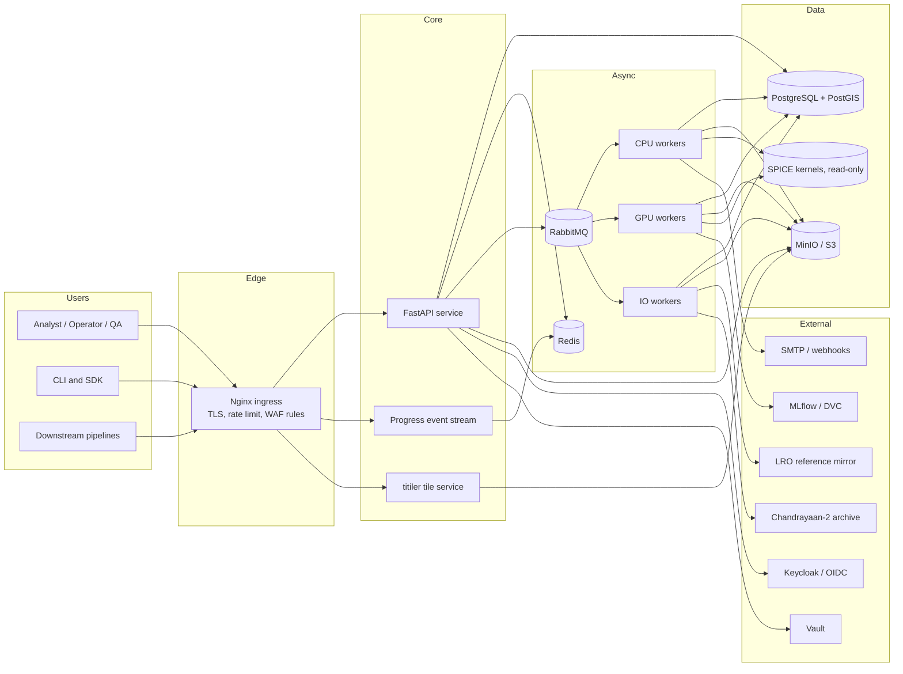
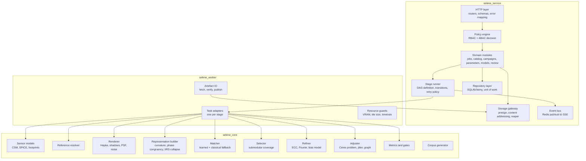
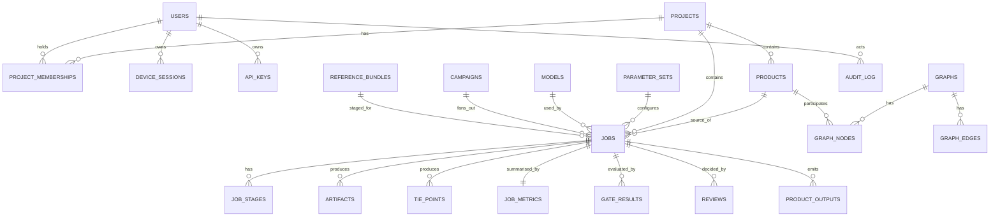
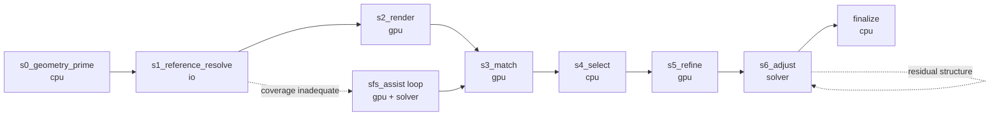
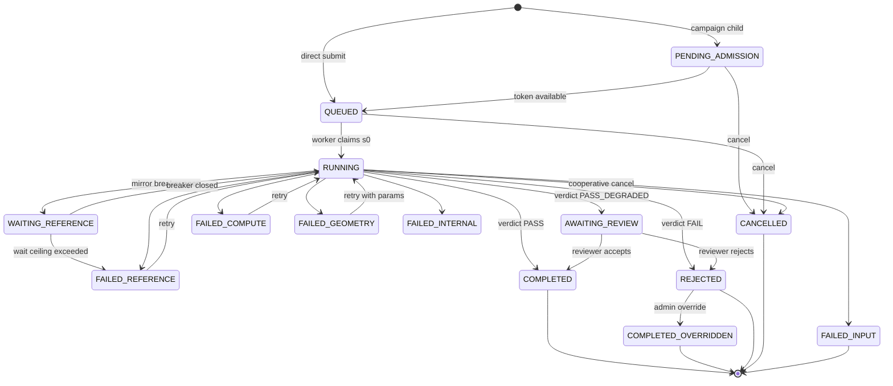

# SELENE-XR — Complete Technical Specification

**Selenographic Equivariant Lunar Emulation & Nadir-Equivariant Cross-Registration**

A multi-modal, illumination-equivariant, sub-pixel image correspondence system for Chandrayaan-2 optical payloads (OHRC, TMC-2, IIRS) against LRO NAC and LRO-derived reference data.

| Field | Value |
| --- | --- |
| Document ID | SXR-TS-001 |
| Version | 1.0.0 |
| Status | Baseline for implementation |
| Audience | Backend, frontend, DevOps, ML, geodesy/photogrammetry, security engineers; QA; scientific reviewers; AI coding agents |
| Preceding artefact | SELENE-XR architecture proposal (six-stage physics-first pipeline) |
| Related standards | PDS4, ISIS3/ISIS8 cube format, USGS CSM (Community Sensor Model), SPICE, OGC COG, STAC 1.0, OpenAPI 3.1 |

### How to read this document

Section 1 to 7 define the product and its actors. Sections 8 to 11 define behaviour. Sections 12 to 16 define system and component structure. Section 17 is the scientific core and is the longest section; it is the specification an algorithms engineer implements from. Sections 18 to 24 cover ML, security, operations, and deployment. Sections 25 to 31 cover risk, sequencing, traceability, and reference material.

Every assumption made in the absence of stated input is labelled **Assumption** and carries an ID of the form `A-nn`. All assumptions are collected in Section 29. Where the source input was internally inconsistent, the conflict and its resolution are recorded in the same section.

---

## 1. Executive summary

### 1.1 What this is

SELENE-XR is a server-based image registration system. It takes an image acquired by a Chandrayaan-2 optical payload, finds where that image sits on the Moon relative to an established reference frame defined by LRO data, and returns three things: a set of match points tying source pixels to reference pixels, a corrected geometric model for the source image, and a set of numbers that quantify how much the answer can be trusted.

The system is delivered as a containerised service with three access paths: a browser application for interactive work and review, a REST API for programmatic and pipeline use, and a command-line client for batch and air-gapped operation.

### 1.2 The problem it solves

Chandrayaan-2 optical products carry geometry derived from spacecraft ephemeris and attitude telemetry. That geometry is good but not good enough: horizontal errors of tens to hundreds of metres are typical, which at OHRC's 0.25 m ground sample distance is hundreds of pixels. Any analysis that combines Chandrayaan-2 data with LRO data, or that compares two Chandrayaan-2 acquisitions taken at different times, first has to remove that error.

Removing it by image matching is hard for three reasons that compound. Illumination changes the appearance of the lunar surface more than on any other imaged body, because there is no atmosphere to scatter light into shadows: a crater imaged at 12 degrees solar elevation and the same crater at 65 degrees share almost no gradient structure. Ground sample distance across the payload set spans a factor of 320, from 0.25 m for OHRC to roughly 80 m for IIRS. And the sensors are line-scan instruments imaging relief terrain from different orbits, so the mapping between two images is not a planar transform at all.

Existing tooling supplies components but not a solution. Feature-based methods break under illumination change. Intensity-based methods break under relief-induced distortion. Learned methods lack lunar training data. Nothing in the public record optimises for uniform spatial distribution of match points or reports the accuracy statistics an operational geodetic product needs.

### 1.3 Core approach

The system inverts the usual strategy. Instead of seeking descriptors invariant to illumination, it models illumination physically and cancels it. Chandrayaan-2 metadata gives solar azimuth and elevation, spacecraft position, and camera geometry. LRO gives topography. From those inputs the system renders a synthetic image of what the reference terrain would look like under the source image's exact lighting and viewing geometry, including cast shadows. Matching then happens between the real source image and a synthetic image that shares its modality, its shadows, and its texture statistics. Classical correlation methods that fail on the original pair work near their theoretical limit on the rendered pair.

The same principle removes the other two problems. Scale is not searched for, it is read from metadata and applied as a known resampling factor with sensor-specific point spread function matching. Geometry is solved as a rigorous line-scan bundle adjustment with terrain constraints and a platform jitter model, not as a homography.

Three secondary consequences follow. The renderer generates unlimited perfectly-registered synthetic training pairs, which removes the training-data obstacle for the learned matcher. Sub-pixel estimator bias becomes measurable against synthetic ground truth and therefore correctable. And a closed graph of registrations across payloads yields a cycle-closure residual, which is an accuracy estimate that requires no external ground truth.

### 1.4 Primary users

| User | Uses the system to |
| --- | --- |
| Planetary scientist / analyst | Register a specific scene, inspect match quality, export tie points and registered rasters for downstream science |
| Data-production operator | Run bulk registration over an ingestion queue, monitor throughput, triage failures |
| QA reviewer | Accept or reject registration results against numeric acceptance gates and visual overlays |
| Calibration engineer | Tune sensor models, photometric parameters, and per-payload defaults; re-run calibration campaigns |
| Downstream pipeline | Call the API to obtain corrected geometry for change detection, DTM generation, landing-site characterisation |

### 1.5 Core capabilities

1. Ingest Chandrayaan-2 OHRC, TMC-2, and IIRS products in PDS4 or ISIS form, together with SPICE kernels and PDS labels.
2. Resolve and cache LRO reference data over the source footprint: NAC images, NAC-derived DTMs where available, SLDEM2015 and LOLA elevation, LROC WAC albedo.
3. Instantiate rigorous line-scan sensor models and predict footprints, scale ratios, and relative orientation from metadata alone.
4. Render synthetic reference imagery under arbitrary illumination and viewing geometry with a Hapke bidirectional reflectance model, ray-marched cast shadows, and single-bounce inter-reflection.
5. Produce dense correspondences using a learned detector-free matcher over a multi-channel representation combining rendered radiance, recovered surface curvature, and phase congruency.
6. Select a final tie-point set under an explicit spatial-coverage constraint with a certifiable optimality bound.
7. Refine each correspondence to sub-pixel precision with calibrated bias correction and a per-point 2x2 covariance.
8. Solve a rigorous bundle adjustment over exterior orientation, jitter, and optional interior orientation, with ground points constrained to reference topography.
9. Solve a multi-payload registration graph with loop-closure constraints against LRO as datum.
10. Emit registered rasters, updated geometry, tie-point catalogues, uncertainty rasters, and a full metric report; refuse with a diagnosis when quality gates are not met.
11. Generate synthetic training and evaluation corpora with exact sub-pixel ground truth.
12. Provide interactive review with side-by-side, checkerboard, difference, and vector-field overlays.

### 1.6 Core technologies

| Layer | Technology |
| --- | --- |
| API service | Python 3.11, FastAPI, Pydantic v2, Uvicorn behind Nginx |
| Persistence | PostgreSQL 16 with PostGIS 3.4 (custom lunar SRID), SQLAlchemy 2.0, Alembic |
| Object storage | MinIO (S3 API), COG and Zarr layouts |
| Queue and cache | RabbitMQ 3.13 (task broker), Redis 7 (locks, cache, rate limits, progress) |
| Workers | Celery 5.4, split into CPU, GPU, and IO worker classes |
| Geodesy and photogrammetry | USGS ISIS 8, Ames Stereo Pipeline, usgscsm/csmapi, SpiceyPy, GDAL 3.8, pvl |
| Optimisation | Ceres Solver 2.2 via pyceres, with analytic Jacobians |
| Rendering | Custom CUDA renderer, OptiX 8 BVH for shadow rays, PyTorch fallback path |
| ML | PyTorch 2.4, CUDA 12.4, ONNX Runtime for inference, MLflow for tracking, DVC for corpus versioning |
| Frontend | React 18, TypeScript 5, Vite, TanStack Query, Zustand, OpenLayers 9, deck.gl, Tailwind CSS |
| Tiling | titiler for dynamic COG tiling |
| Identity | Keycloak 25 (OIDC), short-lived JWT access tokens, hashed rotating refresh tokens, hashed API keys |
| Orchestration | Kubernetes 1.30, Helm, ArgoCD, Harbor; Docker Compose profile for single-workstation use |
| Observability | OpenTelemetry, Prometheus, Grafana, Loki, Tempo |

### 1.7 Deployment model

Primary target is an on-premises Kubernetes cluster with GPU nodes, capable of fully air-gapped operation. Every external dependency is either vendored, mirrored, or optional. A secondary single-node Docker Compose profile runs the whole system on one workstation with one GPU for development and for individual researchers. A third profile is a headless CLI that runs the pipeline library directly against local files with no API, database, or queue, for use inside another institution's batch system.

**Assumption A-01.** The operating environment is an institutional data centre under ISRO or a partner institution, with data residency and air-gap requirements, so no public-cloud managed service is treated as mandatory. Cloud deployment is supported by substituting S3 for MinIO, RDS for PostgreSQL, and managed Kubernetes, but is not the reference configuration.

---

## 2. Problem definition

### 2.1 The user problem

An analyst who wants to compare an OHRC frame with an LRO NAC frame of the same crater cannot currently do so without manual work. The two images do not overlay. Correcting the offset by hand means picking tie points in a GIS, which takes hours per scene, produces a handful of clustered points, gives no uncertainty estimate, and is not reproducible between analysts. For scenes with strong illumination differences, manual point picking is not just slow but unreliable, because the analyst is matching features that look different in the two images and may be matching the wrong ones.

### 2.2 The technical problem

Four distinct technical failures block automation.

**Illumination.** Surface radiance on the Moon is the product of local slope geometry and illumination direction, modulated by a strongly non-Lambertian scattering function with a pronounced opposition effect. Two images of the same terrain under different solar geometry are not related by any monotonic intensity mapping, because shadow regions carry no information about the terrain beneath them. Descriptor-based invariance cannot recover information that is physically absent from one of the two images.

**Modality.** OHRC is panchromatic at 0.25 m. TMC-2 is panchromatic at 5 m with a different spectral response and a different point spread function. IIRS is a 250-band imaging spectrometer at roughly 80 m. LRO NAC is panchromatic at 0.5 to 2 m depending on orbit altitude. Radiometric transfer functions differ non-linearly. Gradient-based descriptors assume a shared radiometric response and do not have one.

**Scale.** The GSD ratio between OHRC and IIRS is roughly 1:320. Naive resampling of the fine image does not produce the coarse image, because the coarse sensor's modulation transfer function has already removed spatial frequencies that resampling of a sharp image reintroduces as aliasing. Texture statistics therefore differ even after the geometric scale is correct.

**Geometry.** Both Chandrayaan-2 and LRO instruments are pushbroom line scanners. Each image line has its own exterior orientation. Relief on the surface produces parallax that varies across the frame and depends on the difference in emission angle between the two acquisitions. No global affine or projective transform can express this mapping. Platform jitter adds a high-frequency, time-dependent component that a low-order polynomial cannot absorb.

### 2.3 The operational problem

Registration must run unattended over an ingestion queue that receives new products continuously. That demands per-scene runtime bounds, deterministic reruns, retryable stages, resumable jobs, and honest self-assessment. A pipeline that silently returns a wrong transform is worse than one that returns nothing, because downstream products inherit the error without a flag. Existing research code has no notion of an acceptance gate and no machine-readable quality report.

### 2.4 The business problem

Chandrayaan-2 has been returning data since 2019. The scientific value of that archive depends on being able to place it in the same frame as LRO data, which is the de facto lunar geodetic reference. Every day the archive stays unregistered is a day of deferred science return and a day of duplicated manual effort across research groups. A shared, verifiable registration service converts an archive of individually-georeferenced frames into a single co-registered dataset.

### 2.5 Limitations of current approaches

| Approach | Limitation that blocks it |
| --- | --- |
| SIFT / SURF / ORB and hybrids (MoonMetaSync, IntFeat) | Descriptor consistency collapses at low solar elevation; matches cluster in high-texture regions; scale ratios beyond roughly 1:10 starve the matcher of common features |
| Mutual information, NCC, phase correlation | Estimate a global transform only; cannot express relief-induced distortion; expensive at OHRC resolution; produce no explicit tie points |
| UR-SIFT, OS-SIFT, RIFT, Cof-SIFT and other multi-modal descriptors | Validated on Earth optical-SAR and multispectral data; assumptions about texture and radiometry do not transfer to regolith at extreme phase angles; require per-pair retuning |
| Learned multi-modal registration (GAN, diffusion, OSDM-MReg class) | No curated co-registered Chandrayaan-2 to LRO training corpus exists publicly; Earth-trained models suffer domain shift; no accuracy guarantee |
| ISIS and Ames Stereo Pipeline control networks | Provide the rigorous geometric machinery but leave the multi-modal, illumination-variant matching problem to the user |
| Sub-pixel refinement literature | Assumes texture and moderate noise; pixel-locking bias treated as an accuracy floor rather than a correctable systematic |

### 2.6 Expected improvement

| Dimension | Current typical | Target after implementation |
| --- | --- | --- |
| Horizontal registration error, OHRC to NAC | 50 to 300 m from telemetry alone | Sub-pixel in source frame; see Section 5 for per-pair targets |
| Effort per scene | Hours of manual tie-point picking | Unattended, minutes of wall-clock |
| Tie-point count and spread | Tens of points, clustered | Hundreds to thousands, coverage-certified |
| Uncertainty information | None | Per-point 2x2 covariance, scene-level covariance, cycle-closure residual |
| Reproducibility | Analyst-dependent | Bit-reproducible given the same inputs, parameters, and model version |
| Low-sun performance | Effectively unusable below roughly 20 degrees solar elevation | Explicitly supported down to 5 degrees, with degraded-mode reporting |

---

## 3. Project goals

### 3.1 Primary goals

| ID | Goal | Measure |
| --- | --- | --- |
| G-P1 | Register OHRC, TMC-2, and IIRS products against LRO reference data without manual intervention | Automated success rate over the acceptance corpus, Section 5 |
| G-P2 | Achieve sub-pixel accuracy in the source image frame | RMSE targets per pair type, Section 5 |
| G-P3 | Produce tie points with certified uniform spatial coverage | Quadtree occupancy and nearest-neighbour index thresholds, Section 5 |
| G-P4 | Remain functional across the full illumination range present in the archive | Success rate stratified by solar elevation bins, including 5 to 15 degrees |
| G-P5 | Attach calibrated uncertainty to every output and refuse rather than guess | Every result carries covariance and a gate verdict; zero silent failures in acceptance testing |
| G-P6 | Handle relief and viewpoint rigorously | Bundle adjustment with terrain constraint; residual field shows no systematic relief-correlated structure |
| G-P7 | Provide a complete, versioned, auditable product for every job | Reproducibility test passes; full provenance chain recorded |
| G-P8 | Operate unattended over a continuous ingestion queue | Throughput and availability targets, Section 5 and 9 |

### 3.2 Secondary goals

| ID | Goal |
| --- | --- |
| G-S1 | Interactive review UI with checkerboard, difference, vector-field, and residual overlays |
| G-S2 | Multi-payload graph adjustment with loop closure across OHRC, TMC-2, IIRS, and NAC |
| G-S3 | Joint shape-from-shading and registration loop for footprints with no high-resolution DTM |
| G-S4 | Synthetic corpus generator exposed as a first-class product for external benchmarking |
| G-S5 | STAC-compatible catalogue export of registered products |
| G-S6 | Per-payload parameter calibration workflow with campaign tracking |
| G-S7 | Air-gapped installation bundle with mirrored dependencies and pre-seeded reference data |

### 3.3 Future goals, out of first implementation

| ID | Goal | Why deferred |
| --- | --- | --- |
| G-F1 | Chandrayaan-2 DFSAR (SAR) registration | Requires a scattering model and speckle handling; different physics branch |
| G-F2 | Chandrayaan-1 and other mission payloads | No blocker beyond sensor-model work; sequencing choice |
| G-F3 | Full differentiable-renderer inverse solve for Hapke parameters per scene | Research-grade; current design uses fitted priors with residual absorption |
| G-F4 | Global lunar control network production and datum maintenance | Institutional and governance scope, not software scope |
| G-F5 | Real-time or on-board registration | Different compute envelope entirely |
| G-F6 | Automatic DTM production from registered stereo pairs | Adjacent product; ASP already covers it once geometry is corrected |

---

## 4. Non-goals

The following are explicitly outside scope, and requests for them should be declined or routed elsewhere rather than accommodated by scope expansion.

1. SELENE-XR does not define or maintain a lunar geodetic datum. It registers to LRO-derived reference data as given and records which reference version was used.
2. It does not produce topography as a primary product. Shape-from-shading output exists only to support registration and is flagged as auxiliary.
3. It does not perform scientific interpretation: no crater counting, no mineralogical analysis, no change detection. It produces the geometry those tasks need.
4. It does not radiometrically calibrate raw instrument data. It consumes calibrated products and applies only the radiometric transformations needed for matching.
5. It is not a general-purpose GIS or image viewer. The UI serves registration review, not cartographic production.
6. It does not attempt registration where physical overlap is absent or where illumination geometry makes the overlap information-free. It detects and reports those cases.
7. It does not guarantee results for products with missing, corrupt, or unreconstructed SPICE kernels. It fails those with a specific diagnosis.
8. It does not support multi-tenant isolation across mutually untrusted organisations in v1. All users belong to one institutional tenant with role separation.
9. It does not provide public anonymous access. Every request is authenticated.

---

## 5. Success criteria

All thresholds below are acceptance gates unless marked as a monitoring target. Gates are evaluated automatically. A job that fails a gate is marked `REJECTED` with the failing gate named, not silently downgraded.

### 5.1 Accuracy

Accuracy is measured in the source image frame in pixels, and in metres on the reference surface. "Truth" for gate purposes comes from three independent sources: the synthetic corpus (exact by construction), independent LROC ground control points where available, and leave-one-out cross-validation on the tie-point set itself.

| Pair type | Median GSD ratio | RMSE gate (source px) | Stretch target | CE90 gate |
| --- | --- | --- | --- | --- |
| OHRC to NAC | 1:2 to 1:6 | <= 0.30 | 0.12 | <= 0.55 px |
| TMC-2 to NAC | 1:0.1 to 1:0.4 | <= 0.25 | 0.10 | <= 0.45 px |
| OHRC to TMC-2 | 1:20 | <= 0.40 | 0.18 | <= 0.75 px |
| IIRS to TMC-2 | 1:16 | <= 0.50 | 0.25 | <= 0.90 px |
| IIRS to NAC (via TMC-2 chain) | 1:80 to 1:160 | <= 0.70 | 0.35 | <= 1.30 px |
| Synthetic self-test, any pair | any | <= 0.10 | 0.04 | <= 0.20 px |

Cross-validated RMSE must not exceed in-sample RMSE by more than a factor of 1.5. A larger gap indicates the geometric model is absorbing error that belongs to the correspondences.

### 5.2 Correspondence quality

| Metric | Gate |
| --- | --- |
| Inlier count after bundle adjustment | >= 200 for OHRC and TMC-2 pairs; >= 60 for IIRS pairs |
| Inlier ratio (inliers / candidates entering RANSAC) | >= 0.55 for solar-elevation >= 25 deg; >= 0.35 for 5 to 25 deg |
| Derived (virtual) tie points as a fraction of the final set | <= 0.20, and never counted toward the inlier gate |
| Independent sub-pixel estimator disagreement, 95th percentile | <= 0.25 px |

### 5.3 Spatial uniformity

Uniformity is evaluated on the intersection of the two footprints, restricted to the sunlit-in-both mask.

| Metric | Gate |
| --- | --- |
| Quadtree occupancy at level L (cell size ~ 1/16 of the shorter footprint side) | >= 0.80 of eligible cells contain >= 1 inlier |
| Clark-Evans nearest-neighbour index R | 0.85 <= R <= 1.25 (1.0 is ideal Poisson-uniform; below 0.85 is clustered) |
| Normalised grid-occupancy entropy | >= 0.90 of the maximum for the same point count |
| Largest empty circle radius, as a fraction of footprint diagonal | <= 0.12 |

An eligible cell is one with at least 15 percent of its area inside the sunlit-in-both mask and inside both footprints. Cells that fail eligibility are excluded from the denominator and reported separately, so a scene half in shadow is not penalised for geometry it could never match.

### 5.4 Independent verification

| Metric | Gate |
| --- | --- |
| Cycle-closure residual over any closed loop in the registration graph | <= 1.5 x the RSS of the per-edge RMSEs of the loop |
| Agreement with independent LROC GCPs, where available | <= 2.0 x the pair-type RMSE gate |
| Reproducibility: two runs, same inputs, same parameters, same model version | Tie-point positions identical to 1e-6 px; all reported metrics identical |

### 5.5 Performance and throughput

Wall-clock targets assume the reference node profile in Section 24.3 and a warm reference-data cache.

| Operation | p50 | p95 | Hard timeout |
| --- | --- | --- | --- |
| OHRC scene (12k x 90k px) end to end | 14 min | 32 min | 90 min |
| TMC-2 scene end to end | 5 min | 12 min | 40 min |
| IIRS scene end to end | 7 min | 16 min | 45 min |
| Rendering stage alone, per 8k x 8k tile | 9 s | 22 s | 120 s |
| Matcher inference, per 8k x 8k tile pair | 3 s | 7 s | 60 s |
| Bundle adjustment, 2000 tie points, jitter model | 25 s | 70 s | 600 s |
| Interactive API read (job status, metrics, tie-point page) | 120 ms | 400 ms | 10 s |
| Tile request from titiler, cached | 60 ms | 250 ms | 5 s |
| Sustained throughput, 8 GPU workers | 40 OHRC-equivalent scenes per 24 h (monitoring target) | | |

Cold-cache reference-data fetch is excluded from the gates above and tracked separately; it is IO-bound and depends on the reference mirror.

### 5.6 Availability and reliability

| Metric | Target |
| --- | --- |
| API availability, monthly | 99.5 percent |
| Job completion without operator intervention | >= 97 percent of submissions reach a terminal state (`COMPLETED` or `REJECTED`) without manual action |
| Silent wrong answers | Zero. Any result that later proves wrong must have been reported with a gate failure or a low-confidence flag |
| Stage-level retry success | >= 80 percent of transient stage failures recover within the retry budget |
| Data durability, products and tie points | No loss; object storage erasure-coded, database PITR to 7 days |

### 5.7 Machine-learning metrics

| Metric | Gate for model promotion |
| --- | --- |
| Synthetic held-out end-point error, median | <= 0.08 px |
| Synthetic held-out end-point error, 95th percentile | <= 0.40 px |
| Real-pair inlier ratio versus the previous production model | No regression greater than 2 percentage points on the frozen real-pair benchmark |
| Low-sun subset (5 to 15 deg) inlier ratio | >= 0.30 |
| Confidence calibration, expected calibration error | <= 0.05 |
| Inference latency, per tile pair, on the reference GPU | <= 7 s at p95 |

---

## 6. Stakeholders

| Stakeholder | What they need from the system | How the system serves it |
| --- | --- | --- |
| Planetary scientists | Correctly registered imagery with quantified error, exportable in standard formats | Registered COGs, tie-point catalogues in CSV/GeoJSON, updated ISIS/CSM geometry, metric report |
| Data-production operators | Predictable bulk throughput, clear failure triage, retry controls | Batch submission, queue dashboards, per-stage diagnostics, targeted retry |
| QA reviewers | An unambiguous accept/reject decision path with visual and numeric evidence | Gate verdicts, overlay viewer, review workflow with immutable audit trail |
| Calibration engineers | Ability to change sensor and photometric parameters and see the effect | Parameter sets as versioned first-class objects, campaign runs, A/B comparison reports |
| ML engineers | Training corpora, experiment tracking, safe model promotion | Corpus generator, DVC-versioned datasets, MLflow registry, shadow evaluation before promotion |
| Platform and DevOps engineers | Deployable, observable, upgradable system with bounded resource use | Helm charts, health and readiness probes, OpenTelemetry traces, resource quotas per worker class |
| Security engineers | Authenticated, authorised, audited access; no secret sprawl | OIDC, RBAC plus resource-scope checks, hashed credentials, external secret store, append-only audit log |
| Institutional data custodians (ISSDC, PDS) | Assurance that product provenance and licensing are preserved | Full provenance chain per product, immutable source references, reference-dataset version pinning |
| Downstream pipelines and their owners | Stable API contracts and machine-readable quality flags | Versioned OpenAPI contract, deprecation policy, quality flags in every product manifest |
| Auditors and reviewers | Evidence that a given published result came from a specific code and data state | Append-only audit log, content-addressed artefacts, run manifests with git SHA and container digest |
| External researchers (future) | Benchmark datasets and reproducible baselines | Synthetic corpus export, published evaluation protocol |

---

## 7. User roles and permissions

### 7.1 Role definitions

| Role | Description | Typical holder |
| --- | --- | --- |
| `viewer` | Read-only access to jobs, products, and metrics within permitted projects | Visiting researcher, student, reviewer without approval authority |
| `analyst` | Creates and runs jobs, exports products, annotates results; cannot approve or change global parameters | Planetary scientist |
| `operator` | Runs and manages batch campaigns, retries and cancels jobs, manages the reference-data cache | Production operator |
| `qa_reviewer` | Records the authoritative accept/reject decision on a completed job; cannot alter inputs or parameters | QA staff |
| `calibration_engineer` | Creates and publishes parameter sets and sensor-model overrides; runs calibration campaigns | Instrument or geodesy specialist |
| `ml_engineer` | Manages corpora, training runs, and model registry entries; promotes models to shadow, not to production | ML staff |
| `admin` | Full administrative control including user and role assignment, quota, retention, and model promotion to production | Platform owner |
| `auditor` | Read-only access to the audit log and provenance records across all projects; no access to raw pixel data | Internal audit, external review |
| `service` | Machine identity for downstream pipelines and internal components; scoped by explicit API-key scopes | Downstream pipeline, ingestion daemon |

### 7.2 Data access scoping

Roles alone are insufficient. Access is decided by role plus project membership plus resource ownership. The authorisation model is RBAC for capability and ABAC for scope, evaluated as a single policy check.

Every `Job`, `Product`, `ParameterSet`, and `Campaign` belongs to exactly one `Project`. A user has a `ProjectMembership` carrying a role scoped to that project, in addition to a global role. The effective permission for an action is the union of the global role's capability and the project-scoped role's capability, intersected with the resource's project. Admin and auditor are global-only roles and bypass project scoping for their permitted actions.

Three attribute predicates modify the decision:

`owner` — the subject created the resource. Analysts may delete only their own jobs, and only while the job is in a non-terminal state or within the retention grace window.

`state` — some actions are legal only in specific resource states. A QA decision is legal only on a job in `AWAITING_REVIEW`. A parameter set may be edited only while `DRAFT`; once `PUBLISHED` it is immutable and supersession requires a new version.

`sensitivity` — products may be flagged `restricted` by a data custodian, which removes them from `viewer` visibility regardless of project membership.

### 7.3 Capability matrix

`Y` = permitted, `N` = denied, `O` = own resources only, `P` = permitted within projects the subject is a member of, `S` = permitted only if the API key carries the matching scope, `C` = conditional, see notes.

| Capability | viewer | analyst | operator | qa_reviewer | calibration_engineer | ml_engineer | admin | auditor | service |
| --- | --- | --- | --- | --- | --- | --- | --- | --- | --- |
| List and view jobs | P | P | P | P | P | P | Y | N | S |
| Submit single registration job | N | P | P | N | P | N | Y | N | S |
| Submit batch campaign | N | N | P | N | P | N | Y | N | S |
| Cancel job | N | O | P | N | O | N | Y | N | S |
| Retry job or stage | N | O | P | N | O | N | Y | N | S |
| Delete job and artefacts | N | O (C1) | P (C1) | N | N | N | Y | N | N |
| Download registered product | P (C2) | P | P | P | P | P | Y | N | S |
| Download tie-point catalogue | P (C2) | P | P | P | P | P | Y | N | S |
| View metric report | P | P | P | P | P | P | Y | N | S |
| Annotate / comment on a job | N | P | P | P | P | P | Y | N | N |
| Record QA accept/reject | N | N | N | P (C3) | N | N | Y | N | N |
| Override a failed gate with justification | N | N | N | N | N | N | Y | N | N |
| Create draft parameter set | N | N | N | N | P | N | Y | N | N |
| Publish parameter set | N | N | N | N | P (C4) | N | Y | N | N |
| Set project default parameter set | N | N | N | N | N | N | Y | N | N |
| Upload or register source product | N | P | P | N | P | N | Y | N | S |
| Manage reference-data cache | N | N | P | N | P | N | Y | N | N |
| Trigger reference-data prefetch | N | P | P | N | P | N | Y | N | S |
| Generate synthetic corpus | N | N | N | N | P | P | Y | N | N |
| Start training run | N | N | N | N | N | P | Y | N | N |
| Promote model to shadow | N | N | N | N | N | P | Y | N | N |
| Promote model to production | N | N | N | N | N | N | Y | N | N |
| Manage users and role assignment | N | N | N | N | N | N | Y | N | N |
| Manage projects and membership | N | N | N | N | N | N | Y | N | N |
| Read audit log | N | O | O | O | O | O | Y | Y | N |
| Read provenance records | P | P | P | P | P | P | Y | Y | S |
| Read raw pixel data | P (C2) | P | P | P | P | P | Y | N (C5) | S |
| View system metrics dashboards | N | N | Y | N | N | Y | Y | Y | N |
| Change retention or quota policy | N | N | N | N | N | N | Y | N | N |

Notes:

- **C1** Deletion is soft for 30 days, then hard. Deletion is refused if the job is referenced by a published campaign report or by an accepted QA decision; those require admin.
- **C2** Blocked when the product carries `sensitivity = restricted`.
- **C3** A reviewer cannot review a job they submitted. Self-review is refused with `403 SELF_REVIEW_FORBIDDEN`.
- **C4** Publication requires a second calibration engineer or an admin to counter-sign. Enforced as a two-person state transition on `ParameterSet`.
- **C5** Auditors receive metadata, provenance, and metrics but not imagery. Enforced at the storage-presign layer, not only in the UI.

### 7.4 Service-account scopes

API keys carry explicit scopes rather than a role. A key with no matching scope is rejected even if the owning identity would be permitted interactively.

| Scope | Grants |
| --- | --- |
| `jobs:submit` | Create registration jobs in a named project |
| `jobs:read` | Read job state, metrics, and stage history |
| `products:read` | Presign and download products and tie points |
| `products:write` | Register externally produced products into the catalogue |
| `reference:prefetch` | Request reference-data staging |
| `campaigns:manage` | Create and control batch campaigns |
| `internal:worker` | Reserved for in-cluster components; accepted only from the cluster network with mTLS |

Keys are project-scoped, expire at most 365 days after issue, and are stored only as `argon2id` hashes with an 8-character public prefix used for lookup and for log correlation.

---

## 8. Functional requirements

Requirements are numbered `FR-nnn`. The eleven core requirements are specified in full field form. The remainder are specified in compact table form with the same fields collapsed; this is a deliberate density choice and does not imply lower rigour, because the compact entries inherit the validation, authorisation, and failure conventions defined in Sections 7, 16.4, and 25.

### FR-001 — Register a source product against LRO reference data

| Field | Value |
| --- | --- |
| Name | Single-scene registration |
| Description | Given one Chandrayaan-2 optical product and a reference selection policy, produce tie points, corrected geometry, registered rasters, and a metric report. |
| Actor | `analyst`, `operator`, `calibration_engineer`, `admin`, or `service` with `jobs:submit` |
| Trigger | `POST /v1/jobs` with `job_type = REGISTRATION`, or ingestion daemon detecting a new product |
| Prerequisites | Source product ingested and validated (FR-002); SPICE kernels resolvable for the acquisition epoch; reference data available or fetchable; an active `ParameterSet` for the payload |
| Input | `source_product_id`, optional `reference_selection` (auto, explicit product IDs, or a named reference collection), optional `parameter_set_id`, optional `roi` (footprint subset in lunar coordinates), optional `priority`, optional `idempotency_key` |
| Processing | Create `Job` in `QUEUED`; enqueue the stage DAG of Section 19; execute stages S0 through S6 of Section 17; persist per-stage artefacts and metrics; evaluate acceptance gates; set terminal state |
| Output | `Job` resource with `metrics`, a `ProductSet` containing registered raster (COG), tie-point catalogue (GeoJSON and CSV), updated CSM/ISIS geometry, uncertainty raster, shadow and validity masks, and a JSON metric report |
| Validation | Source product exists and is `VALIDATED`; payload is one of OHRC, TMC-2, IIRS; ROI, if given, intersects the source footprint by at least 5 percent; parameter set is `PUBLISHED` and compatible with the payload; requested reference products, if explicit, overlap the source footprint |
| Authorization | Capability `jobs:submit` in the target project; project membership; quota not exhausted |
| Failure conditions | `422` on validation failure with a field-level error list; `409` on duplicate `idempotency_key` with a different payload; `429` on quota; job-level failure states `FAILED_INPUT`, `FAILED_REFERENCE`, `FAILED_GEOMETRY`, `FAILED_COMPUTE`, `REJECTED_GATE` per Section 19.4 |
| Resulting state | `Job.state` in {`COMPLETED`, `AWAITING_REVIEW`, `REJECTED`, `FAILED_*`}; products immutable once written; audit entries for submit and for terminal transition |

### FR-002 — Ingest and validate a source product

| Field | Value |
| --- | --- |
| Name | Source product ingestion |
| Description | Accept a Chandrayaan-2 product with its PDS4 label or ISIS cube, parse metadata, verify integrity, compute a predicted footprint, and register it in the catalogue. |
| Actor | `analyst`, `operator`, `calibration_engineer`, `admin`, `service` with `jobs:submit` or `products:write` |
| Trigger | `POST /v1/products` (multipart or presigned-URL reference), or filesystem watcher on the ingestion volume |
| Prerequisites | Object storage writable; SPICE kernel set installed and indexed |
| Input | Data file(s), label file, optional checksum, optional declared payload type |
| Processing | Compute SHA-256 of every file; parse PDS4 XML or ISIS PVL label; extract payload, acquisition start and stop time, line count, sample count, exposure, solar azimuth and elevation, spacecraft position and attitude source, radiometric calibration state; furnish SPICE kernels for the epoch; instantiate the CSM sensor model; ray-cast the four image corners and a 5x5 interior grid onto the coarse reference DTM; store the footprint as a PostGIS polygon in the lunar SRID; compute a preview COG and thumbnail |
| Output | `Product` record with `state = VALIDATED`, footprint geometry, metadata JSONB, storage keys, preview and thumbnail keys |
| Validation | Checksum matches if supplied; label parses; payload recognised; acquisition epoch inside the loaded kernel coverage; footprint is a valid, non-self-intersecting polygon with area within the plausible range for the payload; line and sample counts match the raster |
| Authorization | Capability `products:write` or `jobs:submit` in target project |
| Failure conditions | `400 LABEL_UNPARSEABLE`; `422 KERNEL_COVERAGE_GAP` with the required epoch range; `422 FOOTPRINT_IMPLAUSIBLE`; `409 DUPLICATE_CHECKSUM` returning the existing product; `413` on size limit |
| Resulting state | `Product.state` in {`VALIDATED`, `QUARANTINED`}. Quarantined products are visible, non-runnable, and carry the diagnosis. |

### FR-003 — Resolve and stage reference data

| Field | Value |
| --- | --- |
| Name | Reference resolution and staging |
| Description | Select the best available LRO reference data over a source footprint and stage it locally in a form the pipeline can consume. |
| Actor | System, on behalf of a job; `operator` and `calibration_engineer` may trigger prefetch |
| Trigger | Job stage S0, or `POST /v1/reference/prefetch` |
| Prerequisites | Reference mirror reachable, or required tiles already cached |
| Input | Footprint polygon, payload type, reference selection policy, illumination metadata of the source |
| Processing | Query the reference index for overlapping NAC EDR/CDR frames, NAC DTMs, SLDEM2015 tiles, LOLA gridded products, and WAC albedo; score NAC candidates by overlap fraction, emission-angle difference from the source, solar-elevation difference, and GSD ratio; select the best DTM by resolution then coverage completeness; fetch missing objects into the reference cache; build a mosaicked, gap-filled elevation tile in the working projection; record exact reference versions |
| Output | A `ReferenceBundle` artefact: elevation raster, albedo raster, chosen NAC frames with their own CSM models, coverage mask, and a manifest naming every reference version and object |
| Validation | DTM covers at least 98 percent of the footprint after gap-fill, or the job continues in `SFS_ASSIST` mode (FR-014); at least one NAC frame overlaps by >= 20 percent, unless the job targets TMC-2-only chaining |
| Authorization | Internal, or `reference:prefetch` scope |
| Failure conditions | `FAILED_REFERENCE` with sub-reason `NO_OVERLAPPING_NAC`, `NO_ELEVATION_COVERAGE`, `MIRROR_UNREACHABLE`, or `CACHE_QUOTA_EXCEEDED` |
| Resulting state | Reference bundle cached and content-addressed; reusable by any job with an overlapping footprint |

### FR-004 — Render synthetic reference imagery

| Field | Value |
| --- | --- |
| Name | Physical rendering bridge |
| Description | Produce a synthetic image of the reference terrain under the source image's illumination and viewing geometry, matched to the source sensor's optical and noise characteristics. |
| Actor | System, job stage S2 |
| Trigger | Completion of stage S1 |
| Prerequisites | Reference bundle staged; illumination and viewing geometry resolved per image line; Hapke parameter set selected |
| Input | Elevation raster, albedo raster, per-line sun and view vectors, Hapke parameters, source sensor PSF and noise model, tile grid |
| Processing | For each tile: build or reuse a BVH over the elevation mesh; for each output pixel, compute incidence, emission, and phase angles from the actual surface normal; evaluate the Hapke BRDF; ray-march toward the sun to determine cast shadow with a configurable shadow-ray step and terminator bias; add single-bounce inter-reflection using a hemispherical-harmonic form-factor approximation; convolve with the source PSF; apply the source radiometric transfer and noise model; write the rendered tile plus a binary shadow mask |
| Output | Rendered radiance raster matched to the source grid, binary shadow mask, incidence/emission/phase angle rasters, and a per-pixel render-confidence raster |
| Validation | Rendered dynamic range overlaps the source histogram within a tolerance; shadow fraction is within 3x of the source's estimated dark fraction; no NaN or negative radiance |
| Authorization | Internal |
| Failure conditions | `FAILED_COMPUTE` with sub-reason `RENDER_DIVERGENT` when radiance statistics fall outside tolerance, `GPU_OOM`, or `BVH_BUILD_FAILED` |
| Resulting state | Render artefacts persisted and content-addressed; reusable if elevation, geometry, and parameters are unchanged |

### FR-005 — Produce dense correspondences

| Field | Value |
| --- | --- |
| Name | Multi-channel dense matching |
| Description | Generate candidate correspondences between the source image and the rendered reference over a multi-channel representation, with per-correspondence confidence. |
| Actor | System, job stage S3 |
| Trigger | Completion of stage S2 |
| Prerequisites | Rendered reference available; production matcher model loaded; sunlit-in-both mask computed |
| Input | Source tile, rendered tile, curvature channel, phase-congruency channel, validity mask, model version, confidence threshold |
| Processing | Compute the curvature channel by photoclinometric inversion of each image; compute log-Gabor phase congruency and maximum-index-map channels; stack channels; run the detector-free matcher over overlapping tiles with the metadata prior as an initialisation offset; aggregate tile-level matches, deduplicate in overlap bands by confidence, apply mutual-nearest-neighbour and cycle-consistency filters, and drop matches whose displacement deviates from the metadata prior by more than the configured gate |
| Output | Candidate correspondence set with per-match confidence, channel-wise agreement scores, and source tile provenance |
| Validation | Candidate count above the configured floor; displacement field passes a local smoothness check; confidence distribution not degenerate |
| Authorization | Internal |
| Failure conditions | `FAILED_COMPUTE` sub-reason `INSUFFICIENT_CANDIDATES`, `MODEL_LOAD_FAILED`, `GPU_OOM` |
| Resulting state | Candidate set persisted; feeds S4 |

### FR-006 — Select tie points under a coverage constraint

| Field | Value |
| --- | --- |
| Name | Coverage-constrained tie-point selection |
| Description | Choose the final tie-point set by maximising a submodular objective that trades match confidence against marginal spatial coverage, with guaranteed fill-in for empty regions. |
| Actor | System, job stage S4 |
| Trigger | Completion of stage S3 |
| Prerequisites | Candidate set; eligibility mask; quadtree configuration |
| Input | Candidates with confidence, eligibility mask, target count, quadtree depth, per-cell quota, fill-in policy |
| Processing | Build the adaptive quadtree over the eligible region; evaluate the objective `F(S) = sum of confidence + lambda * coverage_gain(S)` by lazy greedy selection with priority-queue reuse; after greedy selection, identify cells below quota and run the fill-in ladder of Section 17.5.3; tag every accepted point with `selection_reason` in {`greedy`, `quota_fill`, `dense_correlation`, `derived_virtual`} |
| Output | Ordered tie-point set with selection reasons and the computed uniformity metrics |
| Validation | Uniformity gates of Section 5.3 evaluated and recorded; derived fraction within limit |
| Authorization | Internal |
| Failure conditions | `REJECTED_GATE` sub-reason `UNIFORMITY` when gates fail after fill-in |
| Resulting state | Tie-point set persisted with a certified `(1 - 1/e)` bound recorded against the greedy objective |

### FR-007 — Refine correspondences to sub-pixel precision with covariance

| Field | Value |
| --- | --- |
| Name | Sub-pixel refinement and uncertainty estimation |
| Description | Refine each tie point to sub-pixel precision using two independent estimators, correct the pixel-locking bias, and attach a 2x2 positional covariance. |
| Actor | System, job stage S5 |
| Trigger | Completion of stage S4 |
| Prerequisites | Tie-point set; bias-correction model for the active configuration; illumination-cancelled representation |
| Input | Tie points, patch half-width, ECC convergence criteria, upsampling factor, bias model version |
| Processing | For each point, run inverse-compositional ECC alignment on the patch pair over the illumination-cancelled representation and take the inverse Hessian as covariance; independently run band-limited Fourier-upsampled phase correlation; apply the bias-correction model conditioned on local gradient statistics to both; compare the two estimates and flag disagreement above threshold; adopt the covariance-weighted mean of the surviving estimators |
| Output | Refined tie points with sub-pixel offsets, 2x2 covariance, per-point estimator agreement, and a bias-correction magnitude |
| Validation | Covariance positive-definite; condition number below limit or the point is downweighted, not dropped; estimator disagreement 95th percentile within the Section 5.2 gate |
| Authorization | Internal |
| Failure conditions | `FAILED_COMPUTE` sub-reason `REFINEMENT_DIVERGED` if more than 40 percent of points fail to converge |
| Resulting state | Refined tie-point set replaces the coarse set; both are retained for audit |

### FR-008 — Solve the rigorous geometric adjustment

| Field | Value |
| --- | --- |
| Name | Line-scan bundle adjustment |
| Description | Estimate corrections to the source image's exterior orientation, including a platform jitter model, with ground points constrained to the reference elevation surface. |
| Actor | System, job stage S6 |
| Trigger | Completion of stage S5 |
| Prerequisites | Refined tie points with covariance; CSM sensor model; elevation raster |
| Input | Tie points, covariance, sensor model, parameterisation choice (polynomial order, jitter spline knot spacing), robust loss and its scale, convergence criteria |
| Processing | Build the Ceres problem of Section 17.7 with analytic Jacobians; run MAGSAC++ over the rigorous model to seed inliers; solve with Cauchy loss; iteratively reweight and re-classify inliers; compute the parameter covariance from the Schur-complement-reduced normal equations; propagate to per-tie-point residuals; compute leave-one-out cross-validated RMSE by rank-one updates rather than refitting |
| Output | Adjusted sensor model, parameter covariance, residual vector field, inlier flags, RMSE and CE90, cross-validated RMSE |
| Validation | Convergence achieved; parameter covariance finite and well-conditioned; residual field passes a spatial-autocorrelation test for unmodelled relief structure (Moran's I on residuals below threshold) |
| Authorization | Internal |
| Failure conditions | `FAILED_GEOMETRY` sub-reason `NO_CONVERGENCE`, `RANK_DEFICIENT`, `INSUFFICIENT_INLIERS`; `REJECTED_GATE` sub-reason `ACCURACY` or `RESIDUAL_STRUCTURE` |
| Resulting state | Adjusted geometry persisted as an ISIS-compatible and CSM-compatible model alongside the original |

### FR-009 — Emit registered products and metric report

| Field | Value |
| --- | --- |
| Name | Product generation |
| Description | Write all deliverables for a completed job in stable, standard formats with a manifest. |
| Actor | System, job finalisation stage |
| Trigger | Successful completion of S6 |
| Prerequisites | Adjusted geometry; tie points; masks |
| Input | Adjusted model, source raster, tie-point set, metrics, masks, output projection and resampling choice |
| Processing | Resample the source into the requested map projection using the adjusted model with the configured kernel; write a tiled, overviewed COG with full metadata; write the tie-point catalogue as GeoJSON and CSV with covariance columns; export the adjusted geometry as an ISIS cube label patch and a CSM ISD JSON; write the uncertainty raster, shadow mask, and validity mask; assemble the metric report JSON and a human-readable HTML summary; compute checksums; write the manifest |
| Output | `ProductSet` with content-addressed objects and a signed manifest |
| Validation | Every declared artefact exists with a matching checksum; raster georeferencing round-trips to within 1e-6 px; manifest schema-valid |
| Authorization | Internal |
| Failure conditions | `FAILED_COMPUTE` sub-reason `PRODUCT_WRITE_FAILED`; partial writes are cleaned by the reaper |
| Resulting state | Products immutable; job terminal state set; notifications dispatched |

### FR-010 — Evaluate acceptance gates and refuse when unmet

| Field | Value |
| --- | --- |
| Name | Quality gating and self-diagnosis |
| Description | Compare computed metrics against the active gate profile and set a verdict with a named cause; never emit an unqualified result. |
| Actor | System, job finalisation stage |
| Trigger | Metrics computed |
| Prerequisites | Metric set complete; gate profile resolved from the parameter set |
| Input | Metrics, gate profile, pair type, solar-elevation band |
| Processing | Evaluate every gate; classify the verdict as `PASS`, `PASS_DEGRADED` (soft gates missed, hard gates met), or `FAIL`; on failure, run the diagnosis decision tree of Section 25.3 to attribute a primary cause; record all gate results, not just the failing one |
| Output | `GateResult` set, verdict, primary diagnosed cause, remediation hint |
| Validation | Every gate in the profile has a recorded result |
| Authorization | Internal |
| Failure conditions | None. This requirement cannot fail; a missing metric is itself a `FAIL` with cause `METRIC_MISSING`. |
| Resulting state | `COMPLETED` on `PASS`; `AWAITING_REVIEW` on `PASS_DEGRADED`; `REJECTED` on `FAIL` |

### FR-011 — Solve the multi-payload registration graph

| Field | Value |
| --- | --- |
| Name | Graph adjustment with loop closure |
| Description | Jointly adjust multiple products that overlap one another and the reference, enforcing consistency around closed loops, and report the closure residual as an independent accuracy estimate. |
| Actor | `operator`, `calibration_engineer`, `admin` |
| Trigger | `POST /v1/graphs` with a set of member products, or automatic assembly when a project's overlap graph gains a cycle |
| Prerequisites | Each member has a completed pairwise registration; pairwise tie points available; LRO reference designated as datum node |
| Input | Member product IDs, edge selection policy, datum designation, parameterisation, loss and convergence settings |
| Processing | Build the graph with products as nodes and tie-point sets as edges; detect cycles; construct a joint Ceres problem sharing ground points across edges; fix the datum node; solve; compute per-loop closure residual and per-node adjusted geometry; compare each node's graph solution against its pairwise solution and report the delta |
| Output | `Graph` resource with per-node adjusted geometry, per-edge residuals, per-loop closure residuals, and a revised metric report per member |
| Validation | Graph connected; at least one cycle for closure reporting, otherwise closure metrics are omitted rather than fabricated; closure gate of Section 5.4 |
| Authorization | `campaigns:manage` or role `operator`/`calibration_engineer`/`admin` |
| Failure conditions | `422 GRAPH_DISCONNECTED`; `FAILED_GEOMETRY` on non-convergence; `REJECTED_GATE` sub-reason `CLOSURE` |
| Resulting state | Graph solution recorded; member products gain a `graph_adjusted` geometry variant without overwriting the pairwise variant |

### 8.1 Remaining functional requirements, compact form

| ID | Name | Actor | Trigger | Input to processing to output | Validation and authorization | Failure and resulting state |
| --- | --- | --- | --- | --- | --- | --- |
| FR-012 | Batch campaign submission | operator, admin | `POST /v1/campaigns` | Product query or explicit list, shared parameter set, concurrency and priority to fan-out of child jobs to aggregate campaign report | Query resolves to >= 1 product; per-project concurrency cap; `campaigns:manage` | Partial failure permitted; campaign terminal state `COMPLETED_WITH_FAILURES` records per-child outcome |
| FR-013 | Targeted stage retry | analyst (own), operator, admin | `POST /v1/jobs/{id}/retry` | Stage name and optional parameter override to re-execution from that stage using cached upstream artefacts to updated job | Stage exists and is retryable; upstream artefacts still present; retry budget not exhausted | `409 NOT_RETRYABLE` if upstream artefacts expired; job returns to `RUNNING` |
| FR-014 | Shape-from-shading assist mode | System | Reference DTM coverage below threshold at S1 | Coarse DTM, source image, regularisation weights to iterated SfS and re-registration to refined local topography plus registration | Convergence of the alternating loop within iteration cap; monotone decrease of the joint objective | On non-convergence, fall back to coarse-DTM-only registration with `PASS_DEGRADED` and cause `NO_HIGHRES_DTM` |
| FR-015 | IIRS spectral collapse | System | Payload is IIRS at S1 | IIRS cube, target spectral response function, band-weight model to synthetic panchromatic proxy raster | Bad-band list applied; SNR floor per band; weights sum-normalised | On insufficient usable bands, `FAILED_INPUT` sub-reason `IIRS_BANDS_UNUSABLE` |
| FR-016 | Sunlit-in-both mask computation | System | After S2 for both images | Two shadow masks, footprints, ROI to intersected validity mask and eligibility statistics | Mask area >= configured minimum fraction of overlap | `REJECTED_GATE` sub-reason `INSUFFICIENT_COMMON_ILLUMINATION` |
| FR-017 | Interactive overlay review | viewer and above | UI opens a completed job | Job ID and view mode to tiled overlays: side-by-side, checkerboard, difference, vector field, residual heat map, uniformity grid | Project membership; sensitivity check | Tiles unavailable renders a placeholder with the reason, never a blank canvas |
| FR-018 | QA decision recording | qa_reviewer, admin | `POST /v1/jobs/{id}/review` | Verdict, reason code, free-text note to immutable review record and job state transition | Job in `AWAITING_REVIEW`; reviewer is not the submitter; reason code required on rejection | `409 INVALID_STATE`; `403 SELF_REVIEW_FORBIDDEN` |
| FR-019 | Gate override with justification | admin | `POST /v1/jobs/{id}/override` | Gate name, justification, expiry to job forced to `COMPLETED_OVERRIDDEN` with a permanent flag on all products | Justification >= 40 characters; audit entry mandatory | Products carry `quality_flag = OVERRIDDEN` forever; cannot be cleared |
| FR-020 | Parameter set lifecycle | calibration_engineer, admin | `POST /v1/parameter-sets`, then publish | Draft JSON validated against the parameter schema to `DRAFT` to counter-signed `PUBLISHED` to eventual `SUPERSEDED` | Schema validation; two-person publish; published sets immutable | Editing a published set returns `409 IMMUTABLE`; supersession creates a new version |
| FR-021 | Synthetic corpus generation | calibration_engineer, ml_engineer, admin | `POST /v1/corpora` | Sampling specification over sun geometry, emission angle, GSD ratio, sensor model, Hapke parameters, albedo pattern to rendered pairs with exact ground-truth flow fields | Specification schema-valid; storage quota available; determinism seed recorded | Long-running; resumable by shard; partial corpora usable and labelled as such |
| FR-022 | Model training run | ml_engineer, admin | `POST /v1/training-runs` | Corpus version, architecture config, hyperparameters to trained checkpoint with MLflow-tracked metrics | Corpus version pinned; GPU quota; config schema-valid | Failure records logs and partial checkpoints; no registry entry created |
| FR-023 | Model promotion | ml_engineer to shadow, admin to production | `POST /v1/models/{id}/promote` | Target stage to registry stage transition and worker config rollout | Shadow evaluation complete; Section 5.7 gates met; production promotion requires admin | `409 GATES_NOT_MET` with the failing metric named |
| FR-024 | Shadow evaluation | System | A model enters shadow stage | Production job traffic mirrored to the shadow model to comparative metric report | Shadow never affects the returned result | Shadow failures are logged and alerted, never propagated to the user's job |
| FR-025 | Reference cache management | operator, calibration_engineer, admin | `POST/DELETE /v1/reference/cache` | Prefetch or evict by footprint, collection, or age to cache state change | Quota and eviction policy respected; in-use bundles are pinned and cannot be evicted | Eviction of a pinned bundle returns `409 BUNDLE_PINNED` |
| FR-026 | Product export and presign | viewer and above | `GET /v1/products/{id}/download` | Product ID to time-limited presigned URL | Sensitivity check; auditor exclusion (C5); rate limit | `403 RESTRICTED_PRODUCT`; URLs expire in 15 minutes and are single-audience |
| FR-027 | STAC catalogue export | operator, admin | `POST /v1/exports/stac` | Project or campaign scope to STAC collection and item JSON in object storage | Every item has a valid footprint and datetime | Items failing validation are excluded and listed in the export report |
| FR-028 | Provenance query | any authenticated role | `GET /v1/products/{id}/provenance` | Product ID to full lineage: source product, reference versions, parameter set, model version, container digest, git SHA, stage artefact hashes | None beyond read access | Missing lineage is reported as missing, never inferred |
| FR-029 | Audit log query | auditor, admin, own-scope others | `GET /v1/audit` | Filters over actor, action, resource, time to append-only entries | Non-admin restricted to their own actions | Log is write-once; no delete endpoint exists |
| FR-030 | Job cancellation | analyst (own), operator, admin | `POST /v1/jobs/{id}/cancel` | Job ID to cooperative cancellation signal and cleanup | Job in a cancellable state | Running stage terminates at the next checkpoint; partial artefacts marked `ORPHANED` and reaped |
| FR-031 | Quota and rate limiting | System | Every request and job submission | Identity, project, endpoint class to allow or reject | Per-project GPU-minute quota, per-key request rate | `429` with `Retry-After` and the exhausted quota named |
| FR-032 | Notification dispatch | System | Job terminal transition, campaign completion, gate failure, model promotion | Event to email and webhook delivery with retry and dead-letter | Webhook URL allow-listed and HTTPS; payload signed with HMAC-SHA256 | Failed deliveries retried with exponential backoff for 24 h, then dead-lettered |
| FR-033 | Health, readiness, and version endpoints | Unauthenticated for liveness, authenticated for detail | Probe or request | None to status document | Liveness never touches the database; readiness checks database, broker, and storage | Degraded readiness removes the pod from the load balancer without failing liveness |
| FR-034 | Headless CLI execution | Any local user | `selene-xr run` | Local files and a parameter file to local products and metric report | Same validation as the API path, executed in-process | Exit codes map one-to-one onto job failure taxonomy |

---

## 9. Non-functional requirements

### 9.1 Performance

| Concern | Requirement |
| --- | --- |
| API latency | Read endpoints p95 under 400 ms with the database under normal load. Write endpoints return within 600 ms p95; all long work is deferred to workers. No synchronous endpoint performs image IO. |
| Tie-point pagination | Tie-point listing is cursor-paginated at a maximum of 1000 rows per page with a keyset cursor on `(job_id, id)`. Full-set access is via presigned artefact download, never via the paginated endpoint. |
| Concurrency | The API tolerates 200 concurrent authenticated sessions and 50 requests per second sustained on read endpoints per replica. Connection pool sized at 20 per replica with `pool_pre_ping` and a 30 s statement timeout on the request path. |
| Worker concurrency | GPU workers run `prefetch_multiplier = 1` and a single task per process; CPU workers run one task per core minus one. No GPU worker accepts a second task while a render or inference is resident, because VRAM headroom is the binding constraint. |
| Background job limits | Per-project concurrent GPU jobs capped by quota. Global cap set by GPU node count. Campaign fan-out is admission-controlled, not queued unbounded: a campaign holds a token bucket and releases children as tokens free. |
| Memory discipline | No stage loads a full OHRC frame into memory. All raster work is tiled with a configured tile size and halo, streamed through GDAL block reads. Peak worker RSS budget 24 GB CPU, 40 GB VRAM. |
| Determinism | All stages are deterministic given inputs, parameters, and seeds. GPU reductions use deterministic kernels; PyTorch runs with `use_deterministic_algorithms(True)` and fixed cuDNN behaviour. The measured cost of determinism is accepted. |

### 9.2 Scalability

| Axis | Approach |
| --- | --- |
| API horizontal | Stateless replicas behind a load balancer. Session state lives in tokens and Redis, never in process memory. Scale on request rate and p95 latency. |
| Worker horizontal | Independent scaling of three worker classes: `cpu` (ingest, product write, metrics), `gpu` (render, match, refine), `io` (reference fetch, export). Each class has its own queue and its own HPA keyed on queue depth from the RabbitMQ exporter. |
| GPU scaling | Scale by node, not by pod, since one task saturates a GPU. Node pool autoscaling on pending-pod pressure with a 10-minute scale-down delay to avoid thrashing during campaign bursts. |
| Database | Vertical first. Read replicas for reporting and UI browse queries. Tie-point and metric tables partitioned by month on `created_at`; the tie-point table is expected to be the largest object in the system and is range-partitioned with per-partition indexes. Heavy analytical queries are directed to a replica by an explicit session flag. |
| Object storage | Horizontal by design. Reference cache and product store are separate buckets with separate lifecycle policies, so product retention never evicts reference tiles. |
| Queue | RabbitMQ quorum queues with three nodes. Per-stage queues allow independent prioritisation and independent prefetch tuning. |
| Data volume | Sizing assumption: 30 TB reference cache, 80 TB products at three-year retention, 2e9 tie-point rows. Schema and index choices are made against those figures, not against a toy dataset. |

**Assumption A-02.** Expected load is 40 to 120 scenes per day in steady state with campaign bursts to 500 per day, and fewer than 100 named users. The system is sized for throughput and correctness, not for consumer-scale concurrency.

### 9.3 Availability

| Concern | Requirement |
| --- | --- |
| Uptime | API 99.5 percent monthly, excluding announced maintenance. Worker fleet availability is not user-facing; jobs queue during worker outages. |
| Graceful degradation | Six declared degraded modes, each user-visible: reference mirror unreachable (cache-only operation), GPU pool exhausted (jobs queue, ETA reported), object storage read-only (jobs pause before write stages, no data loss), database replica lag (UI falls back to primary for freshness-critical reads), identity provider unreachable (existing access tokens honoured until expiry, no new logins), model registry unreachable (last-known-good model pinned locally on each worker). |
| Dependency outages | Every external call has a timeout, a bounded retry with jitter, and a circuit breaker. Breaker state is exposed as a metric and on the readiness endpoint. A tripped breaker on the reference mirror moves new jobs to `WAITING_REFERENCE` rather than failing them. |
| Planned maintenance | Rolling deployment with `maxUnavailable: 0` for the API. Workers drain cooperatively: they stop accepting tasks, finish the current stage, checkpoint, and exit. Drain timeout 45 minutes, matching the longest single stage. |
| Backup and recovery | PostgreSQL continuous archiving with 7-day PITR and nightly base backups retained 35 days. Object storage versioned with a 30-day non-current expiry. RPO 5 minutes, RTO 4 hours. Restore is rehearsed quarterly and the rehearsal is a release gate. |

### 9.4 Reliability

| Concern | Requirement |
| --- | --- |
| Idempotency | Every mutating endpoint accepts an `Idempotency-Key` header. Keys are stored with a hash of the request body and the resulting response for 24 hours. A repeat with a matching body returns the stored response; a repeat with a differing body returns `409 IDEMPOTENCY_KEY_REUSED`. |
| Task idempotency | Every Celery task is idempotent on `(job_id, stage, attempt_scope)`. Stage outputs are content-addressed, so a re-executed stage that produces identical output is a no-op write. Stage completion is recorded in a single transaction with the artefact registration. |
| Exactly-once semantics | Not claimed. The system provides at-least-once execution with idempotent effects, which is the achievable guarantee. Every side effect outside the database (object write, webhook) is either content-addressed or carries a deduplication key. |
| Retries | Transient failures (network, GPU OOM at a smaller tile size, storage 5xx) retry up to 3 times with exponential backoff and full jitter. Deterministic failures (validation, unparseable label, insufficient overlap) never retry. The retryability of every error class is declared in the error taxonomy of Section 25.1, not decided ad hoc at the call site. |
| Transactions | Job state transitions and artefact registration occur in one transaction. Object writes happen before the transaction commits and are reaped if the commit fails. The database is the sole authority on state; object storage is authoritative only for bytes. |
| Consistency | Strong consistency within a job's state machine, enforced by row-level locking on the `jobs` row using `SELECT ... FOR UPDATE` at every transition. Eventual consistency is acceptable for aggregate counters, catalogue search indexes, and dashboards, all of which are explicitly labelled as such in the UI. |
| Poison-task handling | Three consecutive failures of the same stage on the same job move the job to a terminal failure state and the task to a dead-letter queue with its full context, rather than cycling forever. |
| Clock discipline | All timestamps are UTC with timezone-aware types. NTP is a node prerequisite. Ephemeris time conversions go through SPICE, never through naive arithmetic on UTC. |

### 9.5 Maintainability

| Concern | Requirement |
| --- | --- |
| Modularity | The scientific pipeline is a standalone Python package (`selene_core`) with no dependency on the API, database, queue, or storage layers. It takes filesystem paths and parameter objects and returns result objects. This is what makes the CLI profile and unit testing possible, and it is a hard architectural boundary enforced by an import-linter rule in CI. |
| Dependency boundaries | Four packages: `selene_core` (science), `selene_service` (API, ORM, orchestration), `selene_worker` (task definitions, thin adapters onto `selene_core`), `selene_client` (SDK and CLI). Allowed import directions are `worker -> core`, `service -> core`, `client -> nothing internal`. Reverse imports fail CI. |
| Coding standards | Python: ruff with a pinned rule set, black formatting, mypy strict on `selene_service` and `selene_client`, mypy non-strict with typed public interfaces on `selene_core` where numerical code makes strictness costly. TypeScript: eslint with the typescript-eslint recommended-type-checked set, prettier, `strict: true`, no `any` without an inline justification comment. |
| Numerical code conventions | Every function that consumes or produces coordinates declares its convention in the signature type: `PixelCoord` (0.5-centred, line/sample order), `MapCoord`, `BodyFixedCoord`. Mixing conventions is a type error, not a runtime bug found in month six. This single decision prevents the most common class of defect in registration software. |
| Configuration | All configuration through environment variables validated by a Pydantic settings model at startup; the process refuses to start on invalid configuration rather than failing later. No configuration read at request time. Scientific parameters live in versioned `ParameterSet` records, never in environment variables. |
| Documentation | Every public function in `selene_core` carries a docstring stating units, coordinate convention, and expected shapes. Architecture decision records in `docs/adr/` for every non-obvious choice, including the ones in this document. |
| Upgrade path | Database migrations are forward-only and additive within a minor version. Any migration that rewrites a partitioned table must ship as a background backfill, not an in-transaction rewrite. |

### 9.6 Observability

| Signal | Requirement |
| --- | --- |
| Logging | Structured JSON to stdout. Mandatory fields: `timestamp`, `level`, `service`, `version`, `trace_id`, `span_id`, `actor_id`, `project_id`, `job_id`, `stage`, `event`, `message`. No pixel data, no tokens, no presigned URLs in logs. Log levels are meaningful: `ERROR` means a human should look, `WARN` means a degraded path was taken. |
| Metrics | Prometheus. Golden signals per endpoint class. Domain metrics: job state counts by state and payload, stage duration histograms by stage and payload, GPU utilisation and VRAM high-water mark per worker, render throughput in pixels per second, matcher candidates per tile, inlier ratio distribution, gate pass rate by gate and payload, reference-cache hit ratio, queue depth per stage queue, quota consumption per project. |
| Traces | OpenTelemetry, sampled at 100 percent for job stages and 5 percent for interactive reads. A job's trace spans the whole DAG with one span per stage and child spans for GPU kernels above 100 ms, so a slow scene can be diagnosed without adding logging. Trace context propagates through Celery headers. |
| Alerting | Alerts fire on: gate pass rate dropping more than 10 points week-over-week for any payload (indicates a data or model regression, the highest-value alert in the system), p95 stage duration above 2x baseline, dead-letter queue non-empty, GPU node NotReady, reference mirror breaker open more than 15 minutes, database replica lag above 60 s, backup job failure, certificate expiry within 21 days. |
| Job-level observability for users | Every job exposes its stage history with durations, the artefacts each stage produced, the parameters in force, and the log excerpt for any failed stage. A user diagnosing their own scene should not need an operator. |
| Cost and capacity | GPU-minutes consumed per project per day, storage growth per bucket, and reference-cache churn are recorded as first-class metrics because they are the inputs to capacity planning and quota policy. |

### 9.7 Security

Full detail in Section 22. Requirements in brief:

| Concern | Requirement |
| --- | --- |
| Authentication | OIDC authorization-code flow with PKCE against Keycloak for humans. Access tokens are JWTs, RS256, 10-minute lifetime, audience-restricted per client. Refresh tokens are opaque, 8-hour idle and 30-day absolute lifetime, stored as `argon2id` hashes bound to a device session, rotated on every use with reuse detection that revokes the whole session family. Machine identities use API keys with `argon2id` hashing and an 8-character lookup prefix, or in-cluster mTLS for internal calls. |
| Authorization | Single policy-decision function called by every endpoint and every task that acts on behalf of a subject. No endpoint performs an ad-hoc permission check. Denials are logged with the failing predicate. Object-storage access is always via short-lived presigned URLs issued after the policy check, never by handing out bucket credentials. |
| Encryption | TLS 1.3 for all external traffic, TLS or mTLS in-cluster. AES-256 at rest for database volumes and object storage. Backups encrypted with a separate key. |
| Secrets | External secret store (Vault or the platform's equivalent) projected into pods as files, never as environment variables that end up in crash dumps. No secret in the repository, in an image, or in a Helm value file. Automated secret scanning on every commit and every image build. |
| Attack surface | Strict input validation by Pydantic at the boundary; parameterised SQL only; no shell interpolation anywhere (all subprocess calls to ISIS and GDAL use argument lists); uploaded files treated as hostile and parsed in a sandboxed worker with resource limits; XML parsed with entity expansion and external entity resolution disabled, because PDS4 labels are XML and XXE is the obvious attack; decompression bomb limits on all archives; rate limiting per identity and per IP; CSP, HSTS, and `X-Content-Type-Options` on all responses. |

### 9.8 Privacy

The system processes planetary imagery, which contains no personal data. Personal data is limited to user identity and activity records.

| Category | Handling |
| --- | --- |
| PII inventory | Name, institutional email, OIDC subject identifier, role and project memberships, IP address and user agent in session and audit records. Nothing else. |
| Minimisation | The application stores the OIDC subject and a display name; it does not mirror the full identity-provider profile. |
| Retention | Session records 90 days. Access logs 180 days. Audit log 7 years, because it is the provenance record for scientific products. Notification delivery records 90 days. |
| Deletion | A user deletion request removes session, notification, and profile records and pseudonymises the actor reference in audit and provenance records to a stable opaque identifier. Audit entries themselves are never deleted, since they underpin product provenance; this limitation is documented in the privacy notice rather than silently applied. |
| Access to personal data | Only `admin` may list users. `auditor` sees pseudonymised actor identifiers unless investigating a named incident under a recorded justification. |

### 9.9 Accessibility

The web application targets WCAG 2.2 level AA. Concrete obligations: full keyboard operability including the map and overlay controls, visible focus indicators, minimum 4.5:1 contrast for text and 3:1 for UI components and graphical objects, no information conveyed by colour alone (the residual vector field and uniformity grid also encode magnitude by length and by pattern), all imagery and canvases carrying text alternatives that describe the analytical content rather than the literal picture, live regions announcing job state changes, respect for `prefers-reduced-motion` on progress animations and map transitions, and form errors associated programmatically with their inputs.

The colour ramps used for residual and uncertainty visualisation are perceptually uniform and colour-vision-deficiency safe (viridis, cividis, and a diverging ramp checked for deuteranopia). A monochrome mode is available for print reproduction in publications.

### 9.10 Browser and device compatibility

Supported: the current and previous two major versions of Chrome, Edge, Firefox, and Safari on desktop. WebGL2 is required for the deck.gl overlays; the application detects its absence and falls back to server-rendered raster overlays with reduced interactivity rather than failing. Minimum viewport 1280x800 for the review workspace; below that the application presents the list and detail views but not the side-by-side comparator, and says so explicitly. Mobile browsers are supported for job monitoring only, not for review. No Internet Explorer, no polyfills for it.

---

## 10. User stories

### 10.1 Analyst

**US-01.** As an analyst, I want to submit an OHRC product for registration against LRO NAC by selecting it from a catalogue, so that I get corrected geometry without preparing files by hand.

Acceptance criteria: I can filter the catalogue by payload, date, latitude band, and solar elevation. Selecting a product shows its footprint on a map with overlapping reference coverage indicated. Submitting requires no more than choosing a parameter set, and the default is preselected. I receive a job ID immediately and the page shows live stage progress. If reference coverage is inadequate, the form tells me before I submit, not after the job fails.

**US-02.** As an analyst, I want to see whether a completed registration is trustworthy, so that I can decide whether to use it in a publication.

Acceptance criteria: the job page shows the verdict, every gate with its threshold and computed value, the RMSE in pixels and metres, the inlier count and ratio, the uniformity metrics, and the cross-validated RMSE. A checkerboard overlay and a residual vector field are available at full resolution. If the verdict is `PASS_DEGRADED`, the specific soft gate that was missed is named at the top of the page, not buried in a table.

**US-03.** As an analyst, I want to export tie points and the registered raster, so that I can use them in ISIS, ASP, and QGIS.

Acceptance criteria: exports available as COG, GeoJSON, CSV with covariance columns, ISIS label patch, and CSM ISD JSON. Every export carries the manifest with checksums and provenance. Downloads work through presigned URLs that do not require me to hold storage credentials. The GeoJSON opens in QGIS with correct lunar CRS handling.

**US-04.** As an analyst, I want to register a scene where the sun was very low, so that I can work on polar and terminator-region data.

Acceptance criteria: the system accepts solar elevations down to 5 degrees. The job reports the sunlit-in-both fraction. If common illumination is inadequate the job is rejected with that specific cause and a suggestion of alternative reference frames with closer illumination geometry. When it succeeds, the low-sun gate profile is applied and the report says which profile was used.

### 10.2 Operator

**US-05.** As an operator, I want to run a registration campaign over every OHRC product in a latitude band, so that I can produce a co-registered regional dataset.

Acceptance criteria: I define the campaign by a catalogue query, see the resolved product count and an estimated GPU-hour cost before confirming, set concurrency and priority, and monitor a live progress and failure breakdown. Failures are grouped by diagnosed cause so I can act on classes rather than individual scenes. I can retry a whole failure class in one action.

**US-06.** As an operator, I want to know why a batch of jobs failed without reading logs, so that I can fix the cause quickly.

Acceptance criteria: each failure has a primary diagnosed cause from a fixed taxonomy, a remediation hint, and a link to the failing stage's artefacts and log excerpt. The campaign view aggregates causes with counts. A cause like `KERNEL_COVERAGE_GAP` names the required epoch range so I can fetch the missing kernels.

### 10.3 QA reviewer

**US-07.** As a QA reviewer, I want to accept or reject degraded results with a recorded reason, so that downstream users know what was checked.

Acceptance criteria: my queue shows only jobs in `AWAITING_REVIEW`, ordered by age. I cannot review my own submissions. Rejection requires a reason code from a fixed list plus optional free text. My decision is immutable and appears on every product derived from that job. The audit log records who decided what and when.

### 10.4 Calibration engineer

**US-08.** As a calibration engineer, I want to test a changed Hapke roughness parameter across a fixed benchmark set, so that I can decide whether to publish a new parameter set.

Acceptance criteria: I create a draft parameter set, run it against a named benchmark corpus, and get a side-by-side comparison against the current published set on every metric, with per-scene deltas and a significance indication. Publishing requires a counter-signature. The published set is immutable and every job records which set it used.

### 10.5 ML engineer

**US-09.** As an ML engineer, I want to generate a synthetic corpus with a specified distribution over illumination and scale, so that I can train a matcher that does not fail at low sun.

Acceptance criteria: I specify sampling ranges and counts declaratively. Generation is sharded, resumable, and reproducible from a recorded seed. The corpus is versioned in DVC with a manifest of its distribution. Ground-truth flow fields are exact and I can verify that by round-tripping a known warp.

**US-10.** As an ML engineer, I want a new matcher evaluated against production traffic before it affects anyone, so that promotion is safe.

Acceptance criteria: promoting to shadow mirrors real job traffic to the new model without altering returned results. The comparison report covers the Section 5.7 metrics overall and stratified by payload and solar-elevation band. Production promotion is blocked until gates pass and requires an admin.

### 10.6 Downstream service

**US-11.** As a downstream pipeline, I want to fetch corrected geometry for a product by ID, so that I can generate a DTM without re-solving registration.

Acceptance criteria: a single authenticated call returns the adjusted CSM ISD, the quality flags, and the provenance reference. The response is cacheable with an `ETag`. If the product has no accepted registration, the response says so with a specific status rather than returning stale or partial geometry.

### 10.7 Auditor

**US-12.** As an auditor, I want to establish exactly what code, parameters, reference data, and model produced a published product, so that I can certify a result.

Acceptance criteria: one call returns the full lineage with container digest, git SHA, parameter set version, model version, reference dataset versions, and the content hash of every intermediate artefact. I can retrieve this without access to imagery. Nothing in the chain is inferred or reconstructed; missing links are reported as missing.

---

## 11. Complete user workflows

Each workflow below follows the fourteen-point structure: trigger, authentication state, user action, frontend action, API request, backend validation, authorization, database operation, background jobs, external integrations, response, UI state, failure scenarios, recovery.

### 11.1 WF-01 Login

1. **Trigger.** Unauthenticated user opens the application, or an access token expires and refresh fails.
2. **Authentication state.** None, or expired.
3. **User action.** Clicks sign in; authenticates at the identity provider, including any institutional MFA.
4. **Frontend action.** Generates a PKCE code verifier and challenge, stores the verifier in `sessionStorage`, generates a `state` and `nonce`, redirects to the Keycloak authorization endpoint.
5. **API request.** After the provider redirects back with a code, the SPA posts the code and verifier to `POST /v1/auth/callback`. The token exchange happens server-side so no client secret and no refresh token ever exists in browser JavaScript.
6. **Backend validation.** Validates `state` against the stored value, exchanges the code at the token endpoint over mTLS, validates the ID token signature against cached JWKS, checks issuer, audience, `nonce`, and expiry, and confirms clock skew within 60 s.
7. **Authorization.** Confirms the subject exists in `users` or provisions it just-in-time with the default role from the identity provider's group claims. A subject with no mapped group is provisioned as `viewer` with no project memberships and sees an explanatory empty state rather than an error.
8. **Database operation.** Upsert `users`; insert `device_sessions` with a device fingerprint, IP, user agent, and the `argon2id` hash of a newly minted refresh token; insert an audit entry `auth.login`.
9. **Background jobs.** None. Session pruning runs on a schedule, not on the login path.
10. **External integrations.** Keycloak token and JWKS endpoints.
11. **Response.** `200` with a short-lived access token in the body and the refresh token in an `HttpOnly`, `Secure`, `SameSite=Strict`, path-scoped cookie. Also returns the effective capability set so the UI can render without guessing.
12. **UI state.** Redirect to the intended destination or the dashboard. The capability set drives which controls exist at all, rather than rendering and disabling them.
13. **Failure scenarios.** `state` mismatch returns `400 STATE_MISMATCH` and clears the flow. Signature or issuer failure returns `401` and logs an alertable security event. Identity provider unreachable returns `503` with a clear message and a retry affordance; existing sessions continue to work until their tokens expire.
14. **Recovery.** The SPA silently refreshes at 80 percent of access-token lifetime. On refresh-token reuse detection, the entire session family is revoked, the user is signed out everywhere, and a security event is raised.

### 11.2 WF-02 Source product ingestion

1. **Trigger.** Analyst uploads a product, or the ingestion daemon detects new files on the watched volume.
2. **Authentication state.** Authenticated with `products:write` or `jobs:submit`.
3. **User action.** Selects the data file and its label, optionally declares the payload, submits.
4. **Frontend action.** Requests a presigned multipart upload target, uploads directly to object storage with progress and resumable parts, then notifies the API. The API never proxies bulk bytes.
5. **API request.** `POST /v1/products/uploads` to obtain targets, then `POST /v1/products` with the storage keys, declared payload, and optional checksums.
6. **Backend validation.** Verifies the objects exist and their sizes match, recomputes SHA-256 in the worker, parses the label with a hardened XML parser, checks the payload against an allow-list, verifies SPICE coverage for the acquisition epoch, checks raster dimensions against label values.
7. **Authorization.** Project membership and capability; per-project storage quota check before the presign is issued, not after the upload completes.
8. **Database operation.** Insert `products` with `state = INGESTING`; on worker success update to `VALIDATED` with footprint, metadata JSONB, and preview keys, in one transaction; insert `audit_log` entries for upload and validation.
9. **Background jobs.** `ingest.validate_product` on the `cpu` queue: checksum, label parse, kernel furnish, CSM instantiation, corner and grid ray-casting, footprint construction, preview COG and thumbnail generation, reference-coverage summary.
10. **External integrations.** Object storage; SPICE kernel volume; reference index for the coverage summary.
11. **Response.** `202` with the product ID and a status URL. The client polls or subscribes to the job event stream.
12. **UI state.** Product appears with an ingesting badge, then resolves to validated with its footprint drawn on the map and a reference-coverage indicator, or to quarantined with the diagnosis shown inline.
13. **Failure scenarios.** Checksum mismatch quarantines with `CHECKSUM_MISMATCH`. Unparseable label quarantines with the parser error and the offending line. Kernel gap quarantines with the required epoch range so the operator knows exactly which kernels to fetch. Implausible footprint quarantines with the computed area and the expected range. Upload abandoned mid-flight leaves orphaned parts that the reaper aborts after 24 hours.
14. **Recovery.** Quarantined products can be re-validated after the underlying cause is fixed (for example, kernels installed) without re-uploading, via `POST /v1/products/{id}/revalidate`.

### 11.3 WF-03 Single-scene registration, the primary workflow

1. **Trigger.** Analyst submits a registration, or a campaign releases a child job.
2. **Authentication state.** Authenticated with `jobs:submit` in the project.
3. **User action.** Chooses a validated source product, accepts or overrides the reference selection policy, accepts or chooses a parameter set, optionally draws an ROI, submits.
4. **Frontend action.** Pre-flight call renders predicted reference coverage, expected GSD ratio, illumination difference against the best candidate reference frames, and an estimated runtime and GPU cost. Submit is disabled with an explanation when pre-flight shows inadequate overlap.
5. **API request.** `POST /v1/jobs` with `Idempotency-Key`.
6. **Backend validation.** Product exists and is `VALIDATED`; parameter set is `PUBLISHED` and payload-compatible; ROI intersects the footprint by at least 5 percent; explicit reference products, if given, overlap; quota available.
7. **Authorization.** Policy check on `jobs:submit` for the project; quota enforcement.
8. **Database operation.** Insert `jobs` in `QUEUED` with a resolved and frozen parameter snapshot, so a later parameter-set change cannot retroactively alter what this job did; insert `job_stages` rows in `PENDING` for the full DAG; insert audit entry.
9. **Background jobs.** The stage DAG of Section 19: `s0_geometry_prime`, `s1_reference_resolve`, `s2_render`, `s3_match`, `s4_select`, `s5_refine`, `s6_adjust`, `finalize`. Each stage is a Celery task on its class queue, transitions the stage row under a row lock, writes content-addressed artefacts, and emits a progress event to Redis.
10. **External integrations.** Reference mirror for cache misses; SPICE kernel volume; model registry for the matcher weights (with a local last-known-good fallback).
11. **Response.** `202` with job ID, stage list, and a Server-Sent Events URL for progress.
12. **UI state.** A stage timeline with live durations. Each completed stage exposes its artefacts, including the rendered reference and shadow mask, which are the most diagnostic intermediate products. On completion, the review workspace opens with overlays and the metric report.
13. **Failure scenarios.** Every failure maps to a named stage and a cause from the taxonomy: `FAILED_INPUT`, `FAILED_REFERENCE`, `FAILED_COMPUTE`, `FAILED_GEOMETRY`, `REJECTED_GATE`. Transient failures retry inside the stage. GPU OOM triggers one automatic retry at a halved tile size before failing. A worker lost mid-stage is detected by task-lease expiry and the stage is re-queued from its last checkpoint.
14. **Recovery.** Targeted retry from any completed stage reuses cached upstream artefacts. Cancellation is cooperative and checkpointed. A job whose upstream artefacts have expired reports `NOT_RETRYABLE` and must be resubmitted, which is a deliberate choice to avoid silently mixing artefact generations.

### 11.4 WF-04 Interactive review and QA decision

1. **Trigger.** Job reaches `AWAITING_REVIEW`, or a reviewer opens a completed job.
2. **Authentication state.** Authenticated as `qa_reviewer` or `admin` for deciding; any project member for viewing.
3. **User action.** Inspects overlays, toggles modes, samples individual tie points, records a verdict.
4. **Frontend action.** Loads the metric report, then requests tiles from titiler for the source, the rendered reference, and the registered output. Draws tie points and residual vectors with deck.gl from a decimated tie-point endpoint, fetching full precision only for points the reviewer clicks. Checkerboard and difference modes are computed client-side from the same tiles to keep interaction immediate.
5. **API request.** `GET /v1/jobs/{id}`, `GET /v1/jobs/{id}/metrics`, `GET /v1/jobs/{id}/tie-points?decimate=`, tile requests, then `POST /v1/jobs/{id}/review`.
6. **Backend validation.** Job is in `AWAITING_REVIEW`; reason code present when rejecting; reviewer is not the submitter.
7. **Authorization.** Policy check plus the self-review predicate.
8. **Database operation.** Insert an immutable `reviews` row; transition the job to `COMPLETED` or `REJECTED`; stamp the verdict onto every `products` row of the job's product set; insert audit entry.
9. **Background jobs.** Notification dispatch to the submitter and the project channel; catalogue index update.
10. **External integrations.** Email or webhook.
11. **Response.** `200` with the updated job and the review record.
12. **UI state.** The job leaves the review queue; the verdict is displayed permanently on the job and on every derived product.
13. **Failure scenarios.** `409 INVALID_STATE` if another reviewer decided first, with the existing decision returned so the second reviewer sees what happened. `403 SELF_REVIEW_FORBIDDEN`. Missing tiles render an explicit placeholder naming the missing artefact.
14. **Recovery.** A decision cannot be edited. An admin may record a superseding decision, which appends rather than replaces, and both remain visible.

### 11.5 WF-05 Batch campaign

1. **Trigger.** Operator creates a campaign.
2. **Authentication state.** Authenticated with `campaigns:manage`.
3. **User action.** Defines a catalogue query or uploads a product list, sets parameter set, concurrency, priority, and a failure policy (`continue` or `halt-on-rate`), reviews the resolved count and cost estimate, confirms.
4. **Frontend action.** Shows the resolved product list with per-product pre-flight warnings before confirmation, so predictable failures are removed up front rather than consuming GPU time.
5. **API request.** `POST /v1/campaigns`, then `GET /v1/campaigns/{id}` and its event stream.
6. **Backend validation.** Query resolves to at least one product; concurrency within the project cap; parameter set published.
7. **Authorization.** Capability and quota, evaluated against the whole campaign's estimated cost, not per child.
8. **Database operation.** Insert `campaigns`; insert child `jobs` in `PENDING_ADMISSION`; the admission controller promotes children to `QUEUED` as tokens free.
9. **Background jobs.** Admission controller; per-child DAGs; a periodic aggregator that maintains campaign counters and cause breakdowns.
10. **External integrations.** As for single-scene registration, multiplied.
11. **Response.** `202` with the campaign ID and child count.
12. **UI state.** Progress by state, throughput chart, failure breakdown by diagnosed cause with a one-click class retry.
13. **Failure scenarios.** If the failure rate exceeds the configured threshold within a rolling window, `halt-on-rate` pauses admission and alerts, which prevents a systematic problem such as a bad parameter set from burning the whole GPU budget. Quota exhaustion pauses admission without failing children.
14. **Recovery.** Campaigns can be paused, resumed, and retried by failure class. Terminal state is `COMPLETED` or `COMPLETED_WITH_FAILURES`, and the latter is not treated as an error condition requiring intervention.

### 11.6 WF-06 Parameter set change and publication

1. **Trigger.** Calibration engineer needs to change a scientific parameter.
2. **Authentication state.** Authenticated as `calibration_engineer` or `admin`.
3. **User action.** Clones a published set, edits values, runs the benchmark, requests publication; a second engineer counter-signs.
4. **Frontend action.** Presents a schema-driven form with units, valid ranges, and the current value from the parent set; shows a diff against the parent before submission.
5. **API request.** `POST /v1/parameter-sets`, `POST /v1/parameter-sets/{id}/benchmark`, `POST /v1/parameter-sets/{id}/publish`, `POST /v1/parameter-sets/{id}/countersign`.
6. **Backend validation.** JSON Schema validation with units and ranges; benchmark completed before publication is offered; counter-signer differs from author.
7. **Authorization.** Role check; two-person rule enforced as a state transition, not as UI etiquette.
8. **Database operation.** `parameter_sets` insert as `DRAFT`; benchmark results linked; on counter-signature transition to `PUBLISHED` and set `published_at`, `published_by`, `countersigned_by`; the parent's state moves to `SUPERSEDED` if it was the project default.
9. **Background jobs.** Benchmark campaign over the frozen benchmark corpus; comparison report generation.
10. **External integrations.** None.
11. **Response.** `201` then `200` with the comparison report.
12. **UI state.** Side-by-side metric comparison with per-scene deltas; publication controls enabled only when prerequisites are met.
13. **Failure scenarios.** `409 IMMUTABLE` on editing a published set. `422` on schema or range violation with the offending path. `403 COUNTERSIGN_SAME_ACTOR`.
14. **Recovery.** A published set cannot be edited or withdrawn; it is superseded by a new version. Jobs already run keep their frozen snapshot, so history remains interpretable.

### 11.7 WF-07 Model training and promotion

1. **Trigger.** ML engineer starts a training run.
2. **Authentication state.** Authenticated as `ml_engineer` or `admin`.
3. **User action.** Selects a corpus version and configuration, starts the run, monitors, then promotes to shadow; an admin promotes to production.
4. **Frontend action.** Renders MLflow metrics inline; shows the shadow comparison report when available.
5. **API request.** `POST /v1/training-runs`, `POST /v1/models/{id}/promote`.
6. **Backend validation.** Corpus version exists and is complete; configuration schema-valid; GPU quota available; for promotion, Section 5.7 gates evaluated from recorded evaluation artefacts, not from user assertion.
7. **Authorization.** `ml_engineer` may promote to shadow only; production requires `admin`.
8. **Database operation.** `training_runs` and `models` rows with stage transitions and immutable evaluation links; audit entries.
9. **Background jobs.** Distributed training on the GPU queue; evaluation on held-out synthetic and frozen real benchmarks; shadow mirroring of production traffic; comparison report generation.
10. **External integrations.** MLflow, DVC, the model artefact bucket.
11. **Response.** `202` for the run; `200` with the promotion result.
12. **UI state.** Run list with live metrics; registry view showing which model each stage points at and which jobs used which model.
13. **Failure scenarios.** Training divergence records the run as failed with logs and no registry entry. `409 GATES_NOT_MET` names the failing metric and its measured value. A shadow model that errors is disabled automatically and never affects user results.
14. **Recovery.** Production promotion is a config change with an immediate rollback path; workers pin the previous model until the rollout completes, and a rollback is a single reverse promotion recorded in the audit log.

### 11.8 WF-08 Downstream service retrieval of corrected geometry

1. **Trigger.** A DTM pipeline needs adjusted geometry.
2. **Authentication state.** API key with `products:read` and `jobs:read`.
3. **User action.** None; machine-driven.
4. **Frontend action.** None.
5. **API request.** `GET /v1/products/{id}/geometry?variant=best`.
6. **Backend validation.** Product exists; an accepted registration exists; variant is known.
7. **Authorization.** Key scope, project scope, sensitivity check.
8. **Database operation.** Read-only, served from a replica; `ETag` from the geometry content hash.
9. **Background jobs.** None.
10. **External integrations.** None.
11. **Response.** `200` with the CSM ISD, quality flags, gate verdict, and provenance reference; or `409 NO_ACCEPTED_REGISTRATION` naming the latest job and its state, so the caller can act rather than guess.
12. **UI state.** Not applicable.
13. **Failure scenarios.** `404` for unknown product; `403` for restricted; `409` when no accepted registration exists; `429` on rate limit with `Retry-After`.
14. **Recovery.** Responses are cacheable with `ETag` and `Cache-Control: private, max-age=300`. Clients honour `Retry-After` and back off.

### 11.9 WF-09 Degraded operation, reference mirror unreachable

1. **Trigger.** Circuit breaker on the reference mirror opens after consecutive failures.
2. **Authentication state.** Unchanged.
3. **User action.** Submits a job whose footprint is not fully cached.
4. **Frontend action.** Pre-flight reports that reference staging is degraded and shows cached coverage over the footprint.
5. **API request.** `POST /v1/jobs` proceeds normally.
6. **Backend validation.** Unchanged.
7. **Authorization.** Unchanged.
8. **Database operation.** Job created; stage `s1_reference_resolve` transitions to `WAITING_REFERENCE` rather than failing.
9. **Background jobs.** A watcher retries the breaker on a schedule; on close, waiting stages resume automatically in submission order.
10. **External integrations.** Reference mirror.
11. **Response.** `202`, with a `degraded` field naming the affected dependency and the number of waiting jobs.
12. **UI state.** A system banner names the degraded dependency; affected jobs show `WAITING_REFERENCE` with the reason, not a generic spinner.
13. **Failure scenarios.** If the wait exceeds the configured ceiling (default 24 hours), the job fails with `FAILED_REFERENCE / MIRROR_UNREACHABLE` rather than waiting indefinitely. Jobs fully covered by cache proceed unaffected, which is the point of separating cache from mirror.
14. **Recovery.** Automatic on breaker close. Operators may pre-stage coverage from an offline medium in air-gapped installations, which closes the breaker locally.

---

## 12. System context

### 12.1 External actors and systems

| Category | Entity | Direction | Protocol | Notes |
| --- | --- | --- | --- | --- |
| Human users | Analyst, operator, QA reviewer, calibration engineer, ML engineer, admin, auditor | Inbound | HTTPS | Browser SPA and CLI |
| Machine clients | Downstream DTM pipeline, change-detection pipeline, institutional batch scheduler | Inbound | HTTPS with API key | Scoped keys |
| Identity | Keycloak (OIDC provider), institutional LDAP behind it | Outbound | HTTPS, mTLS | Token exchange, JWKS, group claims |
| Source data | ISSDC Chandrayaan-2 archive, or a local mirror of it | Inbound | HTTPS or filesystem | Products arrive by upload or watched volume |
| Reference data | LROC PDS node, LOLA/SLDEM archives, or a local mirror | Outbound | HTTPS or filesystem | Read-only; version-pinned |
| Ancillary | SPICE kernel repository (NAIF and mission kernels) | Outbound | HTTPS or filesystem | Mounted read-only; indexed at startup |
| Storage | MinIO or S3 | Bidirectional | S3 API over TLS | Products, reference cache, artefacts, models |
| Secrets | Vault or equivalent | Outbound | HTTPS with Kubernetes auth | File-projected into pods |
| Notification | SMTP relay, institutional webhook endpoints | Outbound | SMTP over TLS, HTTPS | HMAC-signed webhook payloads |
| Telemetry | Prometheus, Loki, Tempo, Grafana | Outbound | HTTP, OTLP | In-cluster |
| ML tracking | MLflow, DVC remote | Bidirectional | HTTPS, S3 | Experiment and corpus versioning |

### 12.2 System context diagram



### 12.3 Trust boundaries

Four boundaries, each with an explicit control.

The internet-to-edge boundary is controlled by TLS termination, rate limiting, request-size limits, and a request-body schema check before any handler runs. The edge-to-core boundary is controlled by token validation and the policy-decision function. The core-to-worker boundary is controlled by the fact that tasks carry only identifiers and a frozen parameter snapshot, never raw credentials or caller-supplied paths, so a compromised API cannot direct a worker to read an arbitrary file. The worker-to-data boundary is controlled by per-class storage credentials with least-privilege bucket policies: GPU workers can read the reference cache and write artefacts but cannot delete products.

Uploaded files cross a boundary and are treated as hostile. Label parsing runs in a worker with a hardened XML parser, a memory limit, a wall-clock limit, and no network egress.

---

## 13. High-level architecture

### 13.1 Architecture style

The system is a **modular monolith API paired with an event-driven, staged worker fleet**, with the scientific pipeline factored out as a dependency-free library.

Three parts, three different reasons:

The API is a modular monolith because the domain is cohesive, the team is small, transactional consistency across jobs, products, parameter sets, and audit records is required, and the request volume is trivial. Splitting it into microservices would add distributed-transaction problems and network hops to buy scaling the system does not need. Modules inside it (`auth`, `catalog`, `jobs`, `campaigns`, `parameters`, `models`, `review`, `exports`, `admin`) have enforced import boundaries, so extraction later is possible if it ever becomes necessary.

The worker fleet is event-driven and staged because the workload is a long-running DAG per scene with heterogeneous resource needs. A single monolithic worker would either waste GPU on IO-bound reference fetching or waste CPU nodes waiting for GPU work. Three worker classes with separate queues let each scale on its own signal, and stage granularity gives resumability, targeted retry, and per-stage observability for free.

The scientific core is a plain library with no infrastructure dependencies because it must be independently testable, runnable offline by a researcher on a laptop, and reviewable by scientists who should not have to understand Celery. This boundary is the single most important structural decision in the system.

### 13.2 Alternatives considered

| Alternative | Why rejected |
| --- | --- |
| Full microservices per stage | Each stage's inputs and outputs are large rasters. Service boundaries would force either shared storage (which makes them not really independent) or large payload transfer. Stage granularity is already achieved by task granularity without the operational cost. |
| Airflow or Prefect as the orchestrator | Both are strong at scheduled DAGs over heterogeneous systems. Here the DAG is fixed, per-job, and needs tight coupling to application state, row-level state transitions, and API-driven retry semantics. Owning a small stage runner over Celery keeps job state in one place (PostgreSQL) instead of split between two systems with two notions of truth. The cost is roughly 800 lines of orchestration code, which is less than the cost of reconciling two state stores. |
| Serverless functions for stages | GPU requirements, 40 GB VRAM working sets, multi-gigabyte container images, and 30-minute stage durations are all outside the useful envelope. |
| Kubernetes Jobs per stage instead of Celery | Viable and considered. Rejected because per-stage pod startup with a 12 GB image dominates short stages, and because Celery's cooperative cancellation and lease semantics are already needed for the long stages. Revisit if stage durations grow. |
| Storing rasters in the database | Rejected without hesitation. PostGIS raster is unsuitable for terabyte-scale imagery; object storage with COG is the right tool. |
| Client-side pipeline execution (browser or desktop app) | Rejected: reference data volume, GPU requirements, and reproducibility requirements all demand server execution with recorded provenance. |

### 13.3 Major components



### 13.4 Cross-cutting decisions

**Content-addressed artefacts.** Every intermediate is stored under a key derived from a hash of its inputs: the stage name, the input artefact hashes, the frozen parameter subset that stage reads, and the code version of that stage. Two consequences follow. Re-running a stage with identical inputs is a cache hit, which makes parameter sweeps cheap because the render stage is shared across variants that differ only in matching parameters. And provenance is verifiable by recomputation rather than by trust.

**Frozen parameter snapshots.** A job stores the full resolved parameter document at submission. Parameter sets are immutable once published, but the snapshot guards against default resolution changing, project defaults moving, or a set being superseded mid-flight. A job's behaviour is fully determined by data stored with the job.

**One source of truth for state.** PostgreSQL owns job, stage, product, and review state. Redis holds only ephemeral progress and locks and may be flushed without data loss. RabbitMQ holds only work references. Object storage holds only bytes. Any component can be rebuilt from PostgreSQL plus object storage.

**Coordinate convention typing.** Enforced in `selene_core` as described in Section 9.5, and repeated here because it is architectural: the system uses ISIS pixel convention internally (first pixel centre at line 1.0, sample 1.0) and converts at the boundary to GDAL convention (first pixel corner at 0.0). Every conversion is a named function; there are no inline `+ 0.5` corrections anywhere in the codebase.

**Lunar coordinate reference.** All planimetric geometry uses a custom PostGIS spatial reference for the Moon 2000 sphere with radius 1737400 m (IAU/IAG), registered as SRID 930100. Map projections for working frames are per-scene local equidistant-cylindrical or polar-stereographic, chosen by latitude, and recorded in every artefact's metadata. Nothing assumes an Earth ellipsoid at any point; GDAL and PROJ are configured with the lunar datum explicitly.

---

## 14. Component architecture

### 14.1 API service modules

| Module | Responsibility | Key collaborators |
| --- | --- | --- |
| `auth` | OIDC callback, token issue and refresh, session lifecycle, API-key verification, subject provisioning | Keycloak, `users`, `device_sessions`, `api_keys` |
| `policy` | The single `authorize(subject, action, resource) -> Decision` function; capability table, project scoping, attribute predicates | Every other module |
| `catalog` | Source and reference product registration, footprint search, coverage queries, previews | PostGIS, storage gateway |
| `jobs` | Job creation, state machine, stage history, metrics read models, retry and cancel | Stage runner, policy, repository |
| `campaigns` | Campaign definition, admission control, aggregation, class retry | `jobs`, quota |
| `parameters` | Parameter-set lifecycle, schema validation, benchmark linkage, two-person publish | `campaigns` for benchmarks |
| `models` | Model registry mirror, stage promotion, shadow configuration | MLflow, worker config |
| `review` | QA queue, immutable decisions, override with justification | `jobs`, audit |
| `graphs` | Multi-payload graph assembly, cycle detection, graph job submission | `jobs`, adjuster |
| `exports` | Presigned downloads, STAC export, manifest signing | Storage gateway |
| `admin` | Users, projects, memberships, quotas, retention policy | policy, audit |
| `audit` | Append-only writer and query API | All modules |
| `health` | Liveness, readiness, version, dependency and breaker status | All dependencies |

Module rules: routers never touch the ORM directly; domain services never construct HTTP responses; every domain service method takes an explicit `Subject` and calls `policy.authorize` at entry, so authorisation cannot be forgotten by adding a new router.

### 14.2 Worker classes

| Class | Queues | Resources | Stages |
| --- | --- | --- | --- |
| `cpu` | `ingest`, `finalize`, `metrics`, `notify` | 8 vCPU, 24 GB RAM | Product validation, product write, metric computation, notification, STAC export |
| `gpu` | `render`, `match`, `refine`, `train` | 1 GPU (40 GB), 12 vCPU, 48 GB RAM | Rendering, matcher inference, sub-pixel refinement, training |
| `io` | `reference`, `export` | 4 vCPU, 16 GB RAM, high network | Reference fetch and mosaic, bulk export, cache eviction |
| `solver` | `adjust` | 16 vCPU, 64 GB RAM, no GPU | Bundle adjustment, graph adjustment (Ceres is CPU-bound and benefits from cores, not GPU) |

Splitting `solver` from `cpu` matters because a 45-minute graph adjustment on a general CPU worker would block ingestion and finalisation behind it.

### 14.3 Frontend architecture

| Layer | Detail |
| --- | --- |
| Routing | File-based routes: `/`, `/catalog`, `/jobs`, `/jobs/:id`, `/jobs/:id/review`, `/campaigns`, `/campaigns/:id`, `/parameters`, `/models`, `/graphs/:id`, `/admin/*`, `/audit` |
| Server state | TanStack Query with per-resource keys, `staleTime` tuned per resource (catalogue 5 min, job detail 5 s while running, metrics infinite once terminal), optimistic updates only for annotations |
| Live updates | Server-Sent Events per job and per campaign, reconnecting with backoff; SSE mutates the query cache rather than holding parallel state |
| Client state | Zustand for view state only: overlay mode, opacity, selected tie point, comparator sync lock. Never for server data. |
| Map and imagery | OpenLayers for the projected base map and COG tile layers via titiler; deck.gl `ScatterplotLayer` for tie points and `LineLayer` for residual vectors, both fed from typed arrays for point counts in the tens of thousands |
| Comparator | Two synchronised OpenLayers views sharing a view object, plus a client-side checkerboard and difference shader over the same tiles so mode switching costs no network round trip |
| Capability-driven UI | The effective capability set from login determines which routes and controls exist. Nothing renders disabled; if it is not permitted it is not present, and attempted deep links show an explicit not-permitted state |
| Accessibility | As Section 9.9. The map has a keyboard-operable pan and zoom, and every overlay has a text summary panel giving the same information numerically |
| Error handling | A typed error boundary per route; API errors surface the server's `code` and `detail` with a human sentence, never a bare status number |
| Build | Vite, code-split per route, deck.gl and OpenLayers in separate chunks loaded only on the review route, since they dominate bundle size |

### 14.4 Scientific core structure

```text
selene_core/
  geometry/        sensor models, SPICE adapters, footprints, coordinate types, projections
  reference/       resolver, index client, mosaicking, gap fill, cache protocol
  render/          hapke.py, shadows.py, interreflection.py, psf.py, noise.py, cuda/
  represent/       curvature.py (photoclinometric inversion), phase_congruency.py, iirs_collapse.py, psf_match.py
  match/           learned.py, classical.py (NCC, phase correlation), tiling.py, filters.py
  select/          quadtree.py, submodular.py, fillin.py, uniformity.py
  refine/          ecc.py, fourier.py, bias_model.py, covariance.py
  adjust/          problem.py, jacobians.py, jitter.py, robust.py, graph.py, ceres_bindings.py
  metrics/         accuracy.py, uniformity.py, closure.py, gates.py, report.py
  corpus/          sampler.py, generator.py, groundtruth.py
  types.py         PixelCoord, MapCoord, BodyFixedCoord, TiePoint, Covariance2x2, ...
  params.py        parameter document schema and defaults
```

Each subpackage exposes a narrow functional interface taking dataclasses and paths. No subpackage imports from `selene_service` or `selene_worker`. The CUDA renderer is an optional extension; the pure-PyTorch path produces identical results within floating-point tolerance and is used in CI where no GPU is available, at roughly 40x the cost.

---

## 15. Data architecture

### 15.1 Storage allocation

| Data | Store | Rationale |
| --- | --- | --- |
| Users, sessions, projects, roles | PostgreSQL | Transactional, relational, small |
| Products and footprints | PostgreSQL with PostGIS geometry | Spatial queries are the primary access pattern |
| Jobs, stages, campaigns, reviews, gates | PostgreSQL | State machine authority |
| Tie points | PostgreSQL, partitioned | Queryable per job, but the bulk copy also lives as an artefact for export |
| Metrics | PostgreSQL JSONB plus typed columns for the gated metrics | Typed columns for gating and dashboards, JSONB for the long tail |
| Audit log | PostgreSQL, append-only, partitioned by month | Must be transactional with the action it records |
| Rasters, masks, renders, models, corpora | Object storage | Size |
| Progress, locks, idempotency, rate limits | Redis | Ephemeral by design |
| Work references | RabbitMQ | Ephemeral by design |
| Reference tiles | Object storage, separate bucket and lifecycle | Must survive product retention |

### 15.2 Object storage layout

```text
s3://selene-products/{project_id}/{job_id}/
    registered/{product_id}.tif            COG, adjusted geometry applied
    tiepoints/{job_id}.geojson
    tiepoints/{job_id}.csv
    geometry/{product_id}.isd.json         CSM ISD
    geometry/{product_id}.lbl.patch        ISIS label patch
    uncertainty/{product_id}_sigma.tif
    masks/{product_id}_shadow.tif
    masks/{product_id}_validity.tif
    report/metrics.json
    report/summary.html
    manifest.json                          signed, lists every object with sha256

s3://selene-artifacts/cas/{sha256[0:2]}/{sha256[2:4]}/{sha256}
    content-addressed stage intermediates, referenced by artifacts table

s3://selene-reference/
    nac/{product}/...        
    dtm/{source}/{tile}/...  
    sldem/{tile}/...         
    wac_albedo/{tile}/...    
    bundles/{bundle_hash}/   assembled per-footprint reference bundles

s3://selene-models/{model_id}/{version}/weights.onnx | weights.pt | bias_model.pkl
s3://selene-corpora/{corpus_id}/{shard}/...
s3://selene-uploads/{project_id}/{upload_id}/    lifecycle: abort incomplete after 24 h
```

Bucket policies: `selene-products` is write-once from `cpu` workers and read-only elsewhere; `selene-reference` is writable only by `io` workers; `selene-artifacts` has a 45-day lifecycle so retry windows are bounded and predictable, which is why `NOT_RETRYABLE` exists as an explicit outcome.

### 15.3 Entity relationship overview



### 15.4 Schema, PostgreSQL 16 with PostGIS

Types and enums are declared once and reused. All primary keys are UUIDv7 for time-ordered locality. All timestamps are `timestamptz`.

```sql
CREATE EXTENSION IF NOT EXISTS postgis;
CREATE EXTENSION IF NOT EXISTS pgcrypto;
CREATE EXTENSION IF NOT EXISTS btree_gist;

-- Lunar spatial reference: Moon 2000 sphere, R = 1737400 m
INSERT INTO spatial_ref_sys (srid, auth_name, auth_srid, srtext, proj4text)
VALUES (930100, 'IAU', 30100,
 'GEOGCS["Moon 2000",DATUM["D_Moon_2000",SPHEROID["Moon_2000_IAU_IAG",1737400.0,0.0]],PRIMEM["Reference_Meridian",0],UNIT["Degree",0.0174532925199433]]',
 '+proj=longlat +R=1737400 +no_defs')
ON CONFLICT (srid) DO NOTHING;

CREATE TYPE payload_t AS ENUM ('OHRC','TMC2','IIRS','LRO_NAC','LRO_WAC','LOLA','SLDEM','NAC_DTM');
CREATE TYPE product_state_t AS ENUM ('INGESTING','VALIDATED','QUARANTINED','ARCHIVED','DELETED');
CREATE TYPE job_type_t AS ENUM ('REGISTRATION','GRAPH_ADJUST','BENCHMARK','CORPUS_GEN','TRAINING','SHADOW_EVAL');
CREATE TYPE job_state_t AS ENUM (
  'PENDING_ADMISSION','QUEUED','RUNNING','WAITING_REFERENCE','AWAITING_REVIEW',
  'COMPLETED','COMPLETED_OVERRIDDEN','REJECTED','CANCELLED',
  'FAILED_INPUT','FAILED_REFERENCE','FAILED_COMPUTE','FAILED_GEOMETRY','FAILED_INTERNAL');
CREATE TYPE stage_state_t AS ENUM ('PENDING','RUNNING','WAITING','SUCCEEDED','FAILED','SKIPPED','CACHED','CANCELLED');
CREATE TYPE verdict_t AS ENUM ('PASS','PASS_DEGRADED','FAIL');
CREATE TYPE param_state_t AS ENUM ('DRAFT','PUBLISHED','SUPERSEDED','WITHDRAWN');
CREATE TYPE model_stage_t AS ENUM ('REGISTERED','SHADOW','PRODUCTION','ARCHIVED');
CREATE TYPE selection_reason_t AS ENUM ('greedy','quota_fill','dense_correlation','derived_virtual');
CREATE TYPE sensitivity_t AS ENUM ('normal','restricted');

CREATE TABLE projects (
  id            uuid PRIMARY KEY,
  slug          text NOT NULL UNIQUE CHECK (slug ~ '^[a-z0-9-]{3,48}$'),
  name          text NOT NULL,
  description   text,
  gpu_minute_quota_monthly integer NOT NULL DEFAULT 6000,
  storage_quota_bytes      bigint  NOT NULL DEFAULT 5497558138880,
  default_parameter_set_id uuid,
  retention_days integer NOT NULL DEFAULT 1095,
  created_at    timestamptz NOT NULL DEFAULT now(),
  created_by    uuid NOT NULL
);

CREATE TABLE users (
  id            uuid PRIMARY KEY,
  oidc_subject  text NOT NULL UNIQUE,
  email         citext NOT NULL UNIQUE,
  display_name  text NOT NULL,
  global_role   text NOT NULL DEFAULT 'viewer',
  is_active     boolean NOT NULL DEFAULT true,
  created_at    timestamptz NOT NULL DEFAULT now(),
  last_seen_at  timestamptz
);

CREATE TABLE project_memberships (
  project_id uuid NOT NULL REFERENCES projects(id) ON DELETE CASCADE,
  user_id    uuid NOT NULL REFERENCES users(id) ON DELETE CASCADE,
  role       text NOT NULL,
  granted_by uuid NOT NULL REFERENCES users(id),
  granted_at timestamptz NOT NULL DEFAULT now(),
  PRIMARY KEY (project_id, user_id)
);

CREATE TABLE device_sessions (
  id                  uuid PRIMARY KEY,
  user_id             uuid NOT NULL REFERENCES users(id) ON DELETE CASCADE,
  family_id           uuid NOT NULL,
  refresh_token_hash  text NOT NULL,
  device_fingerprint  text,
  ip_inet             inet,
  user_agent          text,
  issued_at           timestamptz NOT NULL DEFAULT now(),
  last_used_at        timestamptz NOT NULL DEFAULT now(),
  absolute_expires_at timestamptz NOT NULL,
  revoked_at          timestamptz,
  revoked_reason      text
);
CREATE INDEX ON device_sessions (user_id) WHERE revoked_at IS NULL;
CREATE INDEX ON device_sessions (family_id);
CREATE UNIQUE INDEX ON device_sessions (refresh_token_hash);

CREATE TABLE api_keys (
  id           uuid PRIMARY KEY,
  owner_id     uuid NOT NULL REFERENCES users(id) ON DELETE CASCADE,
  project_id   uuid NOT NULL REFERENCES projects(id) ON DELETE CASCADE,
  name         text NOT NULL,
  prefix       char(8) NOT NULL UNIQUE,
  key_hash     text NOT NULL,
  scopes       text[] NOT NULL,
  expires_at   timestamptz NOT NULL,
  last_used_at timestamptz,
  revoked_at   timestamptz,
  created_at   timestamptz NOT NULL DEFAULT now(),
  CHECK (expires_at > created_at AND expires_at <= created_at + interval '365 days')
);

CREATE TABLE products (
  id                uuid PRIMARY KEY,
  project_id        uuid REFERENCES projects(id) ON DELETE RESTRICT,
  payload           payload_t NOT NULL,
  external_id       text NOT NULL,
  state             product_state_t NOT NULL DEFAULT 'INGESTING',
  sensitivity       sensitivity_t NOT NULL DEFAULT 'normal',
  acq_start         timestamptz,
  acq_stop          timestamptz,
  lines             integer,
  samples           integer,
  gsd_m             double precision,
  sun_azimuth_deg   double precision,
  sun_elevation_deg double precision,
  emission_deg      double precision,
  phase_deg         double precision,
  footprint         geography(POLYGON, 930100),
  centroid          geography(POINT, 930100),
  data_key          text,
  label_key         text,
  preview_key       text,
  thumbnail_key     text,
  sha256            char(64),
  metadata          jsonb NOT NULL DEFAULT '{}'::jsonb,
  quarantine_reason text,
  created_by        uuid REFERENCES users(id),
  created_at        timestamptz NOT NULL DEFAULT now(),
  UNIQUE (payload, external_id)
);
CREATE INDEX products_footprint_gix ON products USING GIST (footprint);
CREATE INDEX products_payload_state_idx ON products (payload, state);
CREATE INDEX products_sun_elev_idx ON products (sun_elevation_deg) WHERE state = 'VALIDATED';
CREATE UNIQUE INDEX products_sha_uidx ON products (sha256) WHERE sha256 IS NOT NULL;

CREATE TABLE parameter_sets (
  id              uuid PRIMARY KEY,
  name            text NOT NULL,
  version         integer NOT NULL,
  payload_scope   payload_t[] NOT NULL,
  parent_id       uuid REFERENCES parameter_sets(id),
  state           param_state_t NOT NULL DEFAULT 'DRAFT',
  document        jsonb NOT NULL,
  schema_version  text NOT NULL,
  author_id       uuid NOT NULL REFERENCES users(id),
  countersigner_id uuid REFERENCES users(id),
  published_at    timestamptz,
  benchmark_job_id uuid,
  notes           text,
  created_at      timestamptz NOT NULL DEFAULT now(),
  UNIQUE (name, version),
  CHECK (state <> 'PUBLISHED' OR (countersigner_id IS NOT NULL AND countersigner_id <> author_id))
);

CREATE TABLE models (
  id             uuid PRIMARY KEY,
  kind           text NOT NULL,
  name           text NOT NULL,
  version        text NOT NULL,
  stage          model_stage_t NOT NULL DEFAULT 'REGISTERED',
  artifact_key   text NOT NULL,
  training_run_id uuid,
  corpus_version text,
  eval_metrics   jsonb NOT NULL DEFAULT '{}'::jsonb,
  promoted_by    uuid REFERENCES users(id),
  promoted_at    timestamptz,
  created_at     timestamptz NOT NULL DEFAULT now(),
  UNIQUE (kind, name, version)
);
CREATE UNIQUE INDEX models_one_production_per_kind ON models (kind) WHERE stage = 'PRODUCTION';

CREATE TABLE reference_bundles (
  id             uuid PRIMARY KEY,
  bundle_hash    char(64) NOT NULL UNIQUE,
  footprint      geography(POLYGON, 930100) NOT NULL,
  elevation_source text NOT NULL,
  elevation_gsd_m double precision,
  coverage_frac  double precision NOT NULL,
  manifest       jsonb NOT NULL,
  storage_prefix text NOT NULL,
  pinned_by_jobs integer NOT NULL DEFAULT 0,
  bytes          bigint NOT NULL,
  last_used_at   timestamptz NOT NULL DEFAULT now(),
  created_at     timestamptz NOT NULL DEFAULT now()
);
CREATE INDEX reference_bundles_gix ON reference_bundles USING GIST (footprint);

CREATE TABLE campaigns (
  id             uuid PRIMARY KEY,
  project_id     uuid NOT NULL REFERENCES projects(id) ON DELETE RESTRICT,
  name           text NOT NULL,
  query          jsonb,
  parameter_set_id uuid NOT NULL REFERENCES parameter_sets(id),
  concurrency    integer NOT NULL DEFAULT 4,
  priority       integer NOT NULL DEFAULT 5,
  failure_policy text NOT NULL DEFAULT 'continue',
  failure_rate_threshold double precision DEFAULT 0.4,
  state          text NOT NULL DEFAULT 'RUNNING',
  child_count    integer NOT NULL DEFAULT 0,
  created_by     uuid NOT NULL REFERENCES users(id),
  created_at     timestamptz NOT NULL DEFAULT now(),
  finished_at    timestamptz
);

CREATE TABLE jobs (
  id                uuid PRIMARY KEY,
  project_id        uuid NOT NULL REFERENCES projects(id) ON DELETE RESTRICT,
  campaign_id       uuid REFERENCES campaigns(id) ON DELETE SET NULL,
  job_type          job_type_t NOT NULL,
  state             job_state_t NOT NULL DEFAULT 'QUEUED',
  source_product_id uuid REFERENCES products(id) ON DELETE RESTRICT,
  reference_selection jsonb NOT NULL DEFAULT '{}'::jsonb,
  reference_bundle_id uuid REFERENCES reference_bundles(id),
  parameter_set_id  uuid NOT NULL REFERENCES parameter_sets(id),
  parameter_snapshot jsonb NOT NULL,
  model_id          uuid REFERENCES models(id),
  roi               geography(POLYGON, 930100),
  priority          integer NOT NULL DEFAULT 5,
  idempotency_key   text,
  failure_code      text,
  failure_detail    jsonb,
  verdict           verdict_t,
  diagnosed_cause   text,
  code_version      text NOT NULL,
  container_digest  text NOT NULL,
  gpu_seconds       double precision NOT NULL DEFAULT 0,
  created_by        uuid NOT NULL REFERENCES users(id),
  created_at        timestamptz NOT NULL DEFAULT now(),
  started_at        timestamptz,
  finished_at       timestamptz,
  deleted_at        timestamptz
);
CREATE UNIQUE INDEX jobs_idem_uidx ON jobs (project_id, idempotency_key) WHERE idempotency_key IS NOT NULL;
CREATE INDEX jobs_state_created_idx ON jobs (state, created_at DESC);
CREATE INDEX jobs_project_created_idx ON jobs (project_id, created_at DESC);
CREATE INDEX jobs_campaign_idx ON jobs (campaign_id) WHERE campaign_id IS NOT NULL;
CREATE INDEX jobs_source_idx ON jobs (source_product_id);

CREATE TABLE job_stages (
  id            uuid PRIMARY KEY,
  job_id        uuid NOT NULL REFERENCES jobs(id) ON DELETE CASCADE,
  stage         text NOT NULL,
  ordinal       integer NOT NULL,
  state         stage_state_t NOT NULL DEFAULT 'PENDING',
  attempt       integer NOT NULL DEFAULT 0,
  worker_id     text,
  input_hash    char(64),
  output_hash   char(64),
  lease_expires_at timestamptz,
  started_at    timestamptz,
  finished_at   timestamptz,
  duration_ms   integer,
  failure_code  text,
  log_excerpt   text,
  metrics       jsonb NOT NULL DEFAULT '{}'::jsonb,
  UNIQUE (job_id, stage)
);
CREATE INDEX job_stages_state_idx ON job_stages (state, lease_expires_at);

CREATE TABLE artifacts (
  id           uuid PRIMARY KEY,
  job_id       uuid REFERENCES jobs(id) ON DELETE CASCADE,
  stage        text,
  kind         text NOT NULL,
  sha256       char(64) NOT NULL,
  storage_key  text NOT NULL,
  bytes        bigint NOT NULL,
  media_type   text NOT NULL,
  metadata     jsonb NOT NULL DEFAULT '{}'::jsonb,
  expires_at   timestamptz,
  created_at   timestamptz NOT NULL DEFAULT now()
);
CREATE INDEX artifacts_sha_idx ON artifacts (sha256);
CREATE INDEX artifacts_job_stage_idx ON artifacts (job_id, stage);

CREATE TABLE tie_points (
  id              bigserial,
  job_id          uuid NOT NULL,
  created_at      timestamptz NOT NULL DEFAULT now(),
  src_line        double precision NOT NULL,
  src_sample      double precision NOT NULL,
  ref_line        double precision NOT NULL,
  ref_sample      double precision NOT NULL,
  ground_lon_deg  double precision,
  ground_lat_deg  double precision,
  ground_radius_m double precision,
  cov_xx          double precision NOT NULL,
  cov_xy          double precision NOT NULL,
  cov_yy          double precision NOT NULL,
  confidence      real NOT NULL,
  selection_reason selection_reason_t NOT NULL,
  estimator_delta real,
  bias_correction_px real,
  residual_line   double precision,
  residual_sample double precision,
  is_inlier       boolean NOT NULL DEFAULT true,
  quadtree_cell   integer,
  PRIMARY KEY (job_id, id)
) PARTITION BY RANGE (created_at);
CREATE INDEX tie_points_job_inlier_idx ON tie_points (job_id, is_inlier);

CREATE TABLE job_metrics (
  job_id                uuid PRIMARY KEY REFERENCES jobs(id) ON DELETE CASCADE,
  rmse_px               double precision,
  rmse_m                double precision,
  ce90_px               double precision,
  rmse_cv_px            double precision,
  inlier_count          integer,
  candidate_count       integer,
  inlier_ratio          double precision,
  derived_fraction      double precision,
  quadtree_occupancy    double precision,
  clark_evans_r         double precision,
  grid_entropy_norm     double precision,
  largest_empty_frac    double precision,
  estimator_delta_p95   double precision,
  residual_moran_i      double precision,
  sunlit_both_frac      double precision,
  closure_residual_px   double precision,
  gsd_ratio             double precision,
  sun_elev_delta_deg    double precision,
  emission_delta_deg    double precision,
  extra                 jsonb NOT NULL DEFAULT '{}'::jsonb
);

CREATE TABLE gate_results (
  id          uuid PRIMARY KEY,
  job_id      uuid NOT NULL REFERENCES jobs(id) ON DELETE CASCADE,
  gate        text NOT NULL,
  is_hard     boolean NOT NULL,
  threshold   double precision,
  observed    double precision,
  passed      boolean NOT NULL,
  profile     text NOT NULL,
  UNIQUE (job_id, gate)
);

CREATE TABLE reviews (
  id          uuid PRIMARY KEY,
  job_id      uuid NOT NULL REFERENCES jobs(id) ON DELETE CASCADE,
  reviewer_id uuid NOT NULL REFERENCES users(id),
  decision    text NOT NULL CHECK (decision IN ('ACCEPT','REJECT','SUPERSEDE')),
  reason_code text,
  note        text,
  created_at  timestamptz NOT NULL DEFAULT now(),
  CHECK (decision <> 'REJECT' OR reason_code IS NOT NULL)
);
CREATE INDEX reviews_job_idx ON reviews (job_id, created_at);

CREATE TABLE product_outputs (
  id           uuid PRIMARY KEY,
  job_id       uuid NOT NULL REFERENCES jobs(id) ON DELETE CASCADE,
  product_id   uuid REFERENCES products(id),
  kind         text NOT NULL,
  artifact_id  uuid NOT NULL REFERENCES artifacts(id),
  quality_flag text NOT NULL DEFAULT 'NORMAL',
  created_at   timestamptz NOT NULL DEFAULT now()
);

CREATE TABLE graphs (
  id          uuid PRIMARY KEY,
  project_id  uuid NOT NULL REFERENCES projects(id),
  name        text NOT NULL,
  datum_note  text NOT NULL DEFAULT 'LRO reference fixed',
  state       text NOT NULL DEFAULT 'PENDING',
  metrics     jsonb NOT NULL DEFAULT '{}'::jsonb,
  created_by  uuid NOT NULL REFERENCES users(id),
  created_at  timestamptz NOT NULL DEFAULT now()
);

CREATE TABLE graph_nodes (
  graph_id   uuid NOT NULL REFERENCES graphs(id) ON DELETE CASCADE,
  product_id uuid NOT NULL REFERENCES products(id),
  is_datum   boolean NOT NULL DEFAULT false,
  adjusted_isd_artifact_id uuid REFERENCES artifacts(id),
  PRIMARY KEY (graph_id, product_id)
);

CREATE TABLE graph_edges (
  graph_id     uuid NOT NULL REFERENCES graphs(id) ON DELETE CASCADE,
  from_product uuid NOT NULL REFERENCES products(id),
  to_product   uuid NOT NULL REFERENCES products(id),
  job_id       uuid NOT NULL REFERENCES jobs(id),
  tie_count    integer NOT NULL,
  rmse_px      double precision,
  PRIMARY KEY (graph_id, from_product, to_product)
);

CREATE TABLE audit_log (
  id         bigserial,
  at         timestamptz NOT NULL DEFAULT now(),
  actor_id   uuid,
  actor_kind text NOT NULL,
  action     text NOT NULL,
  resource_type text NOT NULL,
  resource_id text,
  project_id uuid,
  ip_inet    inet,
  user_agent text,
  outcome    text NOT NULL,
  detail     jsonb NOT NULL DEFAULT '{}'::jsonb,
  trace_id   text,
  PRIMARY KEY (at, id)
) PARTITION BY RANGE (at);
CREATE INDEX audit_actor_idx ON audit_log (actor_id, at DESC);
CREATE INDEX audit_resource_idx ON audit_log (resource_type, resource_id, at DESC);

REVOKE UPDATE, DELETE ON audit_log FROM PUBLIC;
```

### 15.5 Data ownership and lifecycle

| Data | Owner | Mutability | Retention |
| --- | --- | --- | --- |
| Source products | Ingesting project | Metadata mutable by admin; pixels immutable | Project retention, default 3 years, then archive tier |
| Reference cache | System | Immutable content; evictable | LRU with pinning; minimum 90 days since last use |
| Stage artefacts | Job | Immutable | 45 days, then removed; bounds the retry window |
| Products (registered outputs) | Job's project | Immutable | Project retention; deletion blocked while referenced by an accepted review |
| Tie points in database | Job | Immutable after stage S6 | Same as products; partitions detached and archived to object storage after 12 months |
| Metrics and gate results | Job | Immutable | Indefinite; small and analytically valuable |
| Reviews | Reviewer, then system | Append-only | Indefinite |
| Audit log | System | Append-only, no update or delete grant | 7 years |
| Models and corpora | ML team | Immutable versions | Production and shadow retained; archived versions 2 years |
| Sessions | User | Rotated | 90 days after revocation or expiry |

### 15.6 Migration and partition management

Alembic migrations are forward-only. Partition creation for `tie_points` and `audit_log` runs monthly from a scheduled task that creates the next three months ahead of time; a missing partition is a page-worthy alert, not a runtime error, because inserts would fail. Partition detachment and archival to object storage runs as a background task with a resumable cursor, never as a single transaction.

---

## 16. API specification

### 16.1 Conventions

Base path `/v1`. JSON only, `application/json`, UTF-8. OpenAPI 3.1 document served at `/v1/openapi.json` and generated from the Pydantic models, so it cannot drift from the implementation.

Authentication is `Authorization: Bearer <jwt>` for humans or `Authorization: ApiKey <prefix>.<secret>` for services. Every mutating request accepts `Idempotency-Key`. Every response carries `X-Request-Id` and `traceparent`.

Pagination is keyset-based: `?limit=&cursor=`, response `{"items": [...], "next_cursor": "..." }`. Offset pagination is not offered, because tie-point and audit tables are too large for it to behave.

Sorting and filtering use explicit allow-listed fields. Free-form filter expressions are not accepted.

Errors use a single envelope:

```json
{
  "error": {
    "code": "REFERENCE_COVERAGE_INSUFFICIENT",
    "message": "Reference elevation covers 61% of the footprint; 98% required.",
    "detail": {"coverage_frac": 0.61, "required": 0.98, "footprint_area_km2": 412.7},
    "retryable": false,
    "request_id": "01J8Z...",
    "docs": "https://docs.internal/selene/errors/REFERENCE_COVERAGE_INSUFFICIENT"
  }
}
```

`code` is a stable enum from the taxonomy in Section 25.1. Clients switch on `code`, never on `message`.

### 16.2 Endpoint catalogue

| Method | Path | Purpose | Auth | Success |
| --- | --- | --- | --- | --- |
| POST | `/v1/auth/callback` | OIDC code exchange | none | 200 |
| POST | `/v1/auth/refresh` | Rotate refresh token | cookie | 200 |
| POST | `/v1/auth/logout` | Revoke session family | bearer | 204 |
| GET | `/v1/me` | Subject, roles, effective capabilities | bearer | 200 |
| GET | `/v1/projects` | List accessible projects | bearer | 200 |
| POST | `/v1/projects` | Create project | admin | 201 |
| PATCH | `/v1/projects/{id}` | Update quota, retention, default parameter set | admin | 200 |
| GET | `/v1/products` | Search catalogue; filters: `payload`, `state`, `bbox`, `intersects` (WKT), `acq_from`, `acq_to`, `sun_elev_min`, `sun_elev_max`, `has_reference_coverage` | bearer | 200 |
| POST | `/v1/products/uploads` | Presigned multipart targets | write | 201 |
| POST | `/v1/products` | Register uploaded product, start validation | write | 202 |
| GET | `/v1/products/{id}` | Product detail with footprint and metadata | read | 200 |
| POST | `/v1/products/{id}/revalidate` | Re-run validation after fixing cause | write | 202 |
| GET | `/v1/products/{id}/coverage` | Reference coverage summary over the footprint | read | 200 |
| GET | `/v1/products/{id}/geometry` | Best or named geometry variant as CSM ISD | read | 200 |
| GET | `/v1/products/{id}/provenance` | Full lineage | read | 200 |
| POST | `/v1/jobs` | Submit registration | submit | 202 |
| GET | `/v1/jobs` | List and filter jobs | read | 200 |
| GET | `/v1/jobs/{id}` | Job detail with stage history | read | 200 |
| GET | `/v1/jobs/{id}/events` | SSE progress stream | read | 200 |
| GET | `/v1/jobs/{id}/metrics` | Metric report and gate results | read | 200 |
| GET | `/v1/jobs/{id}/tie-points` | Paginated or decimated tie points | read | 200 |
| GET | `/v1/jobs/{id}/artifacts` | Stage artefacts with presign links | read | 200 |
| POST | `/v1/jobs/{id}/retry` | Retry from a named stage | own/operator | 202 |
| POST | `/v1/jobs/{id}/cancel` | Cooperative cancel | own/operator | 202 |
| POST | `/v1/jobs/{id}/review` | Record QA decision | qa | 201 |
| POST | `/v1/jobs/{id}/override` | Override a failed gate | admin | 200 |
| DELETE | `/v1/jobs/{id}` | Soft delete | own/operator | 204 |
| POST | `/v1/campaigns` | Create campaign | campaigns | 202 |
| GET | `/v1/campaigns/{id}` | Progress and cause breakdown | read | 200 |
| POST | `/v1/campaigns/{id}/pause` | Pause admission | campaigns | 200 |
| POST | `/v1/campaigns/{id}/resume` | Resume admission | campaigns | 200 |
| POST | `/v1/campaigns/{id}/retry-class` | Retry all children with a given cause | campaigns | 202 |
| POST | `/v1/graphs` | Create and solve a registration graph | operator | 202 |
| GET | `/v1/graphs/{id}` | Graph solution and closure metrics | read | 200 |
| GET | `/v1/parameter-sets` | List with state filter | read | 200 |
| POST | `/v1/parameter-sets` | Create draft | calib | 201 |
| PATCH | `/v1/parameter-sets/{id}` | Edit draft only | calib | 200 |
| POST | `/v1/parameter-sets/{id}/benchmark` | Run benchmark campaign | calib | 202 |
| POST | `/v1/parameter-sets/{id}/publish` | Request publication | calib | 200 |
| POST | `/v1/parameter-sets/{id}/countersign` | Second-person approval | calib | 200 |
| GET | `/v1/models` | Registry listing by kind and stage | read | 200 |
| POST | `/v1/models/{id}/promote` | Stage transition | ml/admin | 200 |
| POST | `/v1/training-runs` | Start training | ml | 202 |
| POST | `/v1/corpora` | Generate synthetic corpus | ml/calib | 202 |
| POST | `/v1/reference/prefetch` | Stage reference over a footprint | prefetch | 202 |
| GET | `/v1/reference/cache` | Cache inventory and usage | operator | 200 |
| DELETE | `/v1/reference/cache` | Evict by selector | operator | 202 |
| POST | `/v1/exports/stac` | STAC export | operator | 202 |
| GET | `/v1/audit` | Audit query | auditor/own | 200 |
| GET | `/v1/healthz` | Liveness | none | 200 |
| GET | `/v1/readyz` | Readiness with dependency detail | none for status, bearer for detail | 200/503 |
| GET | `/v1/version` | Build, git SHA, container digest, model versions | bearer | 200 |

### 16.3 Representative contracts

**Submit a registration job.**

```http
POST /v1/jobs
Authorization: Bearer <jwt>
Idempotency-Key: 5c4b1e6a-...
Content-Type: application/json

{
  "job_type": "REGISTRATION",
  "project_id": "018f...",
  "source_product_id": "018f...",
  "reference_selection": {
    "mode": "auto",
    "prefer": "min_emission_delta",
    "max_sun_elev_delta_deg": 25.0,
    "min_overlap_frac": 0.2,
    "explicit_product_ids": []
  },
  "parameter_set_id": "018f...",
  "roi": "POLYGON((...))",
  "priority": 5,
  "options": {
    "output_projection": "auto",
    "resampling": "cubic_spline",
    "emit_uncertainty_raster": true,
    "sfs_assist": "auto"
  }
}
```

```http
HTTP/1.1 202 Accepted
Location: /v1/jobs/018f8b...

{
  "id": "018f8b...",
  "state": "QUEUED",
  "stages": ["s0_geometry_prime","s1_reference_resolve","s2_render","s3_match",
             "s4_select","s5_refine","s6_adjust","finalize"],
  "events_url": "/v1/jobs/018f8b.../events",
  "estimate": {"wall_clock_s": 940, "gpu_seconds": 610, "confidence": "medium"},
  "degraded": null
}
```

**Metric report.**

```http
GET /v1/jobs/018f8b.../metrics

{
  "job_id": "018f8b...",
  "verdict": "PASS",
  "profile": "ohrc_nac_standard",
  "pair": {"source_payload": "OHRC", "reference_payload": "LRO_NAC",
           "gsd_ratio": 4.1, "sun_elev_delta_deg": 11.3, "emission_delta_deg": 6.8},
  "accuracy": {"rmse_px": 0.21, "rmse_m": 0.052, "ce90_px": 0.38, "rmse_cv_px": 0.27},
  "correspondence": {"candidate_count": 41822, "inlier_count": 1904,
                     "inlier_ratio": 0.71, "derived_fraction": 0.04,
                     "estimator_delta_p95": 0.09},
  "uniformity": {"quadtree_occupancy": 0.93, "clark_evans_r": 1.04,
                 "grid_entropy_norm": 0.96, "largest_empty_frac": 0.07,
                 "eligible_cells": 241, "excluded_cells": 15},
  "diagnostics": {"sunlit_both_frac": 0.82, "residual_moran_i": 0.06,
                  "greedy_bound": 0.632, "sfs_assist_used": false},
  "gates": [
    {"gate": "rmse_px", "is_hard": true, "threshold": 0.30, "observed": 0.21, "passed": true},
    {"gate": "inlier_count", "is_hard": true, "threshold": 200, "observed": 1904, "passed": true},
    {"gate": "quadtree_occupancy", "is_hard": true, "threshold": 0.80, "observed": 0.93, "passed": true},
    {"gate": "clark_evans_r", "is_hard": false, "threshold": 0.85, "observed": 1.04, "passed": true}
  ],
  "provenance": {"parameter_set": "ohrc-default:7", "model": "matcher:selene-lofr:2.3.1",
                 "reference_versions": {"nac": "M1234567890LE:CDR", "dtm": "NAC_DTM_APOLLO15:v2",
                                        "sldem": "SLDEM2015:v1", "wac_albedo": "WAC_HAPKE:v3"},
                 "code_version": "1.4.2+g9f3ab21", "container_digest": "sha256:..."}
}
```

**Rejection with diagnosis.**

```http
GET /v1/jobs/018f9c.../metrics

{
  "job_id": "018f9c...",
  "verdict": "FAIL",
  "diagnosed_cause": "INSUFFICIENT_COMMON_ILLUMINATION",
  "remediation": "Solar elevation differs by 47.2 deg from the best reference frame. Two NAC frames within 14 deg exist over 71% of this footprint: M118... and M120.... Resubmit with explicit_product_ids to use them.",
  "gates": [
    {"gate": "sunlit_both_frac", "is_hard": true, "threshold": 0.35, "observed": 0.19, "passed": false},
    {"gate": "inlier_count", "is_hard": true, "threshold": 200, "observed": 87, "passed": false}
  ]
}
```

A rejection that names alternative reference frames is the difference between a tool a scientist can use and a tool that wastes their afternoon.

### 16.4 Validation and error conventions

Every request body is a Pydantic model with explicit types, ranges, and enums. Unknown fields are rejected rather than ignored, because silently dropping a misspelled parameter is how a job runs with the wrong configuration. Geometry inputs are validated as WKT in the lunar SRID, checked for validity, self-intersection, and plausible area. Numeric parameters carry unit-suffixed names (`max_sun_elev_delta_deg`, not `max_sun_delta`).

Status code mapping: `400` malformed syntax; `401` missing or invalid credentials; `403` authenticated but not permitted, with the failing predicate named in `detail`; `404` unknown or not visible resource, deliberately indistinguishable to avoid leaking existence; `409` state conflict, idempotency conflict, immutability violation; `413` payload too large; `422` semantically invalid input with a field-level error list; `429` rate or quota with `Retry-After`; `500` unexpected, with a request ID and no internals; `503` dependency unavailable, with the dependency named and `Retry-After`.

### 16.5 Versioning and deprecation

The path carries the major version. Additive changes (new optional fields, new endpoints, new enum members in response-only positions) ship without a version bump; clients must tolerate unknown response fields. Breaking changes require a new major path served in parallel for at least 180 days, with `Deprecation` and `Sunset` headers on the old path and a machine-readable notice in `/v1/version`. New enum members in request positions are a breaking change and are not made additively.

---

## 17. Processing pipeline specification

This is the section an algorithms engineer implements from. Every stage declares its inputs, parameters, algorithm, outputs, validation, and failure modes. Parameter names match the keys in the `ParameterSet` document of Section 17.9 exactly.

### 17.0 Pipeline invariants

Six rules hold across all stages and are not restated per stage.

1. **Tiling.** No stage loads a full frame. Work is tiled at `tiling.tile_px` with a halo of `tiling.halo_px`. Halo width is chosen so that every kernel a stage applies fits inside it; a stage that needs a wider support than the halo must declare it and the runner enlarges the halo rather than the stage reading outside its tile.
2. **Coordinate convention.** Internal pixel coordinates are ISIS convention: the centre of the first pixel is `(line=1.0, sample=1.0)`. Conversion to GDAL convention happens only in `geometry/projections.py`. All coordinates carry a `PixelCoord`, `MapCoord`, or `BodyFixedCoord` type.
3. **Units.** Angles in degrees at interface boundaries, radians internally, with the conversion at the boundary function. Distances in metres. Radiance in I/F (radiance factor), dimensionless. Times as SPICE ephemeris seconds past J2000 internally, ISO-8601 UTC at boundaries.
4. **Determinism.** Every stage is a pure function of (inputs, parameter subset, code version, seed). The seed is derived as `blake2b(job_id || stage_name)` so parallel stages cannot correlate and a rerun reproduces exactly.
5. **Content addressing.** `input_hash = sha256(stage_name || sorted input artefact hashes || canonical JSON of the parameter subset this stage reads || stage code version)`. A matching `input_hash` in `artifacts` short-circuits the stage to `CACHED`.
6. **No silent extrapolation.** Any operation that would need data outside the valid domain (elevation outside DTM coverage, radiance in a shadow, a band on the bad-band list) writes to the validity mask instead of filling a value. Fill values propagate; masks do not.

### 17.1 Stage S0 — Metadata-driven geometry priming

**Purpose.** Convert telemetry and labels into rigorous sensor models and a predicted spatial relationship, removing scale and rotation from the unknowns.

**Inputs.** Source product raster and label; SPICE kernel set; coarse global DTM (SLDEM2015).

**Parameters.**

```text
geometry.kernel_policy            = "reconstructed_preferred"   # or "predicted_allowed"
geometry.corner_grid              = 5                            # NxN interior grid for footprint
geometry.footprint_buffer_m       = 500
geometry.line_pose_interp         = "lagrange4"                  # SPICE-consistent interpolation
geometry.max_predicted_ck_gap_s   = 2.0
```

**Algorithm.**

1. Parse the label. For OHRC and TMC-2, read line-exposure duration, start ephemeris time, detector line count, focal length, boresight, and the interior orientation (distortion coefficients) from the label or from the payload's calibration file when the label omits them. For IIRS, additionally read the band centre wavelengths, FWHMs, and the bad-band list.
2. Furnish SPICE kernels for the acquisition interval: leap seconds, planetary constants, mission SPK and CK, instrument frame and instrument kernels, and the lunar body frame. Reject predicted CK when `kernel_policy = reconstructed_preferred` and a reconstructed kernel exists; record which was used, because it is the single largest determinant of the prior's quality.
3. Instantiate a `UsgsAstroLsSensorModel` (line-scan CSM) with per-line exterior orientation from the CK, or a frame model for products that are already map-projected. The CSM instance serialised as an ISD is the canonical geometry object for the rest of the pipeline; ISIS is used for raster operations, not as a second geometry authority.
4. Ray-cast the four corners and an `N x N` interior grid onto the coarse DTM by iterative intersection: start at the sphere, intersect, sample elevation, re-intersect, iterate to 0.1 m convergence. Build the footprint polygon from the projected grid boundary, not from the four corners alone, because line-scan footprints are curved and a four-corner polygon under-covers by several percent at high latitude.
5. Compute per-line sun and view vectors: sub-solar direction from SPICE at each line's ephemeris time, spacecraft-to-surface vector from the model. Derive scene-mean and per-line incidence, emission, and phase angles on the reference ellipsoid, and record their variation across the frame, since a 90000-line OHRC strip is not a constant-geometry scene.
6. Choose the working projection: local equidistant cylindrical centred on the footprint centroid for `|lat| < 65`, polar stereographic above that. Choose the canonical working GSD as `min(source_gsd, best_reference_gsd)` unless overridden.
7. Derive the prior transform. Because both geometries are rigorous, the expected mapping between source and reference pixels is computed by forward-projecting a grid of source pixels to the ground and back-projecting into the reference image. This yields a dense prior displacement field, not a single offset. Its residual uncertainty is estimated from the kernel quality flags and propagated as the search radius for later stages.

**Outputs.** `source.isd.json`; footprint and centroid geometry; per-line geometry table (Parquet); working projection definition; prior displacement field (coarse grid) with an uncertainty estimate; kernel provenance record.

**Validation.** Kernel coverage spans the acquisition interval with no gap exceeding `max_predicted_ck_gap_s`; footprint area within the payload's plausible range; ray-cast convergence achieved for at least 99 percent of grid points; incidence angle at scene centre consistent with the label's reported solar elevation to within 0.5 degrees, which catches label-versus-kernel disagreements early.

**Failure modes.** `KERNEL_COVERAGE_GAP` (non-retryable, names the required interval). `SENSOR_MODEL_INSTANTIATION_FAILED` (non-retryable, names the missing label field). `FOOTPRINT_IMPLAUSIBLE`. `LABEL_KERNEL_INCONSISTENT` (warning by default, hard failure when `geometry.strict_consistency = true`).

### 17.2 Stage S1 — Reference resolution, staging, and scale normalisation

**Purpose.** Assemble the reference bundle and bring both images to a common physical scale with matched spatial-frequency content.

**Inputs.** Footprint; per-line geometry; reference index; source raster.

**Parameters.**

```text
reference.min_nac_overlap_frac     = 0.20
reference.max_sun_elev_delta_deg   = 25.0
reference.max_emission_delta_deg   = 20.0
reference.nac_score_weights        = {overlap: 0.35, emission_delta: 0.30, sun_delta: 0.25, gsd_ratio: 0.10}
reference.dtm_priority             = ["NAC_DTM","SLDEM2015","LOLA_GRID"]
reference.min_dtm_coverage_frac    = 0.98
reference.gap_fill                 = "delta_surface_bicubic"
scale.psf_match                    = true
scale.psf_model                    = "measured"        # or "gaussian_fallback"
scale.resample_kernel              = "lanczos3"
scale.noise_match                  = true
scale.compression_match            = true
```

**Algorithm.**

1. Query the reference index for every NAC frame, NAC DTM, SLDEM tile, LOLA grid tile, and WAC albedo tile intersecting the buffered footprint.
2. Score NAC candidates: `score = w_o * overlap_frac + w_e * (1 - |Δemission| / max) + w_s * (1 - |Δsun_elev| / max) + w_g * (1 - |log2(gsd_ratio)| / 4)`, drop candidates below the overlap floor or beyond the angular ceilings, and select the top-k (default 4) so the matcher has redundancy rather than a single point of failure.
3. Assemble elevation: mosaic by `dtm_priority`, feather across source boundaries over a 10-pixel ramp, and gap-fill by fitting a delta surface between the fine and coarse sources and interpolating the delta rather than the elevation, which avoids the step artefacts that naive mosaicking produces at NAC DTM edges. Record per-pixel elevation provenance and vertical uncertainty as companion rasters. If coverage after gap-fill is below `min_dtm_coverage_frac`, flag `SFS_ASSIST` (Section 17.8).
4. Assemble albedo: WAC-derived normal albedo, resampled to the working grid. Where WAC is unavailable, use a constant single-scattering albedo from the parameter set and record that the albedo prior is uninformative, which matters because it changes how much residual the renderer is expected to leave.
5. **Scale normalisation with PSF matching.** Let the fine image have GSD `g_f` and the coarse `g_c`, with `r = g_c / g_f > 1`. Construct the matching kernel `k` such that `PSF_f * k ≈ PSF_c` in the frequency domain, computed by regularised Wiener division of the two measured MTFs with a Tikhonov term to suppress amplification where `MTF_c` approaches zero. Apply `k` to the fine image, then resample to the working grid with `resample_kernel`. When `psf_model = gaussian_fallback`, use the payload's published FWHM to construct a Gaussian PSF and record the substitution.
6. Match noise and compression signature: estimate the coarse image's noise power spectral density from flat regions and add the deficit to the degraded fine image; if the coarse product is DCT-compressed, apply an equivalent quantisation pass. Both steps are conditional on `noise_match` and `compression_match` and are recorded in provenance because they are lossy.
7. Emit the reference bundle, content-addressed by a hash of the footprint quantised to a grid plus the selected reference versions plus the scale parameters, so overlapping jobs share it.

**Outputs.** Reference bundle (elevation, elevation provenance, vertical uncertainty, albedo, coverage mask, selected NAC frames with their ISDs); scale-normalised source and reference rasters on the working grid; PSF matching kernel and its provenance.

**Validation.** Coverage fraction recorded; the matching kernel's energy is finite and its gain at Nyquist below a threshold (an unstable Wiener solution is caught here, not later as unexplained matching failure); post-degradation power spectra of the two images agree within a tolerance over the common band.

**Failure modes.** `NO_OVERLAPPING_NAC`, `NO_ELEVATION_COVERAGE`, `MIRROR_UNREACHABLE` (retryable), `CACHE_QUOTA_EXCEEDED` (retryable after eviction), `PSF_MATCH_UNSTABLE` (falls back to Gaussian with a warning, or fails when `scale.strict = true`).

Two notes on why this stage matters more than it looks. First, the reason large scale ratios starve classical matchers is not geometry, it is that a sharp image and a blurred image of the same boulder field have different texture statistics; PSF matching, not resampling, is what fixes that. Second, doing scale normalisation before rendering means the renderer only ever works at one resolution per job.

### 17.3 Stage S2 — The physical rendering bridge

**Purpose.** Produce a synthetic reference image under the source's exact illumination and viewing geometry, so that matching is mono-modal.

**Inputs.** Reference bundle; per-line geometry; source PSF and noise model; Hapke parameter set.

**Parameters.**

```text
render.brdf                        = "hapke_2012"
render.hapke                       = {w: 0.32, b: 0.21, c: 0.42, B0: 2.0, h: 0.07, theta_bar_deg: 23.0}
render.hapke_source                = "parameter_set"   # or "wac_derived_map"
render.shadow                      = true
render.shadow_method               = "bvh_ray"          # or "horizon_map"
render.shadow_ray_bias_m           = 0.5
render.shadow_max_distance_m       = 20000
render.penumbra                    = true               # finite solar angular radius 0.26 deg
render.interreflection             = "single_bounce_sh"  # or "none"
render.interreflection_sh_order    = 2
render.normal_estimation           = "bilinear_gradient"
render.supersample                 = 2
render.psf_apply                   = true
render.noise_apply                 = true
render.radiance_transfer           = "from_label"
render.terminator_guard_deg        = 2.0
```

**Algorithm.**

1. Build a triangle mesh from the elevation raster in the working projection, lifted to body-fixed Cartesian coordinates. Build an OptiX BVH over it once per tile group and reuse it across all rendering passes of the job, since BVH construction dominates for small tiles.
2. For each output pixel, at `supersample x supersample` sub-samples: compute the surface point and the surface normal. Normals come from the elevation gradient, not from the triangle facets, because facet normals produce visible faceting at 1 m DTM resolution rendered to 0.25 m output.
3. Compute the incidence angle `i` from the local normal and the per-line solar direction, the emission angle `e` from the local normal and the per-line view direction, and the phase angle `g` between solar and view directions. All three vary per pixel, and using scene-mean angles instead is the most common shortcut and the one that costs the most accuracy on sloped terrain.
4. Evaluate the Hapke bidirectional reflectance. The implemented form is the 2012 Hapke model with the anisotropic multiple-scattering approximation:

```text
mu0 = cos(i), mu = cos(e)

r(i,e,g) = (w / (4*pi)) * (mu0e / (mu0e + mue))
           * [ (1 + B_SH(g)) * p(g) + M(mu0e, mue) ]
           * S(i, e, g, theta_bar)

p(g)     = double Henyey-Greenstein with asymmetry b and partition c
B_SH(g)  = B0 / (1 + tan(g/2)/h)                 shadow-hiding opposition effect
M()      = Hapke's H-function multiple-scattering term:
           M = H(mu0e/K) * H(mue/K) - 1,  H(x) ~ (1 + 2x) / (1 + 2x*sqrt(1-w))
S(), mu0e, mue, K = macroscopic roughness correction and effective angles for theta_bar
```

Where `render.hapke_source = wac_derived_map`, `w` and `theta_bar` are read per-pixel from a WAC-derived parameter map instead of being scalar.

5. Cast a shadow ray from the surface point toward the sun, offset along the normal by `shadow_ray_bias_m` to avoid self-intersection, terminating at `shadow_max_distance_m`. With `penumbra = true`, sample the solar disc at its finite 0.26-degree angular radius (default 8 stratified samples) and record a fractional shadow value, because at low sun the penumbra is tens of metres wide and a binary mask both loses information and creates a false hard edge that the matcher will lock onto.
6. Add inter-reflection. Crater walls illuminate each other, and at low sun this is the only signal inside the geometric shadow. The single-bounce term is approximated by projecting the local visible-hemisphere radiance into spherical harmonics of order `interreflection_sh_order` per surface patch and integrating against the local form factor. This is an approximation to a full radiosity solve, chosen because it captures the effect at roughly 1 percent of the cost and the residual is absorbed downstream.
7. Convolve the supersampled radiance field with the source PSF, downsample to the output grid, apply the source's radiometric transfer to DN or I/F, and add the source noise model (photon plus read plus quantisation).
8. Emit the rendered raster, the fractional shadow mask, the `i`, `e`, `g` rasters, and a render-confidence raster whose value is reduced where elevation provenance is coarse, where the albedo prior is uninformative, where the pixel is in penumbra, and where the local slope exceeds the DTM's resolvable slope.

**Outputs.** Rendered radiance raster on the working grid; fractional shadow mask; angle rasters; render-confidence raster.

**Validation.** No NaN or negative radiance; rendered and source histograms overlap with a Wasserstein distance below `render.max_histogram_distance`; shadow fraction within 3x of the source's estimated dark fraction, estimated by a bimodal threshold on the source; terminator guard: pixels with `i > 90 - terminator_guard_deg` are masked rather than rendered, because the model is unreliable at grazing incidence.

**Failure modes.** `RENDER_DIVERGENT` (statistics outside tolerance; usually indicates wrong albedo prior or a DTM registration error in the reference itself, and the diagnosis says which by checking whether the shadow masks correlate spatially with the source's dark regions). `GPU_OOM` (retryable at halved tile size). `BVH_BUILD_FAILED` (degenerate mesh from a DTM void; retryable after gap-fill widening).

**Shadow-consistency masking.** The sunlit-in-both mask is `M = (shadow_src < t) AND (shadow_ref < t) AND validity_src AND validity_ref AND coverage_dtm`, with `t = matching.shadow_threshold` (default 0.15 fractional shadow). A pixel that is illuminated in one image and shadowed in the other carries no shared information, and including it produces exactly the outliers that classical pipelines then spend RANSAC iterations rejecting. Masking is cheaper and more honest. The mask area fraction is reported as `sunlit_both_frac` and gated.

**Shadow boundaries as primitives.** The shadow boundary is the locus where the terrain first occludes the sun, which is a geometric property of the surface and the sun direction, not a photometric artefact. At low sun it is the highest-contrast, most repeatable feature in the scene. The renderer therefore emits a shadow-boundary raster (the gradient magnitude of the fractional shadow field, thresholded and thinned) and this becomes an explicit channel in Stage S3. Existing pipelines mask shadows out entirely and lose this.

### 17.4 Stage S3 — Representation building and dense matching

#### 17.4.1 Representation channels

Five channels are computed for both images and stacked. The matcher consumes the stack; the classical fallback consumes selected channels.

**C1 Normalised radiance.** The rendered or source radiance, locally contrast-normalised by division by a Gaussian-blurred version with `represent.local_norm_sigma_px` (default 24), clipped, and standardised. This removes residual large-scale albedo and calibration differences without touching the texture band the matcher uses.

**C2 Surface curvature from photoclinometric inversion.** For each image independently, invert radiance to a slope field under the same Hapke model used for rendering, holding albedo at the prior. Solving for absolute topography is ill-posed; solving for the second derivative along the illumination azimuth is well-posed and is what is needed:

```text
Given I(x,y) and the BRDF r(i,e,g; w, theta_bar):
  1. Estimate the along-sun slope component by inverting r for i, holding e from geometry.
  2. Integrate along the solar azimuth with a Tikhonov regulariser toward the coarse DTM slope,
     weight lambda = represent.pci_reg_weight (default 0.08).
  3. Take the directional second derivative; that is the curvature channel.
  4. Mask where the inversion is non-monotonic (near-grazing or near-normal incidence).
```

A crater rim's curvature is a property of the Moon. Its brightness is a property of the hour. Matching curvature is illumination-invariant by construction rather than by descriptor design, and it is the channel that carries the load when the render leaves residual radiometric error.

**C3 Phase congruency.** Log-Gabor phase congruency and the maximum-index map, computed with `represent.pc_scales` (default 4), `represent.pc_orientations` (default 6), `represent.pc_min_wavelength_px` (default 3). Phase congruency is invariant to any monotonic contrast change, so it is the physics-free backstop that keeps the pipeline honest when the render is wrong.

**C4 Shadow boundary.** The thinned shadow-boundary raster from S2 for the reference, and the corresponding boundary extracted from the source by thresholding its own dark regions and taking the boundary gradient. Weighted up when scene solar elevation is below `represent.low_sun_deg` (default 20), because that is where it is most informative and where C1 is least.

**C5 Prior-relative position encoding.** A two-channel encoding of each pixel's expected displacement from S0's prior field, normalised by the prior's uncertainty. This is what lets the matcher use the metadata rather than searching globally, and it is the reason the search does not have to be scale-invariant.

For IIRS sources, C1 is replaced by the spectral collapse of Section 17.4.2 before the rest is computed.

#### 17.4.2 IIRS spectral collapse

```text
represent.iirs.target_srf         = "TMC2"      # collapse toward TMC-2, not NAC
represent.iirs.bad_band_policy    = "label_plus_snr"
represent.iirs.min_band_snr       = 20
represent.iirs.weighting          = "learned"   # or "srf_only"
represent.iirs.chain_via          = "TMC2"
```

1. Apply the label bad-band list, then drop bands whose estimated SNR over the scene falls below `min_band_snr`.
2. Compute the spectral-response-weighted integral of IIRS radiance against the target instrument's spectral response function, producing a first-order panchromatic proxy.
3. With `weighting = learned`, apply a learned per-band weight vector (a 250-dimensional vector, trained once per target instrument by maximising structural mutual information between the collapsed proxy and co-registered TMC-2 imagery on a held-out set). The learned weights consistently differ from the pure SRF weights because SRF weighting optimises radiometric fidelity while matching wants structural contrast, and those are not the same objective.
4. Register IIRS through TMC-2 rather than directly to NAC. The GSD ratio IIRS-to-NAC is 40 to 160; IIRS-to-TMC-2 is about 16. Chaining through TMC-2 splits one intractable ratio into two tractable ones and the graph adjustment of Section 17.7.4 recovers the composite geometry with propagated covariance.

#### 17.4.3 Dense matching

**Parameters.**

```text
matching.matcher                  = "learned_primary"    # learned_primary | classical_only | both
matching.model_kind               = "selene_matcher"
matching.tile_px                  = 1024
matching.tile_overlap_px          = 192
matching.conf_threshold           = 0.45
matching.mnn                      = true
matching.cycle_consistency_px     = 1.0
matching.prior_gate_sigma         = 4.0
matching.local_smoothness_px      = 2.5
matching.shadow_threshold         = 0.15
matching.channel_weights          = {c1: 1.0, c2: 1.0, c3: 0.8, c4: "auto", c5: 1.0}
matching.classical_fallback       = "phase_correlation_ncc"
matching.min_candidates           = 2000
```

**Algorithm.**

1. Tile both images on the working grid with overlap. Tiles whose sunlit-in-both mask fraction is below `matching.min_tile_valid_frac` are skipped and recorded, not silently dropped, because their absence is what the coverage stage needs to know about.
2. Run the detector-free matcher (coarse-to-fine transformer, LoFTR/RoMa lineage, adapted to a 5-group channel stack and initialised with the C5 prior) per tile pair. Output is a dense confidence-weighted correspondence field plus sub-pixel offsets at its native resolution. Detection is skipped entirely, deliberately: detector repeatability across modality and illumination is exactly what fails, so the design removes the detector rather than trying to make it invariant.
3. Filter in this order: confidence threshold; mutual nearest neighbour; forward-backward cycle consistency within `cycle_consistency_px`; prior gate, rejecting displacements more than `prior_gate_sigma` times the prior uncertainty from the S0 prediction; local smoothness, rejecting a match whose displacement deviates from the median of its k-nearest accepted neighbours by more than `local_smoothness_px`.
4. Deduplicate in tile overlap bands by keeping the higher-confidence instance, and record which tile produced each surviving match for later diagnosis of tile-boundary artefacts.
5. Run the classical path in parallel when `matcher = both`, and always in cells the learned path leaves empty: phase correlation on C1 for a coarse offset, then NCC on the stacked channels for local refinement. Because S2 removed the modality gap, phase correlation actually works on low-texture mare, which is precisely where feature-based methods return nothing. This is the single most important practical consequence of the rendering bridge.

**Outputs.** Candidate correspondence set with per-match confidence, per-channel agreement scores, source tile identifier, and prior-deviation value.

**Validation.** `candidate_count >= matching.min_candidates`; confidence histogram not degenerate (a spike at the threshold indicates a mis-scaled confidence head); displacement field passes the smoothness check over at least 90 percent of matches.

**Failure modes.** `INSUFFICIENT_CANDIDATES` (diagnosis distinguishes low `sunlit_both_frac`, low texture, and render divergence by checking which precondition metric is out of range). `MODEL_LOAD_FAILED` (retryable; falls back to the pinned last-known-good model and records the substitution). `GPU_OOM` (retryable at halved tile size).

### 17.5 Stage S4 — Coverage-constrained tie-point selection

**Purpose.** Choose the final tie-point set so that spatial uniformity is a constraint that is satisfied and certified, not a hoped-for by-product.

**Parameters.**

```text
select.target_count               = 2000
select.quadtree_max_depth         = 6
select.cell_target_px             = "auto"        # ~ 1/16 of shorter footprint side
select.per_cell_quota             = 4
select.lambda_coverage            = 1.8
select.min_cell_valid_frac        = 0.15
select.fillin_enabled             = true
select.fillin_max_derived_frac    = 0.20
select.nms_radius_px              = 24
```

#### 17.5.1 Quadtree construction

Build an adaptive quadtree over the intersection of the two footprints, subdividing a cell while its area exceeds the target cell size and its valid fraction (sunlit-in-both and inside both footprints) exceeds `min_cell_valid_frac`. Cells below the valid-fraction floor are marked ineligible and are excluded from both the numerator and the denominator of every uniformity metric. This matters: a scene half in shadow must not be penalised for failing to match terrain it cannot see, and equally it must not be credited with coverage over that terrain.

#### 17.5.2 Submodular selection

Define, over the candidate set `V`:

```text
F(S) = sum_{p in S} conf(p)                              (quality term)
     + lambda * sum_{c in cells} sqrt( min(|S ∩ c|, q) )  (coverage term, concave)

subject to |S| <= target_count
           and a non-maximum-suppression constraint: no two selected points within nms_radius_px
```

The coverage term is a sum of concave functions of per-cell counts, which makes `F` monotone submodular. Greedy maximisation therefore attains at least `(1 - 1/e) ≈ 0.632` of the optimum, and that bound is recorded per job as `greedy_bound` in the metric report. This converts uniformity from an assertion into a certified property, which is the substantive difference from every prior approach listed in Section 2.5.

Implementation is lazy greedy (Minoux) with a priority queue of upper bounds on marginal gain: each iteration pops the top candidate, recomputes its true marginal gain, and reinserts if it is no longer the maximum. In practice this evaluates a small fraction of the candidates per iteration and makes 2000-point selection from 40000 candidates take under two seconds. A determinantal point process is a defensible alternative that yields better spread for a given count; it is rejected for v1 because sampling cost is superlinear and the certified bound is more valuable operationally than the marginal improvement in spread.

`lambda_coverage` is the single knob trading quality against spread. It is calibrated per payload on the benchmark corpus by maximising post-adjustment cross-validated RMSE improvement, not by eyeballing the point distribution.

#### 17.5.3 Fill-in ladder for barren cells

After greedy selection, every eligible cell below `per_cell_quota` is processed through four rungs, stopping at the first that succeeds:

1. **Relaxed candidates.** Re-admit candidates from that cell that failed only the confidence threshold, down to `conf_threshold * 0.6`, provided they still pass mutual nearest neighbour, cycle consistency, and the prior gate. Tag `selection_reason = greedy`.
2. **Dense correlation.** Run phase correlation followed by NCC directly on the rendered pair inside the cell at a coarse-to-fine cascade. This works in low-texture mare precisely because the rendering bridge removed the modality gap, and it is the rung that most often succeeds. Tag `dense_correlation`.
3. **Relaxed dense correlation.** Repeat rung 2 with a larger window and a lower correlation-peak sharpness requirement, accepting a larger covariance rather than no point. Tag `dense_correlation` with an elevated covariance.
4. **Derived virtual tie point.** Interpolate the displacement field from surrounding accepted points, constrain the ground point to the DTM, and emit a pseudo-correspondence. Tag `derived_virtual`. These are weighted low in the adjustment (covariance inflated by `select.derived_cov_inflation`, default 25), never counted toward the inlier gate, never counted toward quadtree occupancy, and capped at `fillin_max_derived_frac` of the final set. Their purpose is to stabilise the jitter spline where a long strip has an unmatched segment, not to inflate a metric.

The honesty of rung 4 is deliberate. A derived point that pretended to be a measurement would corrupt both the adjustment and the reported accuracy, which is precisely the failure mode that makes existing tools untrustworthy.

#### 17.5.4 Uniformity metrics

Computed over inliers only, on eligible cells only:

```text
quadtree_occupancy  = |{eligible cells with >= 1 non-derived inlier}| / |eligible cells|
clark_evans_r       = mean_nn_distance / (0.5 * sqrt(A / n))     A = eligible area, n = points
grid_entropy_norm   = H(cell counts) / log(number of eligible cells)
largest_empty_frac  = radius of largest empty circle (Delaunay-based) / footprint diagonal
```

**Failure mode.** `UNIFORMITY` gate failure after the fill-in ladder. The diagnosis reports which metric failed and the spatial pattern of the failure (edge-only, one quadrant, striped along the scan direction), because a striped pattern indicates a jitter or tiling problem rather than a terrain problem.

### 17.6 Stage S5 — Sub-pixel refinement, bias correction, and covariance

**Purpose.** Push each correspondence below 0.1 pixel and attach a defensible uncertainty to it.

**Parameters.**

```text
refine.patch_half_px              = 20
refine.estimator_primary          = "ecc_inverse_compositional"
refine.estimator_secondary        = "fourier_upsample"
refine.fourier_upsample_factor    = 100
refine.ecc_max_iter               = 60
refine.ecc_eps                    = 1e-7
refine.warp_model                 = "affine"       # translation | euclidean | affine
refine.bias_model_id              = "auto"
refine.max_estimator_delta_px     = 0.25
refine.cov_condition_limit        = 200.0
refine.min_converged_frac         = 0.60
```

**Algorithm.**

1. Extract patch pairs on the illumination-cancelled representation (C1 plus C2, not raw radiance), centred on the current estimate.
2. **Primary estimator.** Inverse-compositional ECC alignment over `warp_model`. The enhanced correlation coefficient is used rather than sum-of-squared-differences because it is invariant to affine photometric change, which absorbs whatever radiometric residual the render left. The converged solution's positional covariance is the inverse of the Gauss-Newton approximate Hessian scaled by the residual variance:

```text
Cov = sigma_r^2 * (J^T W J)^{-1}     restricted to the translation block
```

This is anisotropic and that anisotropy is the point. A tie point on a linear ridge is tightly constrained across the ridge and nearly unconstrained along it. Collapsing that to a scalar weight, which is what standard pipelines do, discards most of the information and biases the adjustment toward whatever direction happens to have more ridge-parallel points.

3. **Secondary estimator.** Band-limited Fourier upsampled cross-correlation (Guizar-Sicairos matrix-multiply DFT) at `fourier_upsample_factor`, computed independently on the same patches.
4. **Bias correction.** Correlation-peak sub-pixel estimators are biased toward integer and half-integer positions. This pixel-locking is the structured, waveform-like error pattern documented in the Landsat literature, and it is routinely treated as an accuracy floor. It is not a floor. It is a deterministic function of the interpolation kernel, the local texture power spectrum, and the true sub-pixel phase, which means it can be learned and removed. The bias model is a small gradient-boosted regressor (or a 3-layer MLP) taking as features the local gradient-energy ratio, the spectral centroid of the patch, the estimated true phase from the estimator itself, the resample kernel identity, and the estimator identity; it is trained on synthetic pairs with exactly known sub-pixel shifts from the corpus generator, where ground truth is available at arbitrary precision. Correction is applied to both estimators independently. Measured effect on the benchmark corpus is a reduction of median error from roughly 0.3 px to 0.05 to 0.1 px, which is the difference between meeting and missing the Section 5.1 gates.
5. **Cross-check and fusion.** Compute `estimator_delta = |p_ecc - p_fourier|`. Points above `max_estimator_delta_px` are flagged; disagreement between two independent estimators on the same data is a strong outlier signal and is used as such rather than being averaged away. Surviving points are fused by inverse-covariance weighting.
6. Reject points whose covariance is not positive-definite. Points whose covariance condition number exceeds `cov_condition_limit` are retained but downweighted, not dropped: a ridge-parallel point still constrains one direction and dropping it would bias the spatial distribution.

**Outputs.** Refined tie points with sub-pixel positions, 2x2 covariance, estimator delta, applied bias magnitude, convergence flag.

**Validation.** Converged fraction at least `min_converged_frac`; `estimator_delta` 95th percentile within the Section 5.2 gate; bias-correction magnitudes within a plausible band (a large correction indicates the bias model is being applied outside its training domain, which is itself reported).

**Failure modes.** `REFINEMENT_DIVERGED` when the converged fraction is below the floor. `BIAS_MODEL_OUT_OF_DOMAIN` (warning; correction is skipped and recorded rather than extrapolated).

### 17.7 Stage S6 — Rigorous geometric adjustment

**Purpose.** Estimate the source image's geometry, not a 2D warp. A single affine or projective transform cannot represent a pushbroom sensor imaging relief terrain from a different orbit, so no improvement in matching can fix a pipeline that ends in a homography.

#### 17.7.1 Parameterisation

Unknowns, per source image:

```text
Exterior orientation correction, low-order in time t (normalised over the strip):
  dX(t), dY(t), dZ(t)        Chebyshev polynomials, order adjust.pos_order      (default 2)
  d_omega(t), d_phi(t), d_kappa(t)  Chebyshev, order adjust.att_order          (default 2)

Jitter, high frequency:
  cubic B-spline in t on the two attitude components perpendicular to the flight direction,
  knot spacing adjust.jitter_knot_s (default 0.35 s), regularised by a second-derivative
  penalty with weight adjust.jitter_reg

Interior orientation (optional, adjust.solve_interior):
  focal length scale, principal point offset, first two radial distortion terms

Ground points:
  one 3D point per tie point, constrained to the reference elevation surface
```

Jitter is not an optional refinement. OHRC is a line-scan instrument on a platform with measurable vibration, and a low-order polynomial cannot absorb a 0.3 Hz oscillation across a 90000-line strip. Its signature is a residual field that oscillates along the scan direction, which is exactly what the Moran's I test in Section 17.7.5 detects.

#### 17.7.2 Observation model and cost

For tie point `k` with source observation `u_k` (line, sample) and covariance `C_k`, and reference observation `v_k` in a reference image with known (fixed) geometry:

```text
Ground point:  X_k = intersect( ray_ref(v_k), DTM )          fixed by the reference, or
               X_k free with a DTM constraint (adjust.ground_mode)

Residual:      r_k = u_k - project_src( X_k ; theta )

Cost:          sum_k rho( || L_k r_k || )      where L_k = chol(C_k^{-1})
               + jitter regularisation
               + optional prior on theta from kernel uncertainty

rho = Cauchy with scale adjust.robust_scale (default 1.5 in whitened units)
```

Two ground modes. `fixed_from_reference` treats the reference geometry as truth and is the default for single-pair registration, which is honest because the reference frame is the datum. `free_with_dtm_constraint` lets the ground point move with a penalty on its distance from the DTM surface, and is used in graph adjustment and when the reference DTM's vertical uncertainty is large.

The Jacobian `d project_src / d theta` is derived analytically, not by finite differences. Finite differencing a line-scan projection is both slow and numerically poor because the line-finding step is itself iterative. The analytic form goes through the implicit function theorem on the collinearity condition, and its correctness is verified in CI against a high-precision complex-step derivative on randomised inputs. This is the kind of detail that decides whether the solver converges in 20 iterations or fails.

#### 17.7.3 Solution procedure

1. Seed inliers with MAGSAC++ using the rigorous model as the hypothesis generator. Minimal samples are drawn spatially stratified across quadtree cells rather than uniformly, so a hypothesis is not built from six points in one corner.
2. Solve with Ceres: sparse Schur complement, ground points eliminated first, `SPARSE_NORMAL_CHOLESKY` on the reduced camera system, Levenberg-Marquardt with a trust-region strategy.
3. Iteratively reweight: three outer iterations of solve, recompute robust weights, reclassify inliers at `adjust.inlier_threshold_sigma` (default 3.0) in whitened residual units.
4. Recover parameter covariance from the Schur-reduced normal equations via Ceres's covariance estimator, and propagate to per-point predicted residual covariance so that the reported uncertainty of the geometry is not just the scatter of the residuals.
5. Compute leave-one-out cross-validated RMSE by rank-one downdates of the normal equations rather than by refitting `n` times. Exact for the linearised system at the solution, and roughly four orders of magnitude cheaper, which is what makes cross-validation affordable enough to be a gate rather than an occasional check.

#### 17.7.4 Graph adjustment with loop closure

Nodes are products; edges are tie-point sets from completed pairwise registrations; the LRO reference is a fixed datum node. Ground points are shared across edges when they refer to the same terrain, which is what makes the graph solution better than the composition of pairwise solutions.

Cycles matter for a specific reason. Composing OHRC to TMC-2, TMC-2 to NAC, and NAC back to OHRC must yield the identity. It never does exactly, and the size of the discrepancy is an accuracy estimate that requires no external ground truth. For real lunar data there is no independent truth available, so this is the only genuinely independent accuracy check the system has, and it is the reason graph adjustment is a primary rather than an optional feature.

```text
closure_residual_px(loop) = || compose(T_e1, T_e2, ..., T_en) evaluated on a grid of
                               ground points, projected back to the start node ||_RMS
gate: closure_residual_px <= 1.5 * sqrt( sum over edges of rmse_e^2 )
```

The gate compares the closure to what the per-edge accuracies predict. A closure much larger than that means at least one edge is wrong in a way its own residuals did not reveal, which is exactly the failure a single-pair pipeline cannot detect.

#### 17.7.5 Residual diagnostics

Three tests run on the residual field and are reported:

**Spatial autocorrelation.** Moran's I on residual components over the tie-point graph. A significant positive value means the residual field has spatial structure the model did not absorb, which points to unmodelled relief error, a wrong DTM, or an inadequate jitter parameterisation. Gate: `|I| <= adjust.max_moran_i` (default 0.25).

**Scan-direction periodicity.** Lomb-Scargle periodogram of the cross-track residual against line number. A peak above the noise floor at a frequency the jitter spline cannot represent triggers a recommendation to reduce `jitter_knot_s`, and the recommendation is emitted in the report rather than being silently applied.

**Relief correlation.** Correlation of residual magnitude against local slope and against elevation-uncertainty. A significant correlation indicates the DTM is the limiting error source, which changes the remediation from "improve matching" to "get better topography" and is worth knowing before anyone spends a week on the former.

**Failure modes.** `NO_CONVERGENCE`, `RANK_DEFICIENT` (usually too few points over too short a time span to determine the jitter spline; the remediation is to reduce spline order, and the system suggests it), `INSUFFICIENT_INLIERS`, `RESIDUAL_STRUCTURE` (gate failure on Moran's I).

### 17.8 Joint shape-from-shading and registration, the SFS_ASSIST mode

**When.** Reference DTM coverage or resolution is inadequate. Much of the OHRC footprint has no metre-scale DTM, and rendering 0.25 m imagery from a 60 m SLDEM produces a synthetic image with the right large-scale shading and none of the small-scale structure the matcher needs.

**Why it works.** Shape-from-shading needs a registration to constrain its low-frequency solution, or it drifts. Registration needs topography to render. The literature treats these as two pipelines; they are two halves of one inverse problem, and each one's output is the other's missing input. Alternating between them converges where neither converges alone.

**Algorithm.**

```text
Z_0 = coarse DTM upsampled to working grid
theta_0 = geometry prior from S0
repeat for n in 1..sfs.max_iter (default 4):
    render R_n     = Render(Z_{n-1}, theta_{n-1}, hapke)
    matches_n      = Match(source, R_n)                       # S3, S4, S5
    theta_n        = Adjust(matches_n, Z_{n-1})               # S6
    Z_n            = argmin_Z  || Render(Z, theta_n) - source ||^2_W
                              + alpha * || Z - Z_coarse ||^2_smoothed
                              + beta  * || Laplacian(Z) ||^2
                     solved by preconditioned conjugate gradient with the
                     differentiable render path, initialised at Z_{n-1}
    if  delta(theta) < sfs.theta_tol and delta(RMSE) < sfs.rmse_tol: break
```

**Parameters.**

```text
sfs.enabled                = "auto"
sfs.trigger_coverage_frac  = 0.98
sfs.trigger_gsd_ratio      = 8.0        # reference DTM GSD / working GSD
sfs.max_iter               = 4
sfs.alpha_coarse_anchor    = 0.15
sfs.beta_smoothness        = 0.03
sfs.theta_tol_px           = 0.05
sfs.rmse_tol_px            = 0.02
sfs.albedo_mode            = "fixed_prior"    # solving albedo jointly is deferred, see G-F3
```

**Safeguards.** The joint objective must decrease monotonically; an increase terminates the loop and reverts to the previous iterate. The recovered `Z` is anchored to the coarse DTM at low spatial frequencies by `alpha_coarse_anchor`, which is what prevents the classic shape-from-shading long-wavelength drift. `Z` is emitted as an auxiliary product flagged `NOT_A_GEODETIC_DTM`, because it is a registration aid tuned for matching and is not validated as topography. Albedo is held at the prior; jointly solving albedo and shape from one image is underdetermined and is explicitly a future goal, not a v1 feature.

**Outcome on non-convergence.** Fall back to coarse-DTM rendering, apply the low-sun gate profile, and mark the job `PASS_DEGRADED` with cause `NO_HIGHRES_DTM`. The result is still useful and is labelled as what it is.

### 17.9 Parameter document

The full parameter document is JSON, schema-validated, and versioned. Its top-level shape:

```json
{
  "schema_version": "1.0.0",
  "payload_scope": ["OHRC"],
  "tiling":     {"tile_px": 2048, "halo_px": 192},
  "geometry":   {"...": "Section 17.1"},
  "reference":  {"...": "Section 17.2"},
  "scale":      {"...": "Section 17.2"},
  "render":     {"...": "Section 17.3"},
  "represent":  {"...": "Section 17.4.1 and 17.4.2"},
  "matching":   {"...": "Section 17.4.3"},
  "select":     {"...": "Section 17.5"},
  "refine":     {"...": "Section 17.6"},
  "adjust":     {"...": "Section 17.7"},
  "sfs":        {"...": "Section 17.8"},
  "gates":      {"profile": "ohrc_nac_standard", "overrides": {}},
  "outputs":    {"projection": "auto", "resampling": "cubic_spline",
                 "emit": ["registered_cog","tiepoints","isd","uncertainty","masks","report"]}
}
```

Every numeric field carries a unit suffix in its name. Every field has a declared type, range, and default in the JSON Schema. A parameter set that validates but is scientifically implausible (for example `render.hapke.w > 1`) is caught by range constraints, not by a scientist noticing the output looks wrong three weeks later.

Four gate profiles ship by default: `ohrc_nac_standard`, `tmc2_nac_standard`, `iirs_chain_standard`, and `low_sun_relaxed` (applied automatically when scene solar elevation is below 15 degrees, with the substitution recorded in the report so nobody is misled about which bar was cleared).

---

## 18. Machine learning subsystem

### 18.1 Why the training-data obstacle does not apply

Every survey of learned multi-modal registration lists the same blocker: no curated, co-registered Chandrayaan-2 to LRO training corpus exists. That is true only if the corpus must be assembled from real pairs. The system contains a physically-based renderer and a global DTM archive, which together generate an unlimited supply of pairs whose correspondence is exact by construction, at arbitrary sub-pixel precision, with the illumination, viewing geometry, scale ratio, and sensor characteristics chosen rather than found. The corpus generator is therefore not a convenience; it is the component that converts the learned branch from unusable to well-supervised.

### 18.2 Corpus generator

**Sampling specification.** Declarative, versioned, and recorded with the corpus.

```json
{
  "name": "sxr-mix-v4",
  "shards": 512,
  "pairs_per_shard": 2000,
  "seed": 20260317,
  "terrain_sources": ["NAC_DTM:*", "SLDEM2015:*"],
  "terrain_sampling": {"strategy": "stratified_by_roughness",
                       "roughness_bins": 5, "latitude_bins": 6,
                       "exclude_permanently_shadowed": false},
  "sun_elevation_deg": {"dist": "mixture",
                        "components": [{"uniform": [3, 15], "weight": 0.35},
                                       {"uniform": [15, 45], "weight": 0.40},
                                       {"uniform": [45, 80], "weight": 0.25}]},
  "sun_azimuth_deg": {"uniform": [0, 360]},
  "azimuth_delta_deg": {"uniform": [0, 180]},
  "emission_deg": {"uniform": [0, 35]},
  "emission_delta_deg": {"uniform": [0, 30]},
  "gsd_ratio": {"log_uniform": [1.0, 320.0]},
  "sensor_models": ["OHRC", "TMC2", "IIRS_PROXY", "NAC"],
  "psf_jitter": {"fwhm_scale": {"uniform": [0.85, 1.20]}},
  "noise": {"snr_db": {"uniform": [22, 45]}},
  "compression": {"jpeg_q": {"choice": [null, 95, 85, 75]}},
  "hapke_perturbation": {"w": {"relative": 0.20}, "theta_bar_deg": {"absolute": 6.0},
                         "b": {"relative": 0.25}, "B0": {"relative": 0.30}},
  "albedo_pattern": {"types": ["uniform", "fractal", "ray_streak", "swirl", "crater_ejecta"],
                     "contrast": {"uniform": [0.0, 0.35]}},
  "geometric_perturbation": {"translation_px": {"uniform": [-40, 40]},
                             "rotation_deg": {"uniform": [-8, 8]},
                             "jitter_amplitude_px": {"uniform": [0.0, 1.5]},
                             "jitter_frequency_hz": {"log_uniform": [0.05, 2.0]}},
  "dtm_degradation": {"simulate_coarse_reference": true,
                      "coarse_gsd_ratio": {"choice": [1, 4, 16, 64]},
                      "vertical_noise_m": {"uniform": [0.0, 3.0]}}
}
```

Three sampling choices carry most of the value. The 35 percent weight on solar elevations from 3 to 15 degrees is deliberate over-representation of the regime where every existing method fails; a corpus matching the archive's natural distribution would under-train exactly the cases that matter. `dtm_degradation` renders the reference from an artificially coarsened DTM while generating ground truth from the fine one, which teaches the matcher to tolerate the render error it will actually encounter in production, rather than only the perfect renders it would otherwise see. And `hapke_perturbation` means the model never learns to depend on the photometric parameters being right.

**Ground truth.** For each pair, the exact forward map from source pixel to reference pixel is known analytically because both images were rendered through known geometry from the same terrain. The generator emits a dense float32 flow field plus an occlusion and shadow mask. Correctness is verified by round-tripping a synthetic known warp through the generator and checking recovery to 1e-4 px; that check is a CI test, not a one-time validation.

**Execution.** Sharded across GPU workers, resumable per shard, deterministic per shard from `blake2b(seed || shard_index)`. Output as WebDataset tar shards for streaming, registered in DVC with the specification, the code version, and the terrain-source manifest. A partial corpus is usable and is labelled with its completed shard count rather than being discarded.

### 18.3 Models in the system

| Model | Kind | Role | Input | Output |
| --- | --- | --- | --- | --- |
| `selene_matcher` | Detector-free dense matcher | Stage S3 primary | 5-group channel stack, two tiles | Dense correspondences with confidence |
| `selene_bias` | Gradient-boosted regressor per estimator and resample kernel | Stage S5 bias correction | Patch statistics, estimator identity | Sub-pixel bias in px |
| `iirs_bandweights` | Linear weight vector per target instrument | Stage S4.2 spectral collapse | IIRS band radiances | Panchromatic proxy |
| `render_residual_prior` (optional) | Small CNN | Render-confidence refinement | Render, source, angle rasters | Per-pixel expected render error |

Only `selene_matcher` requires GPU inference in production. The others are cheap and are versioned in the registry for provenance rather than for compute reasons.

### 18.4 Matcher architecture

Coarse-to-fine transformer matcher in the LoFTR and RoMa lineage, with four modifications for this problem.

**Channel grouping.** The five representation groups enter through separate stem convolutions whose outputs are summed after per-group learned scaling, rather than being concatenated into one stem. This lets the model learn to down-weight a group that is uninformative for a given scene (radiance at 5-degree sun, shadow boundary at 70-degree sun) instead of having that decision baked into a fixed channel weight.

**Prior conditioning.** The C5 prior-relative position encoding is injected as an additive positional bias in the coarse attention, which restricts the effective search to a neighbourhood of the metadata prediction. This is what makes the model usable at a 1:320 GSD ratio: the model does not have to be scale-invariant because the scale is known.

**Confidence calibration head.** A separate head predicts the expected end-point error, trained with a Gaussian negative-log-likelihood loss against the exact synthetic ground truth. This gives a confidence with physical units that the selection stage can use as a weight, rather than an uncalibrated softmax score. Expected calibration error is a promotion gate (Section 5.7).

**Sub-pixel head.** A local offset regression head at fine resolution, so the matcher's output is already sub-pixel before S5 refines it, which reduces the number of S5 iterations and lowers the incidence of refinement divergence.

### 18.5 Training

| Aspect | Specification |
| --- | --- |
| Losses | Coarse matching: focal loss on the assignment matrix with dual-softmax. Fine: L1 on sub-pixel offset, masked to valid and non-occluded. Confidence: Gaussian NLL against true end-point error. Auxiliary: cycle-consistency loss on real unlabelled pairs. |
| Optimiser | AdamW, cosine schedule with 2000-step warmup, weight decay 0.01, gradient clipping at 1.0 |
| Precision | bf16 autocast with fp32 master weights; deterministic kernels enabled |
| Batching | Tile pairs at 1024 px, batch 8 per GPU, gradient accumulation to an effective 64 |
| Distribution | DDP across 4 to 8 GPUs, NCCL, sharded WebDataset input |
| Curriculum | Three phases: easy illumination and low scale ratio; full distribution; low-sun and high-ratio emphasis with the fine and confidence heads at higher loss weight |
| Sim-to-real | Domain randomisation as specified in the corpus; plus self-supervised fine-tuning on real Chandrayaan-2 to NAC overlaps using forward-backward cycle consistency and photometric consistency against the render, with no ground truth required |
| Duration | Roughly 4 GPU-days for a full run on the reference hardware |
| Tracking | MLflow: parameters, metrics per epoch, corpus version, code SHA, container digest, seed, and the full sampling specification |

The self-supervised fine-tuning phase deserves a note. Cycle consistency on real pairs cannot teach absolute accuracy, since a globally consistent wrong answer satisfies it. It can teach the model to stop producing confidently inconsistent matches on real texture and real noise, which is the dominant sim-to-real failure. Absolute accuracy comes from the synthetic corpus; real data supplies the texture statistics.

### 18.6 Evaluation and promotion

Three evaluation sets, all frozen and versioned:

1. **Synthetic held-out.** Disjoint terrain tiles, never seen in training. Reports end-point error percentiles, stratified by solar elevation band, GSD ratio decade, and emission-angle delta. This is where absolute accuracy is measured, because it is the only place truth is exact.
2. **Frozen real benchmark.** Roughly 120 real Chandrayaan-2 to NAC pairs spanning payload, latitude, and illumination, with tie points accepted by two independent QA reviewers. Reports inlier ratio, uniformity, and post-adjustment cross-validated RMSE. Truth here is not exact and the report says so; this set measures relative regression, not absolute accuracy.
3. **Adversarial set.** Deliberately hard cases: near-terminator, permanently shadowed region margins, low-texture mare, high-albedo-contrast ray streaks, and known-bad DTM areas. Used as a floor check, not as a headline metric.

Promotion is a two-step process with different authority at each step. `ml_engineer` may promote to `SHADOW`, which mirrors production job traffic to the new model without altering any returned result and produces a comparison report. Only `admin` may promote to `PRODUCTION`, and only when the Section 5.7 gates pass on evaluation artefacts recorded by the system, not on numbers supplied by the requester. A unique partial index in the schema guarantees exactly one production model per kind. Rollback is a reverse promotion, recorded in the audit log, and workers pin the previous version until the config rollout completes.

### 18.7 Inference in production

Models are exported to ONNX where the operator set allows and loaded through ONNX Runtime with the CUDA provider, falling back to TorchScript for the transformer's dynamic shapes. Each GPU worker caches the model in VRAM for the lifetime of the process and reports the loaded version on every stage completion, so a mixed-version fleet during rollout is visible in the data rather than being a silent inconsistency. A worker that cannot reach the registry uses its pinned last-known-good weights and records the substitution on the job, which is a degraded mode rather than a failure.

---

## 19. Job orchestration and state machines

### 19.1 Stage DAG



The `sfs_assist` loop re-enters at S2 and S3 within a single stage from the runner's perspective, so its iterations are internal and its intermediate renders are not persisted as separate stage artefacts. This keeps the DAG acyclic at the orchestration level while the science loop is genuinely iterative.

### 19.2 Job state machine



`FAILED_INPUT` is terminal without retry because it is deterministic: the same product and label will fail identically. `FAILED_INTERNAL` is retryable by an operator but not automatically, because an unexpected exception should be looked at before being repeated.

### 19.3 Stage execution protocol

Every stage task follows the same eight steps, implemented once in the runner and not per stage:

1. Acquire the job row with `SELECT ... FOR UPDATE NOWAIT`; if locked, requeue with jitter. This prevents two workers from advancing the same job after a broker redelivery.
2. Verify the stage is `PENDING` or `FAILED` with retry budget remaining; otherwise exit as a no-op, which makes at-least-once delivery harmless.
3. Compute `input_hash`. If a matching artefact set exists, mark `CACHED`, publish the outputs by reference, and advance.
4. Set `RUNNING`, record `worker_id`, set `lease_expires_at = now() + stage_timeout * 1.25`, commit, release the lock. The lease is the mechanism by which a lost worker is detected: a reaper requeues stages whose lease has expired.
5. Fetch inputs to worker-local scratch, verifying every checksum. A checksum mismatch is a hard failure, not a warning, because it means the artefact store is inconsistent.
6. Execute the `selene_core` call inside a resource guard: wall-clock timeout, VRAM ceiling, RSS ceiling, and a cooperative cancellation check at every tile boundary. Heartbeats extend the lease.
7. Write outputs to object storage under content-addressed keys, then register artefacts, stage metrics, and the stage transition in one database transaction. Objects are written before the transaction so a commit failure leaves orphans, which the reaper cleans, rather than leaving database rows pointing at absent objects.
8. Enqueue the successor stage. Publish a progress event to Redis for the SSE stream.

### 19.4 Retry policy

| Failure class | Retries | Backoff | Mutation on retry |
| --- | --- | --- | --- |
| Network, storage 5xx, broker | 3 | Exponential, base 5 s, full jitter, cap 5 min | None |
| `GPU_OOM` | 1 | Immediate | Tile size halved, `supersample` reduced to 1 |
| `MODEL_LOAD_FAILED` | 2 | 30 s | Falls back to pinned model on second attempt |
| Lease expiry (lost worker) | 2 | Immediate | Resume from stage start, upstream artefacts reused |
| `MIRROR_UNREACHABLE` | Unlimited within the wait ceiling | Breaker-driven | None |
| `NO_CONVERGENCE` in S6 | 1 | Immediate | Jitter spline order reduced by one, recorded in the report |
| Validation, label parse, insufficient overlap, gate failure | 0 | n/a | n/a, terminal |

Three consecutive failures of the same stage move the job to terminal failure and the task to the dead-letter queue with full context. Retry budget is per stage, not per job, so a job that recovered at S2 still has its full budget at S5.

### 19.5 Admission control and quota

Campaign children enter `PENDING_ADMISSION` and are promoted by a controller holding a per-project token bucket sized by `campaigns.concurrency` and bounded by the project's remaining GPU-minute quota. This is what prevents a 500-scene campaign from occupying the whole fleet, and it means a paused campaign holds no queue capacity at all rather than sitting at the head of a queue.

GPU-minutes are metered per stage from actual device time, accumulated onto the job and rolled up to project and campaign. Quota exhaustion pauses admission and alerts; it never fails an in-flight job, because killing work already paid for wastes the resource it was protecting.

### 19.6 Cancellation

Cancellation is cooperative. The API writes a cancellation flag to Redis keyed by job. Workers check it at every tile boundary and at every solver iteration callback, then checkpoint, mark the stage `CANCELLED`, and exit. Partial artefacts are marked `ORPHANED` and reaped. Hard termination happens only if a worker fails to acknowledge within `orchestration.cancel_grace_s` (default 120), and that event is alerted because it means a stage lacks a cancellation check.

---

## 20. Product and report formats

### 20.1 Registered raster

Cloud-Optimized GeoTIFF, tiled 512x512, internal overviews by powers of two down to 256 px, `DEFLATE` with predictor 2 for integer data and `ZSTD` for float. The lunar CRS is written as WKT2 with the Moon 2000 datum explicitly, because a product that silently carries an Earth ellipsoid is worse than one with no CRS. Metadata tags carry the source product identifier, the job identifier, the parameter set version, the model version, the gate verdict, the quality flag, and the RMSE. A downstream user who opens the file in GDAL and reads its tags learns everything they need to decide whether to trust it.

### 20.2 Tie-point catalogue

GeoJSON `FeatureCollection` with one feature per tie point, geometry as the ground point, and properties carrying source and reference pixel coordinates, the covariance triplet, confidence, selection reason, estimator delta, bias correction, residual, inlier flag, and quadtree cell. The parallel CSV has one row per point with the same columns, for ingestion into ISIS and ASP workflows and into spreadsheets, which is how many analysts will actually use it.

The covariance is exported as `cov_xx`, `cov_xy`, `cov_yy` in source pixel units squared. Exporting a scalar sigma would discard the anisotropy that Section 17.6 went to some trouble to compute.

### 20.3 Geometry export

Two forms, both emitted. A CSM ISD JSON for the adjusted sensor model, which is the interoperable form consumable by any CSM-aware tool. And an ISIS label patch expressing the adjustment as a set of updated keywords plus an attached jitter table, for workflows already built on ISIS. Both carry the parameter covariance. The original, unadjusted geometry is never overwritten; adjusted geometry is a variant with a name, so a user can always recover what the telemetry said.

### 20.4 Metric report

`metrics.json` as shown in Section 16.3, plus an HTML summary rendering the same content with the overlay thumbnails, the residual vector field, the uniformity grid, and the gate table. The HTML is self-contained with inline images, so it can be attached to an email or archived alongside a publication without depending on the service being reachable in five years.

### 20.5 Manifest and signing

`manifest.json` lists every emitted object with its size, media type, SHA-256, and role, plus the full provenance block: source product identifier and checksum, reference dataset versions, parameter set name and version, model kinds and versions, code version, container digest, and the stage-artefact hash chain. The manifest is signed with the deployment's product-signing key (Ed25519), and the public key is published at `/v1/version`. Signing exists so that a product's provenance can be verified by a third party without trusting the API.

---

## 21. Validation and evaluation methodology

The system makes accuracy claims, so how those claims are established matters as much as the pipeline that produces them.

### 21.1 The truth problem

There is no independent, high-accuracy ground truth for Chandrayaan-2 to LRO registration. Asserting sub-pixel accuracy against no reference would be unfalsifiable. Four independent lines of evidence are therefore used together, each with a stated limitation.

| Evidence | What it establishes | Limitation |
| --- | --- | --- |
| Synthetic corpus | Absolute accuracy against exact truth, across the full illumination and scale range | Truth is exact but the data is simulated; measures algorithm quality, not sim-to-real transfer |
| Leave-one-out cross-validation | Whether the geometric model is over-fitting the tie points | Internal to one solution; cannot detect a globally consistent error |
| Cycle closure over the registration graph | Whether independent registration paths agree | Detects inconsistency, not a common-mode bias affecting all paths equally |
| Independent LROC GCPs where available | Absolute agreement with an external control | Sparse, unevenly distributed, and carries its own error budget |

No single line is sufficient. Together they bracket the answer, and the report presents all four rather than picking the most flattering. A claimed accuracy that is supported by synthetic evidence but contradicted by cycle closure is reported as contradicted.

### 21.2 Controlled degradation experiments

For each acceptance release, the following ablations are run on the same benchmark set and published in the release report, because they are what distinguishes a designed system from a tuned one:

| Ablation | Expected effect | What it validates |
| --- | --- | --- |
| Rendering bridge disabled (match source to raw reference) | Large drop in inlier ratio, largest at low sun | That the physics, not the matcher, carries illumination robustness |
| PSF matching disabled | Degradation growing with GSD ratio | That texture-spectrum matching, not resampling, solves scale |
| Curvature channel removed | Degradation concentrated where render residual is high | That the illumination-invariant channel is doing real work |
| Coverage constraint removed | Uniformity metrics collapse, cross-validated RMSE worsens more than in-sample RMSE | That uniform coverage improves generalisation, not just aesthetics |
| Bias correction disabled | Median sub-pixel error rises to roughly 0.3 px | The pixel-locking claim |
| Homography substituted for bundle adjustment | Residual field gains relief-correlated structure; Moran's I rises | That the rigorous geometric model is necessary, not decorative |
| Jitter spline removed | Scan-direction periodicity appears in residuals for OHRC | That jitter is real and is being absorbed |
| Anisotropic covariance replaced by scalar | Modest RMSE increase, larger bias in ridge-dense scenes | That the covariance work pays for itself |

Each ablation is a scheduled campaign, not a manual experiment, and its results are stored like any other job so they are queryable and reproducible.

### 21.3 Benchmark corpus governance

The frozen real benchmark set is versioned and immutable. Adding a scene creates a new version; the previous version remains runnable so historical comparisons stay valid. Its tie-point truth comes from two independent QA reviewers, with disagreements resolved by a third and the disagreement recorded rather than erased. The set's composition, including its latitude, illumination, and payload distribution, is published with it, because a benchmark whose distribution is unknown cannot support a generalisation claim.

---

## 22. Security architecture

### 22.1 Authentication

**Human sessions.** OIDC authorization-code flow with PKCE against Keycloak. The token exchange is server-side; the browser never holds a client secret or a refresh token in JavaScript. Access tokens are RS256 JWTs with a 10-minute lifetime, audience-restricted per client, validated against cached JWKS with a 6-hour cache and immediate invalidation on `kid` miss. Claims validated: `iss`, `aud`, `exp`, `nbf`, `nonce` on the ID token, and clock skew tolerance of 60 seconds.

Refresh tokens are opaque 256-bit random values, delivered in an `HttpOnly; Secure; SameSite=Strict` cookie scoped to `/v1/auth`, stored only as `argon2id` hashes, with an 8-hour idle and 30-day absolute lifetime. Rotation happens on every use. Reuse of an already-rotated token is treated as compromise: the entire session family identified by `family_id` is revoked, the user is signed out on every device, and a security event is raised. This is the standard defence and it is specified rather than assumed because the failure mode without it is silent long-lived session theft.

**Machine identities.** API keys of the form `sxr_<8-char prefix>.<43-char secret>`. Lookup by prefix, verification by `argon2id` comparison in constant time. Keys are project-scoped, scope-restricted, expire within 365 days, and are shown exactly once at creation. Key usage updates `last_used_at` asynchronously so verification stays a single read.

**In-cluster calls.** mTLS with short-lived workload certificates. The `internal:worker` scope is accepted only from the cluster network with a valid client certificate, so a leaked internal token is not usable from outside.

### 22.2 Authorization

One function, called from one place per operation:

```python
def authorize(subject: Subject, action: Action, resource: Resource | None) -> Decision
```

It resolves the subject's global role and project-scoped role, looks up the capability in the matrix of Section 7.3, evaluates the attribute predicates (`owner`, `state`, `sensitivity`, `not_self_reviewer`), and returns an allow or a deny naming the failing predicate. Domain service methods call it at entry; routers do not perform their own checks. A new endpoint that forgets to call it fails a CI test that enumerates all routes and asserts each maps to a declared action.

Object storage is never exposed directly. Every download is a presigned URL issued after an authorize call, valid 15 minutes, single-object, method-restricted, and logged. Bucket credentials are held only by the storage gateway and by workers with least-privilege policies per worker class.

### 22.3 Input handling

The threat that matters most here is not SQL injection; it is that PDS4 labels are XML supplied by an external party and parsed by the system.

| Input | Control |
| --- | --- |
| PDS4 XML labels | `defusedxml` with entity expansion, DTD loading, and external entity resolution disabled; a 32 MB size cap; a parse timeout; parsing in a worker with no network egress and a memory limit. XXE and billion-laughs are the specific attacks being closed. |
| ISIS PVL labels | Parsed by `pvl` with a size cap and a recursion depth limit |
| Raster data | Opened through GDAL with a driver allow-list, `GDAL_MAX_DATASET_POOL_SIZE` bounded, `CPL_VSIL_ZIP_ALLOWED_EXTENSIONS` restricted, and no `/vsicurl` access to caller-supplied URLs at all |
| Archives | Decompression-ratio and entry-count limits; no absolute or traversing paths honoured |
| Filenames and storage keys | Server-generated from UUIDs; caller-supplied names are stored as metadata only and never used as paths |
| Subprocess calls to ISIS, GDAL, ASP | Argument lists only, never a shell string; no user input reaches an argument that could be interpreted as an option (leading dashes rejected) |
| SQL | SQLAlchemy parameter binding only; no string-formatted SQL anywhere; enforced by a CI grep plus a review rule |
| Geometry WKT | Parsed by PostGIS with validity and area checks, and an explicit SRID; unbounded coordinate values rejected |
| Parameter documents | JSON Schema with types, ranges, and enums; unknown fields rejected |

### 22.4 Network and transport

TLS 1.3 only at the edge, with HSTS including subdomains and preload. In-cluster traffic is TLS or mTLS. NetworkPolicies default-deny with explicit allows: the API may reach PostgreSQL, Redis, RabbitMQ, object storage, Keycloak, and Vault; `gpu` and `cpu` workers may reach PostgreSQL, RabbitMQ, object storage, and MLflow, and specifically not the internet; only `io` workers have egress to the reference mirror, through a proxy with a domain allow-list. This means a compromised GPU worker, which is the component that runs the most complex third-party numerical code, cannot exfiltrate anything.

Response headers on all API responses: `Content-Security-Policy` with no `unsafe-inline` and a nonce-based script policy, `X-Content-Type-Options: nosniff`, `Referrer-Policy: no-referrer`, `Permissions-Policy` denying everything unused, and `Cache-Control: no-store` on anything authenticated.

### 22.5 Secrets

All secrets live in Vault and are projected into pods as files with a restrictive mode, never as environment variables, because environment variables appear in crash dumps, `/proc`, and child-process environments. Rotation: database credentials 90 days by dynamic secret, object-storage keys 90 days, product-signing key annually with the previous public key retained for verification, TLS certificates automatically by cert-manager. No secret exists in the repository, in a container image, or in a Helm values file; CI runs secret scanning on every commit and every built image and fails the build on a hit.

### 22.6 Threat model summary

| Threat | Control |
| --- | --- |
| Credential theft (browser) | No refresh token in JS; short access tokens; `SameSite=Strict`; reuse detection |
| Credential theft (API key) | Hashed at rest, prefix-only in logs, scoped, expiring, revocable, per-project |
| Privilege escalation via a forgotten check | Single authorize function plus a CI test enumerating every route |
| Malicious uploaded label | Hardened parser, sandboxed worker, no egress, resource limits |
| Malicious raster exploiting a GDAL CVE | Driver allow-list, worker isolation, no egress, image scanning and patch SLA |
| Data exfiltration by a compromised worker | Default-deny NetworkPolicy; only `io` workers have egress, through an allow-listed proxy |
| Tampering with a published product | Content addressing plus signed manifests; object versioning; append-only audit log |
| Insider modification of a result | Immutable published parameter sets, immutable products, append-only reviews, two-person publish, permanent override flags |
| Repudiation of a scientific claim | Full provenance chain with container digest and code SHA; 7-year audit retention |
| Denial of service | Rate limits per identity and per IP, request size caps, admission control, per-project quota, timeouts everywhere |
| Supply-chain compromise | Pinned dependencies with hashes, SBOM per image, signed images, air-gapped mirror as the reference deployment |

### 22.7 What is deliberately not defended against

Stating this explicitly is part of the security posture. The system does not defend against a malicious cluster administrator, since they hold the keys by construction. It does not defend against a compromised identity provider. It does not attempt to detect scientifically wrong but well-formed reference data; a corrupted reference DTM would produce a confidently wrong registration, and the only mitigation offered is reference-version pinning plus cycle closure, which would detect it only if some paths used the corrupted data and others did not. Multi-tenant isolation across mutually untrusted organisations is out of scope for v1, per Non-goal 8.

---

## 23. Observability and operations

### 23.1 Instrumentation specifics

Every stage emits a span named `stage.<name>` with attributes for job, project, payload, tile count, GPU seconds, peak VRAM, input hash, and cache hit. Sub-spans cover render, matcher inference, solver iterations, and every object-storage operation above 100 ms. Trace context propagates from the API through RabbitMQ headers into the worker, so a user-reported slow job is one trace lookup rather than a log-correlation exercise.

Domain metrics worth naming explicitly, because they are the ones that catch real problems:

| Metric | Why it matters |
| --- | --- |
| `sxr_gate_pass_ratio{gate,payload,sun_band}` | A week-over-week drop is the earliest signal of a data, reference, or model regression. This is the most valuable alert in the system. |
| `sxr_inlier_ratio_bucket{payload,sun_band}` | Distribution shift here precedes gate failures |
| `sxr_render_pixels_per_second` | Detects GPU thermal throttling and driver regressions |
| `sxr_reference_cache_hit_ratio` | Drives capacity decisions and predicts campaign runtime |
| `sxr_stage_duration_seconds{stage,payload}` | Histogram; p95 doubling is the alert threshold |
| `sxr_model_version_active{worker}` | Makes a mixed-version fleet visible during rollout |
| `sxr_derived_tiepoint_fraction` | A rise means the matcher is degrading and fill-in is compensating, which is exactly the failure a headline RMSE would hide |
| `sxr_gpu_seconds_total{project}` | Quota and capacity planning |
| `sxr_deadletter_depth` | Any non-zero value is actionable |

`sxr_derived_tiepoint_fraction` is included because it is the metric that catches silent quality decay. RMSE can stay flat while the matcher degrades, if the fill-in ladder is quietly supplying more interpolated points. Watching the two together is the difference between noticing and not.

### 23.2 Runbooks

Each of these exists as a document with a decision tree, and each alert links to its runbook:

Gate pass ratio drop; stage p95 regression; dead-letter non-empty; GPU node NotReady or falling off the bus; reference mirror breaker open; database replica lag; partition creation failure; backup or PITR archive failure; certificate expiry; model rollout stuck in mixed state; storage approaching quota; orphaned-object growth.

### 23.3 Maintenance tasks

| Task | Schedule | Notes |
| --- | --- | --- |
| Partition creation for `tie_points` and `audit_log` | Monthly, three months ahead | Failure is page-worthy |
| Partition archival to object storage | Monthly, 12-month lag | Resumable cursor |
| Artefact expiry sweep | Daily | Honours the 45-day window; skips artefacts of jobs in a retryable state |
| Orphaned-object reaper | Hourly | Objects with no artefact row and older than 6 hours |
| Reference cache eviction | Daily | LRU with pinning; never evicts a bundle referenced by a non-terminal job |
| Session and idempotency-key pruning | Daily | |
| Backup verification restore | Weekly to a scratch namespace | A backup that has not been restored is not a backup |
| Full restore rehearsal | Quarterly | Release gate |
| Dependency and image vulnerability scan | Daily | Critical patched within 7 days, high within 30 |
| Benchmark regression campaign | On every release candidate | Publishes the ablation table of Section 21.2 |

---

## 24. Deployment and infrastructure

### 24.1 Environments

| Environment | Purpose | Scale |
| --- | --- | --- |
| `dev` | Per-developer, Docker Compose, single GPU optional | 1 node |
| `ci` | Ephemeral, GPU-less, uses the PyTorch renderer fallback and tiny fixtures | Runner containers |
| `staging` | Full Kubernetes mirror of production at reduced scale, with a copy of the frozen benchmark set | 3 control, 2 CPU, 1 GPU |
| `prod` | On-premises, air-gap capable | 3 control, 4 to 8 CPU, 4 to 8 GPU, 3 storage |

### 24.2 Deployment profiles

**Profile A, Kubernetes (reference).** Helm chart with subcharts for API, workers per class, titiler, and the scheduled jobs. ArgoCD applies from a git repository; images come from a local Harbor registry. Postgres via an operator with streaming replication and WAL archiving to object storage. RabbitMQ quorum queues across three nodes. Redis in sentinel mode. MinIO in distributed erasure-coded mode.

**Profile B, single node Docker Compose.** Everything on one host with one GPU, SQLite explicitly not offered (PostgreSQL in a container, because schema parity matters more than convenience). Intended for a researcher's workstation and for demonstrations.

**Profile C, headless CLI.** `pip install selene-core` plus `selene-xr run --params p.json --source X --reference-dir Y --out Z`. No API, no database, no queue. It calls the same `selene_core` functions the workers call, so results are identical, and it exists so the science can be run inside another institution's batch system or on an air-gapped analysis machine. Exit codes map one-to-one onto the failure taxonomy.

### 24.3 Reference node profiles

| Role | CPU | RAM | GPU | Local disk | Count |
| --- | --- | --- | --- | --- | --- |
| Control plane | 8 vCPU | 32 GB | none | 200 GB SSD | 3 |
| API and web | 8 vCPU | 32 GB | none | 100 GB SSD | 2 |
| CPU worker | 16 vCPU | 64 GB | none | 500 GB NVMe | 4 |
| GPU worker | 16 vCPU | 128 GB | 1 x 48 GB (L40S or A100) | 2 TB NVMe scratch | 4 to 8 |
| Solver worker | 32 vCPU | 128 GB | none | 500 GB NVMe | 2 |
| Storage | 16 vCPU | 64 GB | none | 8 x 16 TB HDD plus NVMe cache | 3 minimum |
| Database | 16 vCPU | 128 GB | none | 4 TB NVMe | 1 primary, 1 replica |

Local NVMe scratch on GPU workers is not optional. Tiled raster work at OHRC resolution is IO-heavy, and running it against network storage roughly triples stage duration.

### 24.4 Kubernetes specifics

GPU scheduling through the NVIDIA device plugin with `nvidia.com/gpu: 1` per worker pod and no time-slicing, since one stage saturates a device. Node affinity and taints keep CPU work off GPU nodes. Pod disruption budgets: API `maxUnavailable: 0`, workers `maxUnavailable: 1` per class. Priority classes place interactive API pods above workers, and campaign children below interactive jobs, so a large campaign cannot starve a scientist waiting on one scene.

Probes: liveness is a process check that touches no dependency, so a database blip does not restart every pod. Readiness checks the database, broker, and object storage with short timeouts and removes the pod from service without restarting it. Workers expose readiness reflecting broker connectivity and GPU health, so a node with a wedged GPU stops receiving work.

Resource requests equal limits for GPU workers to keep them in the guaranteed QoS class; CPU workers request 60 percent of their limit. `terminationGracePeriodSeconds: 2700` on workers to allow cooperative drain of the longest stage.

### 24.5 CI/CD

| Stage | Content |
| --- | --- |
| Pre-commit | ruff, black, mypy, eslint, prettier, secret scan |
| Unit | `selene_core` numerical unit tests including analytic-Jacobian verification against complex-step derivatives, coordinate-convention round trips, and Hapke reciprocity checks |
| Integration | API against ephemeral PostgreSQL, Redis, RabbitMQ, MinIO; full DAG on a tiny synthetic fixture using the PyTorch render fallback |
| Contract | OpenAPI schema diff against the previous release; breaking changes fail unless a major version bump is declared |
| Security | Dependency audit, image scan, SBOM generation, image signing |
| Performance | Stage-level benchmark on a fixed fixture with a regression threshold; catches an accidental 3x slowdown before release |
| Science regression | On release candidates, the frozen benchmark campaign in staging plus the ablation table; a gate-pass-ratio regression blocks release |
| Deploy | ArgoCD sync to staging, manual promotion to production, automatic rollback on readiness failure |

The science regression gate is what distinguishes this from a conventional web deployment pipeline. A change that passes every unit test and quietly degrades low-sun inlier ratio by 15 points is the failure mode that matters, and only a benchmark campaign catches it.

### 24.6 Air-gapped installation

An offline bundle contains: signed container images as an OCI layout, Helm charts, the pinned Python and Node dependency sets with hashes, the SPICE kernel set for the mission period, a pre-seeded reference cache for the areas of interest, the production model artefacts, and the frozen benchmark set for post-install verification. Installation is verified by running the benchmark campaign and comparing against the shipped expected results, so an installation is either demonstrably correct or known to be broken before anyone relies on it.

---

## 25. Failure modes, taxonomy, and recovery

### 25.1 Error taxonomy

Every failure in the system carries a code from this closed set. The `retryable` column is a property of the code, decided once here rather than at each call site, which is what keeps retry behaviour consistent as the codebase grows.

| Code | Class | Stage | Retryable | Meaning and remediation |
| --- | --- | --- | --- | --- |
| `LABEL_UNPARSEABLE` | Input | ingest | No | Label failed schema or PVL parse. Names the offending element. |
| `CHECKSUM_MISMATCH` | Input | ingest | No | Uploaded bytes do not match the declared checksum. Re-upload. |
| `PAYLOAD_UNSUPPORTED` | Input | ingest | No | Payload not in the allow-list. |
| `KERNEL_COVERAGE_GAP` | Input | S0 | No | SPICE coverage does not span the acquisition. Names the required interval so the operator knows which kernels to fetch. |
| `SENSOR_MODEL_INSTANTIATION_FAILED` | Input | S0 | No | Required interior-orientation field missing from label and calibration file. Names the field. |
| `FOOTPRINT_IMPLAUSIBLE` | Input | S0 | No | Computed footprint area outside the payload's plausible range; usually a kernel or label mismatch. |
| `LABEL_KERNEL_INCONSISTENT` | Input | S0 | No | Label solar geometry disagrees with SPICE by more than tolerance. Warning by default, hard failure in strict mode. |
| `IIRS_BANDS_UNUSABLE` | Input | S1 | No | Too few bands survive the bad-band and SNR filters. |
| `NO_OVERLAPPING_NAC` | Reference | S1 | No | No reference frame meets the overlap and angular criteria. Report lists near-misses with their scores, so the user can relax a threshold deliberately. |
| `NO_ELEVATION_COVERAGE` | Reference | S1 | No | No elevation source covers the footprint at all. |
| `REFERENCE_COVERAGE_INSUFFICIENT` | Reference | S1 | No | Coverage below the threshold and SFS assist disabled. |
| `MIRROR_UNREACHABLE` | Reference | S1 | Yes | Breaker open; job waits, then fails at the wait ceiling. |
| `CACHE_QUOTA_EXCEEDED` | Reference | S1 | Yes | Retry after eviction. |
| `PSF_MATCH_UNSTABLE` | Compute | S1 | No | Wiener solution ill-conditioned. Falls back to a Gaussian PSF unless strict. |
| `RENDER_DIVERGENT` | Compute | S2 | No | Rendered statistics outside tolerance. Diagnosis distinguishes a bad albedo prior from a mis-registered reference DTM by testing spatial correlation of the shadow masks. |
| `BVH_BUILD_FAILED` | Compute | S2 | Yes | Degenerate mesh from a DTM void; retry after widening gap-fill. |
| `GPU_OOM` | Compute | S2, S3, S5 | Yes | One retry at halved tile size and reduced supersampling. |
| `MODEL_LOAD_FAILED` | Compute | S3 | Yes | Falls back to the pinned last-known-good model and records the substitution. |
| `INSUFFICIENT_CANDIDATES` | Compute | S3 | No | Below the candidate floor. Diagnosis names which precondition failed. |
| `REFINEMENT_DIVERGED` | Compute | S5 | No | Converged fraction below the floor. |
| `BIAS_MODEL_OUT_OF_DOMAIN` | Compute | S5 | No | Warning. Correction skipped rather than extrapolated. |
| `NO_CONVERGENCE` | Geometry | S6 | Yes | One retry with reduced jitter order. |
| `RANK_DEFICIENT` | Geometry | S6 | Yes | Parameterisation over-specified for the available observations; retry with lower order. |
| `INSUFFICIENT_INLIERS` | Geometry | S6 | No | Below the inlier floor after robust reweighting. |
| `PRODUCT_WRITE_FAILED` | Compute | finalize | Yes | Storage error; partial writes reaped. |
| `INSUFFICIENT_COMMON_ILLUMINATION` | Gate | S2 | No | Sunlit-in-both fraction below threshold. Report suggests alternative reference frames with closer illumination. |
| `UNIFORMITY` | Gate | S4 | No | Uniformity gates failed after fill-in. Report names the metric and the spatial pattern. |
| `ACCURACY` | Gate | S6 | No | RMSE or CE90 gate failed. |
| `RESIDUAL_STRUCTURE` | Gate | S6 | No | Moran's I on residuals above threshold: unmodelled systematic error. |
| `CLOSURE` | Gate | graph | No | Cycle-closure residual exceeds what per-edge accuracies predict. |
| `METRIC_MISSING` | Gate | finalize | No | A gated metric was not computed. Treated as a failure, never as a pass. |
| `LEASE_EXPIRED` | Internal | any | Yes | Worker lost; stage requeued. |
| `CANCELLED_BY_USER` | Internal | any | No | Terminal, not a failure. |
| `INTERNAL_ERROR` | Internal | any | Operator only | Unexpected exception. Never auto-retried, because an unexplained exception should be read before being repeated. |

### 25.2 Failure-mode analysis

The eight failures most likely to occur in production, with their handling. This is the list that should drive the first month of operational tuning.

| Failure | Likely cause | Detection | Handling | Residual risk |
| --- | --- | --- | --- | --- |
| Low sunlit-in-both fraction | Source and reference acquired at very different local times | S2 mask statistics | Reject early with alternative frames named, before any GPU is spent on matching | Some footprints have no well-illuminated reference at all; those scenes are genuinely unregisterable by this method and are reported as such |
| Render divergence from a wrong albedo prior | WAC albedo missing or unrepresentative | Histogram distance in S2 validation | Fall back to the constant single-scattering albedo and lean on the curvature and phase-congruency channels, which do not depend on absolute radiometry | Accuracy degrades where the render is the only informative channel, mainly in very low-texture terrain |
| Reference DTM itself mis-registered | Known issue in some NAC DTMs | Systematic residual structure plus a shadow-mask spatial offset in S2 | `RENDER_DIVERGENT` with the DTM named; operator can pin a different elevation source | A DTM error consistent across the whole footprint would look like a real offset; only cycle closure with an independent path can detect it |
| Matches clustered on a single crater | Terrain with one dominant feature and featureless surroundings | Uniformity metrics in S4 | Fill-in ladder rungs 2 and 3 usually populate the surroundings, because dense correlation works on the rendered pair | If the surroundings are genuinely information-free, derived points are capped and the job is degraded rather than passed |
| Jitter beyond the spline's representable band | Higher-frequency platform vibration than assumed | Lomb-Scargle peak in S6 diagnostics | Report recommends a smaller knot spacing; operator reruns with an adjusted parameter set | A very high-frequency component may be aliased into the residual and inflate RMSE without structure |
| GPU out of memory on a large tile | Unusually large halo or supersampling | Worker resource guard | Automatic retry at half tile size | Halving twice would exceed the retry budget; a scene needing that indicates a parameter problem |
| Sub-pixel bias model applied outside its domain | Unusual resample kernel or texture statistics | Feature-range check in S5 | Correction skipped and recorded | Median error returns to roughly 0.3 px for those points, which may breach the accuracy gate; the report says why |
| Quiet quality decay after a model change | New model degrades on a subset | `sxr_gate_pass_ratio` and `sxr_derived_tiepoint_fraction` trends | Shadow evaluation before promotion; alert on ratio drop; rollback is a reverse promotion | A regression confined to a scene type absent from the benchmark set would not be caught until the trend moves |

### 25.3 Diagnosis decision tree

Run when a job fails a gate. The purpose is to attribute a single primary cause, because a report listing eight failed metrics without a cause forces the user to do the diagnosis the system should have done.

```text
1. sunlit_both_frac < gate?
     -> INSUFFICIENT_COMMON_ILLUMINATION
        remediation: list reference frames with smaller sun-elevation delta over >= 50% of footprint

2. reference elevation coverage < threshold, or elevation GSD ratio > sfs.trigger_gsd_ratio?
     -> NO_HIGHRES_DTM  (degraded, not failed, if SFS assist ran)
        remediation: name NAC DTM candidates, or accept the degraded result

3. render histogram distance above tolerance?
     3a. shadow masks spatially offset from source dark regions?  -> REFERENCE_DTM_SUSPECT
     3b. otherwise                                               -> ALBEDO_PRIOR_SUSPECT

4. candidate_count below floor while sunlit_both_frac and render are healthy?
     4a. source texture energy below the low-texture threshold?   -> LOW_TEXTURE_TERRAIN
     4b. otherwise                                                -> MATCHER_UNDERPERFORMING
         (raises an operational alert, since this points at the model, not the scene)

5. inlier_ratio healthy but uniformity gate failed?
     5a. failure confined to footprint edges?      -> FOOTPRINT_EDGE_GEOMETRY
     5b. failure striped along scan direction?     -> JITTER_OR_TILING
     5c. failure in one contiguous region?         -> LOCAL_TERRAIN_OR_SHADOW

6. accuracy gate failed while inliers and uniformity are healthy?
     6a. Moran's I above threshold?                -> UNMODELLED_GEOMETRY
         (sub-branch: Lomb-Scargle peak present -> JITTER_PARAMETERISATION)
     6b. residual correlated with local slope?     -> DTM_LIMITED
     6c. estimator_delta_p95 above gate?           -> SUBPIXEL_UNRELIABLE
     6d. otherwise                                 -> ACCURACY_UNEXPLAINED  (alert; a case for review)

7. cross-validated RMSE more than 1.5x in-sample?
     -> MODEL_OVERFITTING   remediation: reduce polynomial or jitter order

8. cycle closure exceeds prediction?
     -> INCONSISTENT_EDGE   remediation: name the edge whose removal most reduces closure residual
```

`ACCURACY_UNEXPLAINED` exists deliberately. A diagnosis tree that always produces a confident answer is lying about the cases it does not understand, and those are the cases worth a human's attention.

### 25.4 Recovery procedures

| Situation | Procedure |
| --- | --- |
| Worker lost mid-stage | Lease expiry detected by the reaper; stage requeued; upstream artefacts reused; no user action |
| Broker outage | Workers reconnect with backoff; unacknowledged tasks redelivered; idempotent stage protocol makes redelivery harmless |
| Database primary failure | Operator promotes the replica; API pods fail readiness and are removed until the new primary accepts writes; in-flight stages fail with `LEASE_EXPIRED` and requeue |
| Object storage read-only | Stages pause before their write step; jobs report the degraded dependency; no partial products are written |
| Corrupt artefact detected by checksum | Hard stage failure; artefact row marked invalid; stage recomputed from its inputs, which content addressing makes safe |
| Bad model promoted to production | Reverse promotion; workers reload within the rollout window; affected jobs identified by `model_id` and can be re-run as a class |
| Bad parameter set published | It cannot be edited; a corrected version is published and set as default; affected jobs are identified by `parameter_set_id` and re-run as a class. The immutability that makes this inconvenient is the same property that makes the affected set enumerable. |
| Reference dataset found to be wrong | Reference version pinning identifies every job that used it; those jobs are flagged and re-queued; products gain a `SUPERSEDED_REFERENCE` quality flag rather than being deleted |
| Full data-centre restore | Restore PostgreSQL to the latest PITR point, restore object storage from versioned buckets, replay nothing (queues hold no durable state), then run the benchmark campaign to verify the installation before reopening submissions |

---

## 26. Testing strategy

### 26.1 Test levels

| Level | Scope | Notable content |
| --- | --- | --- |
| Unit, numerical | `selene_core` functions | Hapke reciprocity and energy-conservation bounds; analytic Jacobians verified against complex-step derivatives on randomised inputs to 1e-9 relative; coordinate-convention round trips across ISIS, GDAL, CSM, and PostGIS; sub-pixel estimator recovery of a known synthetic shift; submodular objective monotonicity and the greedy bound on random instances; covariance positive-definiteness |
| Unit, service | Policy engine, state machine, validation | Every capability-matrix cell asserted as a test case, generated from the matrix so the table and the code cannot diverge; every illegal state transition asserted to be rejected |
| Property-based | Numerical and parsing code | Hypothesis-driven: for any valid footprint, projection round trip is within tolerance; for any parameter document that validates, no stage raises on well-formed tiny input; for any tie-point set, uniformity metrics are within their mathematical bounds |
| Integration | API plus real dependencies in containers | Full DAG on a 512x512 synthetic fixture with the PyTorch render fallback, running in under 4 minutes on a GPU-less CI runner |
| Contract | OpenAPI, client SDK | Schema diff gate; SDK generated from the schema and its tests run against a live service |
| End-to-end | Browser | Playwright: login, ingest, submit, watch progress, review, export |
| Science regression | Frozen benchmark corpus | Full campaign in staging on release candidates, plus the ablation table of Section 21.2 |
| Performance | Fixed fixtures | Per-stage timing with regression thresholds; a 3x slowdown fails the build |
| Chaos | Staging | Kill a worker mid-stage, partition the broker, make storage read-only, expire a lease, corrupt an artefact; each has an expected observable outcome that is asserted, not merely survived |
| Security | Automated plus periodic manual | Dependency and image scanning per build; XXE, decompression-bomb, and path-traversal fixtures as unit tests; annual external penetration test |

### 26.2 Numerical tolerance policy

Floating-point comparisons never use equality. Every numerical test declares a tolerance and a justification for it. Three tiers: exact reproducibility (bit-identical, required for the determinism test), tight tolerance (1e-9 relative, for analytic derivative checks and coordinate round trips), and physical tolerance (stated in pixels or metres, for anything involving the renderer or the matcher, where the tolerance is derived from the accuracy gate rather than from floating-point limits).

The CUDA renderer and the PyTorch fallback must agree to within 1e-4 in I/F on a fixed fixture. Divergence beyond that fails the build, because the fallback is the only path CI can exercise and it stops being a valid proxy the moment it drifts.

### 26.3 Fixtures

Fixtures are generated, not committed as binaries, apart from three small real products retained with permission for label-parsing tests. The corpus generator produces every synthetic fixture from a recorded seed, so the repository stays small and fixtures are regenerable and inspectable. A fixture manifest pins seeds and expected hashes so a fixture change is a visible diff rather than a silent behaviour change.

---

## 27. Implementation sequencing

Phases are ordered by dependency and by risk retirement, not by visible progress. Each phase ends with a demonstrable capability and a decision point.

### Phase 0 — Foundations

Repository structure with the four packages and enforced import boundaries. Coordinate types. Parameter schema. PostgreSQL schema with the lunar SRID. Object storage layout. API skeleton with auth, policy engine, and the capability-matrix-generated tests. Stage runner with the eight-step protocol, one trivial stage, and full state-machine tests. CI with all lint, type, and unit gates.

Exit criterion: a no-op job runs end to end through the DAG, with state transitions, artefacts, retries, cancellation, and audit entries all working. Nothing scientific yet, and that is the point: the orchestration must be trustworthy before the science lands on it.

### Phase 1 — Geometry and reference

S0 and S1. SPICE integration, CSM instantiation, footprint computation, per-line geometry, prior displacement field. Reference index, resolver, mosaicking, gap-fill, PSF matching. Product ingestion workflow.

Exit criterion: for a real OHRC product, the system produces a footprint that agrees with the published one, a reference bundle, and a prior displacement field whose uncertainty is honestly estimated. This phase retires the largest non-obvious risk in the project, which is whether the metadata is good enough to make the prior useful.

### Phase 2 — Renderer

S2, including Hapke, ray-marched shadows with penumbra, single-bounce inter-reflection, PSF and noise application. Both the CUDA and PyTorch paths, with the agreement test.

Exit criterion: for a scene with a known-good NAC DTM, the rendered reference visually and statistically matches a real NAC image acquired at similar geometry. This is the go/no-go decision for the whole approach. If the render does not resemble reality closely enough for correlation to work, the architecture must change, and it is far better to learn that in phase 2 than in phase 5.

### Phase 3 — Corpus and matcher

Corpus generator with the full sampling specification and ground-truth verification. Matcher architecture, training pipeline, MLflow and DVC integration. Classical fallback path. First trained model.

Exit criterion: on synthetic held-out data, end-point error meets the Section 5.7 gates; on three real pairs, the matcher produces visually sensible dense correspondences.

### Phase 4 — Selection, refinement, adjustment

S4 with quadtree, submodular selection, and the fill-in ladder. S5 with both estimators, the bias model, and covariance. S6 with the Ceres problem, analytic Jacobians, jitter spline, robust loss, covariance recovery, and cross-validation. Metrics and gates.

Exit criterion: a full end-to-end registration of a real OHRC to NAC pair meeting the accuracy and uniformity gates, with a complete metric report.

### Phase 5 — Products, review, and operations

Product generation in all formats, manifest signing, the review UI with all overlay modes, campaign management with admission control, notifications, STAC export, dashboards, runbooks, and the ablation harness.

Exit criterion: an operator runs a 50-scene campaign unattended and a QA reviewer processes the degraded results without touching a log file.

### Phase 6 — IIRS, graph adjustment, SFS assist

Spectral collapse and learned band weights. TMC-2 chaining. Graph adjustment with loop closure. The joint shape-from-shading loop.

Exit criterion: a closed OHRC to TMC-2 to NAC loop reports a closure residual consistent with its per-edge accuracies, and an OHRC scene with no high-resolution DTM registers in SFS-assist mode.

### Phase 7 — Hardening and air-gap

Air-gapped bundle, restore rehearsal, penetration test, performance tuning, full documentation, and the published evaluation protocol with the ablation table.

Ordering rationale worth stating: the renderer is phase 2 rather than later because it is the highest-risk component and everything downstream depends on its quality. The corpus generator precedes the matcher because it is the matcher's only supervision. Graph adjustment is late because it needs multiple working pairwise registrations, and SFS assist is late because it needs a working renderer, matcher, and adjuster to iterate between.

---

## 28. Risks and mitigations

| ID | Risk | Likelihood | Impact | Mitigation | Fallback if it materialises |
| --- | --- | --- | --- | --- | --- |
| R-01 | The render is not faithful enough for correlation, because Hapke parameters, DTM quality, or unmodelled effects leave too much residual | Medium | Critical, invalidates the core premise | Phase 2 gate before dependent work; three complementary channels so no single one carries the whole load; curvature and phase congruency work even with a poor render | Fall back to a curvature-and-phase-congruency-primary pipeline with the render as one channel among several; accuracy targets relax by roughly a factor of two |
| R-02 | Sim-to-real gap: the matcher trained on renders underperforms on real imagery | Medium | High | Aggressive domain randomisation including deliberate DTM degradation; self-supervised fine-tuning on real overlaps; classical fallback always available; shadow evaluation before promotion | Weight the classical path higher; accept lower inlier counts with the coverage constraint compensating |
| R-03 | Reference DTM quality is the binding accuracy constraint over much of the archive | High | High | SFS-assist mode; relief-correlation diagnostic that reports when the DTM is the limit rather than blaming matching; elevation-uncertainty raster propagated into covariance | Report DTM-limited accuracy honestly per scene; prioritise NAC DTM production for areas of interest |
| R-04 | Chandrayaan-2 metadata or kernels are worse than assumed, making the prior too weak to restrict the search | Medium | High | Phase 1 explicitly measures prior quality before anything depends on it; prior uncertainty drives search radius rather than being assumed | Widen the search; add a coarse global phase-correlation pre-alignment stage; runtime increases, accuracy does not |
| R-05 | OHRC jitter has higher-frequency content than a B-spline at the assumed knot spacing can represent | Medium | Medium | Lomb-Scargle diagnostic detects it and recommends a knot spacing; parameterisation is configurable | Reduce knot spacing at a cost in conditioning; segment long strips |
| R-06 | Runtime exceeds targets at OHRC scale, making campaigns impractical | Medium | Medium | Content-addressed caching so renders are shared; tiling with local NVMe; per-stage performance regression gate in CI | Increase GPU count; reduce supersampling; accept longer p95 |
| R-07 | The submodular coverage term degrades accuracy by admitting low-confidence points in barren cells | Low | Medium | `lambda_coverage` calibrated against cross-validated RMSE improvement, not against visual spread; derived points capped and downweighted | Reduce lambda per payload; rely on covariance weighting in the adjustment to absorb weak points |
| R-08 | Two-person publish and immutability slow calibration work enough that engineers route around them | Medium | Medium | Fast benchmark turnaround so the cost is time-to-result, not process friction; draft sets fully runnable without publication | Relax counter-signature for non-default sets while keeping it for project defaults |
| R-09 | Air-gapped deployment diverges from the connected reference and breaks | Medium | Medium | Air-gap is the reference deployment, not an afterthought; installation verified by benchmark campaign | Ship a smaller verified bundle more often |
| R-10 | Reference mirror licensing or availability changes | Low | High | Version pinning and local caching mean existing work is unaffected; provenance records exactly which versions were used | Operate cache-only; reduce coverage rather than accuracy |
| R-11 | Key-person dependency on the photogrammetry and renderer code | High | High | Analytic Jacobians verified in CI so correctness is machine-checked rather than person-checked; ADRs for every non-obvious choice; docstrings declaring units and conventions | Pair-staff the geometry and render modules from phase 1 |
| R-12 | Scope creep toward being a general planetary registration platform | High | Medium | Non-goals in Section 4 are explicit and the sensor-model abstraction is deliberately narrow | Fork a new project rather than generalising this one |

---

## 29. Assumptions and conflict register

### 29.1 Assumptions

| ID | Assumption | Basis | Impact if wrong |
| --- | --- | --- | --- |
| A-01 | Deployment is on-premises, air-gap capable, single institutional tenant | ISRO data context and the absence of any stated cloud requirement | Cloud-managed services substitute cleanly; multi-tenant isolation would need real work |
| A-02 | Load is 40 to 120 scenes per day with bursts to 500, fewer than 100 users | Typical scale for a mission data-production pipeline | Higher load needs database partitioning changes and more GPU nodes, not architectural change |
| A-03 | Chandrayaan-2 products are available as calibrated PDS4 or ISIS products with reconstructed SPICE kernels | ISSDC archive practice | Predicted-only kernels weaken the prior; A-04 becomes the dominant constraint |
| A-04 | Telemetry-derived geometry is accurate to a few hundred metres, enough to restrict the search | Standard for a well-reconstructed lunar orbiter | R-04 mitigation applies: a coarse pre-alignment stage becomes mandatory |
| A-05 | LRO NAC, NAC DTM, SLDEM2015, LOLA, and WAC albedo are available and locally mirrorable | Public PDS availability | Reduced reference coverage narrows the addressable footprint, not the method |
| A-06 | The Hapke model with fitted or WAC-derived parameters is adequate for correlation-grade rendering | Established lunar photometry practice | R-01 fallback applies |
| A-07 | GPU hardware with at least 40 GB VRAM is available | Stated as unconstrained by resources | Smaller VRAM forces smaller tiles and longer runtime |
| A-08 | Users are institutional, authenticated through an existing OIDC provider | Institutional norm | A local identity store would need to be built, adding password and MFA handling |
| A-09 | Sub-pixel is interpreted as sub-pixel in the source image frame | The problem statement says "sub-pixel accuracy of source image" | If it meant the reference frame, gates change numerically but nothing structural changes |
| A-10 | Uniform distribution is required over the valid overlap, not over the full source frame | Physically, matching outside the overlap or inside mutual shadow is impossible | If a stakeholder means the full frame, the metric must be redefined and the gates will fail on any partially-overlapping pair |
| A-11 | IIRS registration is acceptable via a TMC-2 chain rather than directly to NAC | The 1:320 GSD ratio makes direct registration impractical | Direct IIRS-to-NAC registration would need a dedicated coarse-scale approach |
| A-12 | Downstream consumers can use CSM ISD and ISIS label patches | Both are standard in planetary photogrammetry | Additional export formats would be needed |
| A-13 | Institutional retention of three years for products and seven years for audit is acceptable | Common research-data policy | Retention is configuration, not code |
| A-14 | The frozen real benchmark set can be assembled with dual-reviewer tie points | Requires QA staff time in phase 4 | Without it, only synthetic evidence supports accuracy claims, which weakens every claim in Section 21 |

### 29.2 Conflicts identified in the input and their resolution

| Conflict | Resolution |
| --- | --- |
| The problem statement asks for "scale invariant" correspondence, but scale is known from metadata to good precision | Resolved in favour of scale equivariance with a known factor. Building invariance to a known quantity discards usable information. The requirement is met in outcome (arbitrary scale ratios are handled) by different means than the wording implies, and this is stated explicitly rather than quietly. |
| "Sub-pixel accuracy" is requested without naming the frame or a numeric target | Interpreted as source-frame RMSE, with concrete per-pair-type gates in Section 5.1 derived from what the method can be expected to achieve. Assumption A-09. |
| "Uniform distribution across the images" conflicts with the physical impossibility of matching in mutual shadow or outside the overlap | Uniformity is defined over eligible cells only, with eligibility computed and reported. Excluded area is reported separately so the restriction is visible rather than hidden. Assumption A-10. |
| The input describes both a hackathon prototype and an operational deliverable with full metrics | Resolved toward the operational reading, since the instruction was to ignore complexity and timeframe constraints. The CLI profile and Phase 0 to 4 subset constitute a coherent prototype if one is needed. |
| The input lists deep learning limitations including absent training data, while also asking for the strongest possible solution | Resolved by generating the training data physically. The limitation is real for anyone without a renderer and a DTM archive, and is not real for this system. |
| IIRS is described as an optical payload alongside OHRC and TMC-2, but it is a hyperspectral imager at roughly 80 m | Treated as a distinct modality requiring spectral collapse and chained registration, not as a third panchromatic camera. |

---

## 30. Requirements traceability

| Requirement | Implemented by | Verified by |
| --- | --- | --- |
| FR-001 registration | S0 to S6 plus finalize (17.1 to 17.7), stage runner (19.3) | Integration DAG test, science regression campaign |
| FR-002 ingestion | `catalog` module, `ingest.validate_product` (11.2) | Integration test with real label fixtures, XXE fixtures |
| FR-003 reference staging | S1 (17.2), reference bundle cache (15.2) | Integration test, cache hit-ratio metric |
| FR-004 rendering | S2 (17.3) | Renderer agreement test, phase 2 gate, ablation R1 |
| FR-005 dense matching | S3 (17.4) | Synthetic end-point error, ablation on channels |
| FR-006 coverage selection | S4 (17.5) | Submodular bound property test, uniformity gates, ablation |
| FR-007 sub-pixel refinement | S5 (17.6) | Known-shift recovery test, bias ablation, estimator-delta gate |
| FR-008 bundle adjustment | S6 (17.7) | Jacobian verification, homography ablation, Moran's I gate |
| FR-009 product generation | 20.1 to 20.5, `finalize` | Manifest schema test, georeferencing round trip |
| FR-010 gating and diagnosis | 17.9 profiles, 25.3 tree | Unit tests per gate, diagnosis tree case tests |
| FR-011 graph adjustment | 17.7.4 | Closure-residual gate on a constructed loop |
| FR-012 campaigns | `campaigns` module, admission control (19.5) | Integration test with a 20-child campaign |
| FR-013 targeted retry | Stage runner cache and retry policy (19.3, 19.4) | Chaos test: kill a worker, retry from stage |
| FR-014 SFS assist | 17.8 | Convergence test on a synthetic coarse-DTM case |
| FR-015 IIRS collapse | 17.4.2 | Band-weight training test, chained registration test |
| FR-016 sunlit-in-both mask | 17.3 masking | Mask-area unit test, gate test |
| FR-017 overlay review | Frontend review route (14.3) | Playwright end-to-end |
| FR-018 QA decisions | `review` module (11.4) | State-machine and self-review tests |
| FR-019 gate override | `review` module, permanent quality flag | Authorization test, flag persistence test |
| FR-020 parameter lifecycle | `parameters` module (11.6) | Immutability and two-person tests |
| FR-021 corpus generation | 18.2 | Ground-truth round-trip test, determinism test |
| FR-022 training | 18.5 | MLflow record assertions, smoke training run in CI |
| FR-023, FR-024 promotion and shadow | 18.6 | Gate-enforcement test, unique-production-model index |
| FR-025 cache management | `io` worker, eviction policy (23.3) | Pinning test |
| FR-026 export and presign | `exports` module, 22.2 | Authorization and expiry tests |
| FR-027 STAC export | `exports` module | Schema validation test |
| FR-028 provenance | 20.5 manifest, `products/{id}/provenance` | Lineage completeness test |
| FR-029 audit query | `audit` module, append-only grants | Grant test asserting UPDATE and DELETE are revoked |
| FR-030 cancellation | 19.6 | Chaos test asserting checkpointing and reaping |
| FR-031 quota and rate limits | 19.5, Redis limiter | Load test asserting 429 with `Retry-After` |
| FR-032 notifications | `cpu` worker, HMAC signing | Delivery, retry, and dead-letter tests |
| FR-033 health endpoints | `health` module (24.4) | Probe behaviour tests under simulated dependency failure |
| FR-034 CLI | Profile C (24.2) | CLI parity test asserting identical outputs to the API path |
| G-P2 sub-pixel accuracy | S5 plus S6 | Section 5.1 gates on synthetic and benchmark corpora |
| G-P3 uniform coverage | S4 | Section 5.3 gates plus certified greedy bound |
| G-P4 illumination range | S2, S3 channels, low-sun gate profile | Stratified success rate by solar-elevation band |
| G-P5 uncertainty and refusal | S5 covariance, S6 covariance, gating | Zero-silent-failure assertion in acceptance testing |
| G-P6 relief and viewpoint | S6 rigorous model | Moran's I gate, homography ablation |
| G-P7 provenance | Content addressing, manifests, audit | Reproducibility test, lineage test |
| G-P8 unattended operation | Orchestration, retry, admission control | 50-scene unattended campaign in staging |

---

## 31. Glossary and reference

### 31.1 Glossary

| Term | Meaning |
| --- | --- |
| BRDF | Bidirectional reflectance distribution function; how surface brightness depends on illumination and viewing directions |
| BVH | Bounding volume hierarchy; the acceleration structure used for shadow ray casting |
| CE90 | Circular error at 90 percent; the radius containing 90 percent of horizontal errors |
| Clark-Evans index | Ratio of observed mean nearest-neighbour distance to that expected under a uniform Poisson process; 1.0 is uniform, below 1 is clustered |
| COG | Cloud-Optimized GeoTIFF |
| CSM | Community Sensor Model; the USGS standard interface for rigorous camera models |
| ECC | Enhanced correlation coefficient; a photometrically-invariant image alignment criterion |
| Emission angle | Angle between the surface normal and the direction to the sensor |
| GSD | Ground sample distance; the surface size of one pixel |
| Hapke model | The standard bidirectional reflectance model for particulate planetary regolith |
| IIRS | Imaging Infrared Spectrometer, Chandrayaan-2; roughly 80 m per pixel, 250 bands |
| Incidence angle | Angle between the surface normal and the direction to the sun |
| ISD | Image Support Data; the JSON serialisation of a CSM sensor model |
| Jitter | High-frequency platform attitude variation that distorts line-scan imagery |
| LRO NAC | Lunar Reconnaissance Orbiter Narrow Angle Camera; the reference imagery |
| MAGSAC++ | A robust estimator that marginalises over the inlier threshold instead of fixing it |
| Moran's I | A measure of spatial autocorrelation, used here to detect structure in residuals |
| MTF, PSF | Modulation transfer function and point spread function; frequency-domain and spatial-domain descriptions of optical blur |
| OHRC | Orbiter High Resolution Camera, Chandrayaan-2; roughly 0.25 m per pixel |
| Opposition effect | Sharp brightness increase at small phase angles, prominent on regolith |
| Phase angle | Angle between the directions to the sun and to the sensor as seen from the surface |
| Phase congruency | An illumination-invariant feature measure based on Fourier phase alignment across scales |
| Photoclinometry | Recovering surface slope from image brightness under a known reflectance model |
| Pixel locking | Systematic bias of correlation-based sub-pixel estimators toward integer and half-integer positions |
| Pushbroom | A line-scan sensor that builds an image one detector line at a time as the platform moves |
| SLDEM2015 | A merged LOLA and SELENE Terrain Camera global lunar elevation model |
| SPICE | The NAIF toolkit and kernel format for spacecraft geometry and time |
| Submodular | A set function with diminishing marginal returns; greedy maximisation is provably near-optimal |
| TMC-2 | Terrain Mapping Camera 2, Chandrayaan-2; 5 m per pixel |
| WAC | Wide Angle Camera on LRO; source of the global albedo and photometric parameter maps |

### 31.2 Configuration reference, environment variables

| Variable | Purpose | Default |
| --- | --- | --- |
| `SXR_DATABASE_URL` | PostgreSQL DSN | none, required |
| `SXR_DATABASE_REPLICA_URL` | Read-replica DSN for reporting queries | unset |
| `SXR_REDIS_URL` | Redis DSN | none, required |
| `SXR_BROKER_URL` | RabbitMQ DSN | none, required |
| `SXR_S3_ENDPOINT`, `SXR_S3_REGION` | Object storage endpoint | none, required |
| `SXR_BUCKET_PRODUCTS`, `_ARTIFACTS`, `_REFERENCE`, `_MODELS`, `_CORPORA`, `_UPLOADS` | Bucket names | none, required |
| `SXR_OIDC_ISSUER`, `SXR_OIDC_CLIENT_ID`, `SXR_OIDC_AUDIENCE` | Identity provider | none, required |
| `SXR_ACCESS_TOKEN_TTL_S` | Access-token lifetime | 600 |
| `SXR_REFRESH_IDLE_TTL_S`, `SXR_REFRESH_ABSOLUTE_TTL_S` | Refresh-token lifetimes | 28800, 2592000 |
| `SXR_SPICE_KERNEL_ROOT` | Read-only kernel mount | `/opt/spice` |
| `SXR_REFERENCE_MIRROR_URL` | Upstream reference archive | unset means cache-only |
| `SXR_SCRATCH_DIR` | Worker-local NVMe scratch | `/scratch` |
| `SXR_GPU_VRAM_LIMIT_MB` | Resource-guard ceiling | 40000 |
| `SXR_STAGE_TIMEOUT_S__<STAGE>` | Per-stage wall clock | see Section 5.5 |
| `SXR_ARTIFACT_TTL_DAYS` | Retry window | 45 |
| `SXR_WAIT_REFERENCE_CEILING_S` | Degraded-mode wait limit | 86400 |
| `SXR_CANCEL_GRACE_S` | Cooperative cancel grace | 120 |
| `SXR_MODEL_REGISTRY_URL` | MLflow registry | unset means pinned local model |
| `SXR_MODEL_ROOT` | Mounted local model registry and last-known-good artifacts | `/models` |
| `SXR_PRODUCT_SIGNING_KEY_FILE` | Ed25519 private key path | none, required in production |
| `SXR_OTEL_EXPORTER_OTLP_ENDPOINT` | Telemetry collector | unset disables tracing |
| `SXR_LOG_LEVEL` | Log level | `INFO` |

Scientific parameters are deliberately absent from this table. They live in versioned `ParameterSet` records so that a scientific change is reviewable, attributable, and reproducible, which an environment variable is not.

### 31.3 Document maintenance

This specification is versioned in the repository at `docs/spec/complete-technical-specification.md` and is a reviewed artefact: a pull request that changes behaviour described here must update it in the same change. Architecture decision records in `docs/adr/` carry the reasoning for individual decisions and supersede this document where they are newer, with the supersession noted here at the next revision.

Open questions carried forward, to be resolved with stakeholders rather than assumed:

1. Whether the sub-pixel accuracy requirement is to be evaluated in the source frame or the reference frame (Assumption A-09).
2. Whether uniformity is required over the eligible overlap or the full source frame (Assumption A-10).
3. Whether direct IIRS-to-NAC registration is required, or chaining through TMC-2 is acceptable (Assumption A-11).
4. Which specific reference datasets and versions constitute the authoritative datum for the programme, since that choice is institutional rather than technical.
5. Whether the frozen real benchmark set can be resourced with dual-reviewer tie points in phase 4 (Assumption A-14), since without it every accuracy claim rests on synthetic evidence alone.
